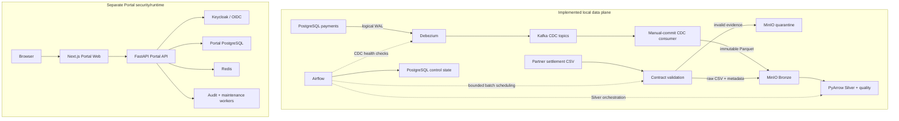

# Fintech Payments Data Platform

Production-oriented fintech payments data platform demonstrating PostgreSQL CDC, Kafka, immutable
Bronze/Silver processing, Airflow orchestration, replay-safe failure handling, and a hardened OIDC
Portal runtime.

> **Maturity:** Local/reference implementation. Production deployment, HA/DR, warehouse analytics,
> and production security authorization remain deferred.

## Business problem

A payments platform must capture transaction changes and partner settlement files reliably,
preserve immutable evidence, reject invalid records, recover safely from partial failures, and
expose operational and security evidence without overstating production maturity.

This repository models that problem through two implemented data paths:

- payment transaction changes captured from PostgreSQL through Debezium and Kafka;
- daily partner settlement CSV files validated against a versioned contract.

Both paths preserve source evidence in Bronze, produce typed Silver outputs, and retain explicit
quality, replay, and ownership state. Airflow schedules bounded work and records control evidence.
A separate Portal runtime demonstrates identity, session, abuse-protection, audit, and operational
security boundaries; it is not the data platform's control plane.

The detailed business context is in the
[business case](docs/business/business-case.md).

## What the project demonstrates

- deterministic payment-domain data and constrained PostgreSQL source contracts;
- a near-real-time CDC path without a production latency SLO;
- versioned settlement contracts, partial rejection, and quarantine;
- immutable MinIO Bronze and Silver publication;
- explicit Kafka offset, object, checksum, manifest, and lineage identities;
- effectively-once behavior at selected publication and delivery boundaries;
- replay-safe, idempotent recovery at named boundaries;
- Airflow orchestration without moving business transformations into DAG files;
- a separate OIDC Portal with PostgreSQL security authority and Redis abuse enforcement;
- reproducible Portal build inputs, hardened first-party containers, and fail-closed scanning;
- destructive migration validation isolated to disposable, run-owned PostgreSQL databases.

## Architecture overview



The two subgraphs intentionally have no control edge. The Portal does not currently operate Kafka,
MinIO, Airflow, or Silver resources.

## Implemented data flow

### CDC path

```text
PostgreSQL payment source
  -> Debezium CDC
  -> Kafka
  -> manual-commit CDC consumer
  -> immutable MinIO Bronze Parquet
  -> PyArrow Silver processing
  -> Airflow orchestration and control evidence
```

The consumer disables automatic offset commit/store. It publishes and verifies immutable objects
before synchronously committing the next Kafka offset. Exact source coordinates remain available
for replay and lineage.

### Settlement path

```text
Partner settlement CSV
  -> filename, checksum, contract, and record validation
  -> Bronze or quarantine
  -> PyArrow Silver processing
  -> quality evidence and Airflow control state
```

The raw source and its checksum remain authoritative evidence. Rejected files or rows are preserved
under bounded quarantine rules rather than silently discarded.

## Implemented capabilities

| Capability                        | Status                       | Evidence / implementation                                                | Scope limitation                                    |
| --------------------------------- | ---------------------------- | ------------------------------------------------------------------------ | --------------------------------------------------- |
| Deterministic payment generator   | Implemented locally          | [`src/generators/`](src/generators/)                                     | Synthetic scale and identities only                 |
| PostgreSQL payment source         | Implemented locally          | [`infrastructure/postgres/init/`](infrastructure/postgres/init/)         | Single-node local topology                          |
| Debezium CDC                      | Implemented locally          | [CDC architecture](docs/architecture/cdc-architecture.md)                | Local connector, no production HA/security          |
| Kafka topics and source envelopes | Implemented locally          | [CDC event contract](docs/data-model/cdc-event-contract.md)              | Database CDC topics, not business event topics      |
| Manual-commit CDC consumer        | Implemented locally          | [CDC Bronze ingestion](docs/architecture/cdc-bronze-ingestion.md)        | Effectively-once only at named boundaries           |
| Immutable MinIO Bronze            | Implemented locally          | [Storage abstraction](docs/architecture/storage-abstraction.md)          | Local MinIO, no production retention/KMS            |
| Settlement contract validation    | Implemented locally          | [Settlement contract](docs/data-model/settlement-contract.md)            | One versioned partner contract                      |
| Quarantine evidence               | Implemented locally          | [Settlement runbook](docs/runbooks/settlement-batch-ingestion.md)        | Local/reference operational policy                  |
| PyArrow Silver                    | Implemented locally          | [Silver architecture](docs/architecture/silver-processing.md)            | No distributed table format                         |
| Data-quality evidence             | Implemented locally          | [Silver quality rules](docs/data-model/silver-quality-rules.md)          | No Gold business classification                     |
| Airflow DAGs and control state    | Implemented with limitations | [Orchestration](docs/architecture/orchestration.md)                      | LocalExecutor and local PostgreSQL                  |
| Recovery and replay behavior      | Implemented with limitations | [CDC recovery](docs/runbooks/cdc-recovery.md)                            | Named component boundaries, not global exactly-once |
| Portal OIDC with PKCE             | Implemented locally          | [Provider lifecycle](docs/portal/provider-session-lifecycle.md)          | Local Keycloak topology                             |
| Opaque server-side sessions       | Implemented locally          | [Portal security ADRs](docs/adr/README.md#portal-security-design-freeze) | Production authorization deferred                   |
| Redis abuse controls              | Implemented locally          | [Abuse protection](docs/portal/abuse-protection.md)                      | Development policy remains active                   |
| Audit outbox and workers          | Implemented locally          | [Audit outbox](docs/portal/audit-outbox-and-maintenance.md)              | Local archive destination                           |
| Portal observability              | Implemented with limitations | [Observability](docs/portal/observability.md)                            | Platform-wide observability is incomplete           |
| Reproducible Portal inputs        | Implemented with limitations | [Reproducible artifacts](docs/portal/reproducible-artifacts.md)          | Byte-identical OCI digest not guaranteed            |
| First-party container hardening   | Implemented locally          | [Container hardening](docs/portal/container-hardening.md)                | First-party Portal services only                    |
| Security scanning                 | Implemented with limitations | [Security scanning](docs/portal/security-scanning.md)                    | Policy result is not production approval            |
| Disposable migration validation   | Implemented locally          | [Portal testing](docs/portal/testing.md)                                 | Explicit isolated command only                      |

## Deferred capabilities

| Capability                               | Status   | Current boundary                                                |
| ---------------------------------------- | -------- | --------------------------------------------------------------- |
| Executable Snowflake path                | Deferred | No warehouse runtime or credentials                             |
| dbt transformations                      | Deferred | No executable models                                            |
| Dimensional marts                        | Deferred | Data path currently ends at Silver/control evidence             |
| Gold reconciliation product              | Deferred | Settlement evidence exists; matching product does not           |
| Dashboards and business analytics        | Deferred | No implemented dashboard runtime                                |
| Portal Kafka adapter                     | Deferred | No Portal-to-Kafka operational capability                       |
| Portal MinIO adapter                     | Deferred | No Portal object browsing or mutation                           |
| Portal Airflow adapter                   | Deferred | No Portal DAG control                                           |
| Portal Silver adapter                    | Deferred | No Portal dataset operations                                    |
| Production callback policy               | Deferred | Local/test/development policy only                              |
| Production abuse policy                  | Deferred | Development policy remains explicit                             |
| Concrete non-environment secret provider | Deferred | Vendor-neutral boundary exists; environment adapter is concrete |
| Production Keycloak topology             | Deferred | Local/reference identity provider                               |
| High availability                        | Deferred | Single-node reference services                                  |
| Multi-region operation                   | Deferred | No multi-region topology                                        |
| Full disaster recovery                   | Deferred | Component recovery exists; no full DR guarantee                 |
| Production deployment                    | Deferred | No approved deployment target or rollout                        |
| SBOM                                     | Deferred | Reproducible artifact inputs exist                              |
| Artifact signing                         | Deferred | No signing identity or release signature                        |
| Provenance attestation                   | Deferred | No release attestation is issued                                |

Deferred scope is not required to understand or evaluate the completed local reference
implementation.

## Reliability and failure semantics

- Kafka offsets advance only after immutable Bronze publication and checksum verification.
- Object keys, Kafka ranges, input checksums, and processing run IDs are deterministic or
  explicitly recorded.
- Settlement manifests own file lifecycle; CDC manifests own partition-range publication;
  Silver lineage owns object processing; PostgreSQL control state owns cross-pipeline execution.
- Same identity and checksum is idempotent; different content at the same immutable key is a hard
  collision.
- Invalid settlement and poison CDC evidence is quarantined before its source can advance.
- Retries reuse component identities rather than hiding partial work.
- The Portal audit outbox commits with the security action and delivers asynchronously with
  `SKIP LOCKED`, leases, fencing, retries, and idempotent receipts.
- Destructive migration checks require a unique disposable database, ownership marker, one-use
  token, bounded role, and scoped teardown.

The Portal audit worker intentionally retains one poison event to demonstrate dead-letter
handling. Health is therefore **DEGRADED** rather than **DOWN**.

Effectively-once behavior is demonstrated at selected immutable publication and delivery
boundaries; the project does not claim exactly-once semantics across the entire platform.

## Portal security/runtime boundary

The Portal is a separate security and runtime engineering surface subordinate to the primary
data-platform story. It demonstrates:

- OIDC Authorization Code with PKCE;
- opaque browser sessions with PostgreSQL server-side authority;
- AES-GCM encrypted provider-token envelopes;
- refresh rotation, generation fencing, revocation, logout, and crypto-erasure;
- signed back-channel logout and durable replay protection;
- Redis-backed distributed abuse enforcement with bounded fallback;
- transactional audit/outbox delivery and maintenance workers;
- structured logs, metrics, tracing, readiness, and correlation;
- immutable build inputs, hardened images, and security scanning.

The Portal is not a unified data-platform control plane, production administration plane,
orchestration UI, or data-governance console. It does not yet operate Kafka, MinIO, Airflow, or
Silver resources. See [Portal boundaries](docs/portal/architecture-boundaries.md) and the
[Portal testing guide](docs/portal/testing.md).

## Quick exploration

This path is read-only or static and does not require full platform startup:

1. Read the [architecture overview](#architecture-overview).
2. Compare [implemented capabilities](#implemented-capabilities) with
   [deferred capabilities](#deferred-capabilities).
3. Choose a reviewer route below.
4. Review the [data-platform demo guide](docs/demo/demo-guide.md) and
   [Portal testing evidence](docs/portal/testing.md).
5. Optionally run safe cross-platform validation:

```bash
python scripts/security/scan.py policy
python scripts/portal/verify_container_hardening.py
docker compose --env-file .env.example config --quiet
```

These commands do not run migrations, reset databases, delete volumes, rebuild images, or start the
full stack. When GNU Make is available, `make help` lists the wider repository command surface.

## Demo and evidence paths

| Path                         | Start here                                                                                                                                                   | Current status                                          |
| ---------------------------- | ------------------------------------------------------------------------------------------------------------------------------------------------------------ | ------------------------------------------------------- |
| Architecture/evidence review | [Business case](docs/business/business-case.md), then this README                                                                                            | Available                                               |
| Canonical interview demo     | [Demo and evidence package](docs/demo/README.md)                                                                                                             | 5/10/20-minute and offline routes available             |
| Detailed data-platform demo  | [Phase demo guide](docs/demo/demo-guide.md) and [extended script](docs/demo/demo-script.md)                                                                  | Optional detailed local reference                       |
| Portal-focused review        | [Local development](docs/portal/local-development.md) and [testing](docs/portal/testing.md)                                                                  | Separate from the data-platform demo                    |
| Full verification            | [Portal testing](docs/portal/testing.md) and repository `Makefile`                                                                                           | Commands are explicit; some require disposable services |
| Security deep dive           | [Scanning](docs/portal/security-scanning.md), [hardening](docs/portal/container-hardening.md), and [threat model](docs/portal/pr-portal-002-threat-model.md) | Current first-party evidence                            |

FF-05 provides a text/JSON-first canonical demo and offline evidence package. No screenshot or
recorded-video proof is claimed; text assets were chosen to reduce privacy and metadata leakage.

## Verification snapshot

The latest local checkpoint recorded:

| Surface                         | Result                                                                                |
| ------------------------------- | ------------------------------------------------------------------------------------- |
| Portal backend                  | 272 passed, 41 skipped, 6 destructive deselected                                      |
| Disposable Portal integration   | 56 passed                                                                             |
| Disposable migration validation | 6 passed                                                                              |
| Foundation                      | 289 passed, 2 skipped, 34 deselected                                                  |
| Real Redis integration          | 4 passed                                                                              |
| Portal Web                      | 29 tests; format, lint, typecheck, and build passed                                   |
| OpenAPI                         | Unchanged; SHA-256 `9fab4ac5b9e41dab87f648d2e797a99caefe51fefacacf4407df97f694471fb2` |
| Alembic                         | Single head `008_audit_outbox_and_maintenance`                                        |
| Security source/dependency scan | 16 findings, 0 blocking                                                               |
| Exact image scan                | 1,340 findings, 0 blocking under current policy                                       |
| Exception register              | 46 active bounded records; none expired                                               |
| Container hardening             | PASS                                                                                  |

Passing policy means no blocking regression under the current policy. It does not mean the images
are vulnerability-free or production-authorized.

## Security posture

Five OCI-digest-pinned scanners cover first-party source, immutable dependency locks, tracked
secrets, exact container images, Git history, and GitHub Actions:

- Semgrep CE;
- OSV-Scanner;
- Gitleaks;
- Trivy;
- zizmor.

The policy fails closed on scanner/input identity problems, stale mandatory data, unsafe reports,
confirmed secrets, expired exceptions, and unsupported first-party Critical/High findings.
Reports are normalized and sanitized. Exceptions are fingerprint-specific, owned, approved,
time-bounded, and review-triggered.

There are no remaining fixed-available first-party Critical/High image findings. Ten
first-party High/no-fix findings remain with indirect reachability classified as unknown and with
bounded dispositions through `2026-09-27`. Verified condition-not-present findings have exact
asset/package evidence. Vendor-image findings remain report-only. These facts do not grant
production security authorization.

See the [security scanning boundary and current disposition](docs/portal/security-scanning.md).

## Known limitations

| Limitation                                   | Consequence                                                                  |
| -------------------------------------------- | ---------------------------------------------------------------------------- |
| Local/reference deployment                   | Service topology and evidence are local, not a production rollout            |
| No HA or multi-region                        | Single-node services cannot support availability claims                      |
| No full DR guarantee                         | Component recovery is tested, but no complete recovery objective is approved |
| Data path ends at Silver and Airflow control | Warehouse, Gold, and analytics outputs do not run                            |
| No executable warehouse/dbt/dashboard path   | Those tools are not implementation claims                                    |
| No Portal data-plane adapters                | Portal cannot operate Kafka, MinIO, Airflow, or Silver                       |
| Local Keycloak topology                      | Production identity topology and authorization remain deferred               |
| Environment-only concrete secret provider    | Vendor-neutral abstraction exists without an external provider               |
| Production callback/abuse policy deferred    | Valid configuration is not production security authorization                 |
| Partial platform observability               | Portal telemetry exists; platform-wide operations coverage is incomplete     |
| OCI byte identity not guaranteed             | Inputs and identities are immutable/measured, not byte-identical             |
| SBOM/signing/provenance deferred             | No supply-chain release attestation exists                                   |
| Vendor image findings report-only            | Vendor risk requires a separate release disposition                          |
| Ten first-party High/no-fix dispositions     | Indirect reachability remains unknown and time-bounded                       |
| Intentional dead letter                      | Audit-worker health remains DEGRADED as validation evidence                  |
| Public publication pending FF-06             | Sanitized fallback evidence exists; publication is not yet approved          |
| Current branch is not pushed                 | Remote CI and public visibility do not include this checkpoint               |

## Choose your path

### Data Engineer

[Business problem](#business-problem) -> [CDC and batch flow](#implemented-data-flow) ->
[Bronze storage](docs/architecture/storage-abstraction.md) ->
[Silver processing](docs/architecture/silver-processing.md) ->
[Airflow orchestration](docs/architecture/orchestration.md) ->
[quality rules](docs/data-model/silver-quality-rules.md)

### Platform Engineer

[Architecture](#architecture-overview) -> [reliability semantics](#reliability-and-failure-semantics)
-> [recovery](docs/runbooks/orchestration-recovery.md) ->
[container hardening](docs/portal/container-hardening.md) ->
[security scanning](docs/portal/security-scanning.md)

### Security Reviewer

[Portal boundary](#portal-securityruntime-boundary) ->
[OIDC/session lifecycle](docs/portal/provider-session-lifecycle.md) ->
[abuse protection](docs/portal/abuse-protection.md) ->
[security scanning](docs/portal/security-scanning.md) ->
[bounded exceptions](docs/portal/security-scanning.md#ff-02-current-image-disposition)

### Hiring Manager

[Project summary](#what-the-project-demonstrates) ->
[capability matrix](#implemented-capabilities) ->
[verification](#verification-snapshot) ->
[limitations](#known-limitations)

### Demo Reviewer

[Demo guide](docs/demo/demo-guide.md) -> [demo script](docs/demo/demo-script.md) ->
[expected checklist](docs/demo/demo-checklist.md). The sanitized fallback package is available;
portfolio publication remains gated by FF-06.

## Repository map

| Path                                               | Reviewer value                                                |
| -------------------------------------------------- | ------------------------------------------------------------- |
| [`src/generators/`](src/generators/)               | Deterministic payment-domain source data                      |
| [`src/ingestion/`](src/ingestion/)                 | Settlement and CDC ingestion implementations                  |
| [`src/processing/silver/`](src/processing/silver/) | Typed Silver and quality processing                           |
| [`src/orchestration/`](src/orchestration/)         | Airflow-neutral control and execution boundaries              |
| [`airflow/`](airflow/)                             | DAG definitions and orchestration tests                       |
| [`infrastructure/`](infrastructure/)               | Local service images, bootstrap, and least-privilege setup    |
| [`apps/portal-api/`](apps/portal-api/)             | FastAPI identity, session, abuse, audit, and runtime services |
| [`apps/portal-web/`](apps/portal-web/)             | Next.js Portal and browser security boundary                  |
| [`scripts/`](scripts/)                             | Bounded lifecycle, validation, and operational entrypoints    |
| [`security/`](security/)                           | Scanner identities, policy, baseline, and exceptions          |
| [`tests/`](tests/)                                 | Foundation unit and integration evidence                      |
| [`docs/architecture/`](docs/architecture/)         | Data-platform engineering deep dives                          |
| [`docs/portal/`](docs/portal/)                     | Portal security/runtime design and operations                 |
| [`docs/demo/`](docs/demo/)                         | Current data-platform rehearsal material                      |
| [`docs/adr/`](docs/adr/)                           | Architecture decisions and status registry                    |

## Technology stack

| Architectural role        | Technologies                                              |
| ------------------------- | --------------------------------------------------------- |
| Sources and CDC           | PostgreSQL, Debezium, Kafka                               |
| Storage and processing    | MinIO, Parquet, PyArrow                                   |
| Orchestration and control | Airflow, PostgreSQL, component manifests                  |
| Portal                    | FastAPI, Next.js, PostgreSQL, Redis, Keycloak             |
| Quality and security      | pytest, mypy, Ruff, Semgrep, OSV, Gitleaks, Trivy, zizmor |
| Delivery                  | Docker Compose, GitHub Actions                            |

Snowflake, dbt, Gold marts, and dashboards are deferred scope, not implemented runtime
technologies.

## Current checkpoint

```text
Branch:
feat/portal-002-runtime-conformance

Latest security checkpoint:
44e61f98aaa070c16845425fb8adb8b7f1af44a6

Feature state:
Frozen

Private review:
Ready with limitations

Security presentation gate:
Cleared

Canonical entrypoint:
Implemented by FF-03

Architecture and claims:
Reconciled by FF-04

Public presentation:
Pending FF-06

Push:
Not performed
```

No remote CI result is claimed for the unpushed checkpoint.

## Further reading

- [Business case](docs/business/business-case.md)
- [Current implemented architecture](docs/architecture/current-state.md)
- [Target and optional architecture](docs/architecture/target-architecture.md)
- [Canonical architecture and portfolio claims](docs/architecture/claims.md)
- [Implementation history and bounded roadmap](docs/roadmap.md)
- [CDC Bronze ingestion](docs/architecture/cdc-bronze-ingestion.md)
- [Silver processing](docs/architecture/silver-processing.md)
- [Airflow orchestration](docs/architecture/orchestration.md)
- [Portal configuration](docs/portal/configuration.md)
- [Portal security scanning](docs/portal/security-scanning.md)
- [Architecture decisions](docs/adr/README.md)
- [Current demo guide](docs/demo/demo-guide.md)
- [Canonical demo and evidence package](docs/demo/README.md)

The root README is the canonical reviewer entrypoint. Detailed documents provide evidence and
historical context but do not override the implemented/deferred boundaries stated here.
