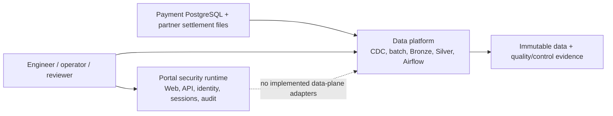
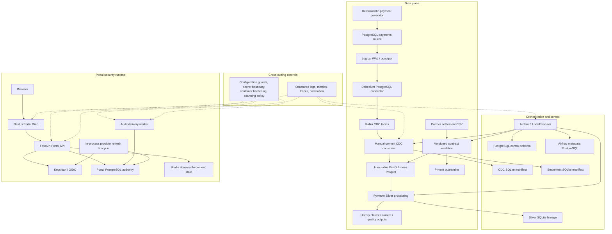

# Current implemented architecture

## 1. Purpose and authority

This document is the authoritative detailed description of architecture implemented in the
repository. When it conflicts with a historical design, roadmap, or proposal, tracked
implementation and current verification evidence take precedence.

Use:

- the root [README](../../README.md) as the reviewer entrypoint;
- this document for implemented architecture and ownership boundaries;
- [target architecture](target-architecture.md) for optional or deferred direction;
- [claims](claims.md) for approved external wording;
- [roadmap](../roadmap.md) for completed history and bounded finalization work.

## 2. Current maturity

The repository is a production-oriented local/reference implementation. The source-to-Silver data
path, Airflow orchestration, and a separate Portal security runtime are implemented and tested.
Production deployment, production security authorization, HA/DR, warehouse analytics, and
platform-wide operational SLOs are deferred.

Feature development is frozen. Current work is limited to documentation, demo evidence,
verification, and publication decisions.

## 3. System context

The dotted edge is an explicit non-integration boundary. The Portal does not currently operate
Kafka, MinIO, Airflow, or Silver datasets.

## 4. Current engineering architecture

The four subgraphs are independently governed. No line connects the Portal API to the data-plane
components because that integration is not implemented.

## 5. Data-plane architecture

The data plane has two intake paths that converge at immutable Bronze evidence and typed Silver
processing:

1. PostgreSQL row changes travel through logical WAL, Debezium, Kafka, a manual-commit consumer,
   and immutable MinIO Bronze Parquet.
2. Partner settlement CSV files pass versioned contract and record validation before accepted
   source bytes enter Bronze or invalid evidence enters private quarantine.

Source, transport, object, manifest, and output identities remain separate. The platform does not
claim a global transaction across PostgreSQL, Kafka, MinIO, SQLite, and Airflow.

## 6. Batch ingestion

Settlement ingestion provides:

- the versioned `settlement-v1` contract and deterministic fixtures;
- filename, checksum, contract, and record validation;
- accepted Bronze publication and private quarantine;
- idempotent manifest lifecycle and replay behavior;
- local and MinIO storage adapters;
- partial-rejection evidence without promoting invalid input.

Settlement matching, reconciliation classification, Finance marts, and dashboards are not
implemented.

## 7. CDC ingestion

The CDC path provides:

- explicit PostgreSQL publication and a dedicated non-superuser replication identity;
- schema-enabled Debezium envelopes for six business tables;
- single-node local Kafka KRaft and durable Connect internal topics;
- manual consumer commit/store control;
- deterministic topic/partition/offset and micro-batch identity;
- upload and checksum verification before committing `offset_end + 1`;
- poison-record quarantine before the source position advances;
- bounded restart, rebalance, collision, and recovery behavior.

Kafka is a local single-node topology with replication factor one. This is not HA evidence and no
production latency SLO is claimed.

## 8. Bronze storage

MinIO Bronze stores immutable source evidence:

- raw settlement objects retain byte/checksum identity;
- CDC objects retain explicit Arrow schema, source metadata, Kafka coordinates, and compressed
  Parquet content;
- conditional writes prevent conflicting overwrite;
- quarantine is private and distinct from accepted publication.

Bronze is authoritative evidence at its publication boundary. It is not the source transaction
authority and does not make the complete cross-system flow exactly-once.

## 9. Silver processing

PyArrow processing produces typed immutable outputs for:

- CDC history, latest-all, and current state;
- explicit delete and tombstone semantics;
- settlement records;
- transaction events;
- quality results and unresolved references;
- incremental lineage and input/output checksums.

Silver processing supports skip, force, dry-run, replay, and recovery controls. It is not a
distributed table-format engine, warehouse, semantic layer, or Gold product.

## 10. Orchestration and control state

Airflow 3 schedules settlement ingestion, CDC control checks, Silver processing, and bounded
backfill. It uses:

- Airflow metadata PostgreSQL for scheduler and task-instance state;
- a separate PostgreSQL `control` schema for cross-pipeline run, quality, and backfill state;
- existing component SQLite manifests for component-local lifecycle evidence.

Airflow does not own payment business data, Kafka offsets, object checksums, or Portal security
authority. The long-running CDC consumer remains outside an Airflow task.

## 11. Portal security/runtime

The implemented Portal is a separate runtime composed of:

- Next.js Web and FastAPI API;
- OIDC Authorization Code with PKCE through Keycloak;
- opaque browser sessions and server-side PostgreSQL session authority;
- AES-GCM encrypted provider-token envelopes;
- provider refresh, rotation/reuse detection, revocation, logout, and crypto-erasure;
- signed back-channel logout and durable replay protection;
- Redis-backed distributed abuse enforcement with bounded local degradation;
- transactional append-only audit, outbox delivery, maintenance, and dead-letter handling;
- frozen role-aware configuration and vendor-neutral secret-provider boundaries;
- OpenTelemetry metrics/traces, structured correlation, container hardening, and security scanning.

PostgreSQL and OIDC are required readiness dependencies when the security runtime is enabled.
Redis is an optional/reconstructible abuse backend: its failure is observable and uses
operation-specific fallback, but it is not session or replay authority.

The Portal has no operational adapter for Kafka, MinIO, Airflow, or Silver. It is not the
data-platform control plane.

## 12. State ownership boundaries

| State                              | Owner                       | Durability                    | Mutation authority                               | Recovery mechanism                                 | Source of truth                       | Limitation                           |
| ---------------------------------- | --------------------------- | ----------------------------- | ------------------------------------------------ | -------------------------------------------------- | ------------------------------------- | ------------------------------------ |
| Payment rows and lifecycle events  | Payments PostgreSQL         | Durable                       | Payment schema roles/application                 | Database recovery outside this local stack         | PostgreSQL source                     | Local single instance                |
| Debezium position                  | Kafka Connect               | Durable local volume/topics   | Connector runtime                                | Connector restart/reconciliation                   | Connect offset topics                 | No multi-worker HA proof             |
| Kafka consumer offsets             | Kafka group coordinator     | Durable local broker volume   | CDC consumer group                               | Restart from committed offset                      | Kafka committed group offset          | Not object source of truth           |
| Bronze objects                     | MinIO                       | Immutable local object volume | Batch/CDC storage adapters                       | Idempotent replay by checksum/coordinate           | Published object + metadata           | No production object-lock/DR         |
| Quarantine                         | MinIO/local private storage | Durable local evidence        | Intake/CDC validation path                       | Operator review and bounded replay                 | Quarantined object/evidence           | No governed redrive product          |
| Silver outputs                     | MinIO/local storage         | Immutable local outputs       | Silver processor                                 | Deterministic reprocessing                         | Output object + lineage               | No table format/warehouse            |
| Component manifests                | SQLite                      | Durable component-local files | Owning batch/CDC/Silver component                | Replay/reconciliation with object state            | Component manifest                    | Single-host ownership                |
| Cross-pipeline control             | PostgreSQL `control` schema | Durable                       | Airflow task/control repository                  | Transactional retry and run reconciliation         | Control rows                          | Not business-data authority          |
| Airflow execution state            | Airflow metadata PostgreSQL | Durable                       | Airflow services                                 | Scheduler/task retry                               | Airflow metadata                      | Not pipeline artifact authority      |
| Portal sessions/security lifecycle | Portal PostgreSQL           | Durable                       | Portal API and bounded worker roles              | Fencing, recovery, revocation, migration guards    | `portal_control` schema               | Production authorization deferred    |
| Redis abuse state                  | Redis                       | Ephemeral/reconstructible     | Abuse-enforcement service                        | TTL, local fallback, Redis recovery                | PostgreSQL remains security authority | Eviction/restart loses counters      |
| Security audit/outbox              | Portal PostgreSQL           | Durable, append-only ledger   | Transactional audit function and delivery worker | At-least-once delivery, receipts, fencing, requeue | Ledger/outbox rows                    | One intentional dead letter retained |
| Keycloak identity/provider state   | Keycloak                    | Durable local provider volume | Identity provider                                | OIDC discovery/JWKS refresh and provider recovery  | Keycloak/provider                     | Local identity topology              |

## 13. Reliability semantics

Reliability claims are deliberately bounded:

- upload and checksum verification occur before Kafka offset commit at the immutable Bronze
  publication boundary;
- topic/partition/offset and range identities make CDC object replay deterministic;
- settlement checksum identity prevents accidental duplicate promotion;
- conditional object writes reject collisions rather than overwriting;
- component manifests record lifecycle and lineage separately from object storage;
- poison evidence is quarantined before its source advances;
- the Portal audit outbox commits with the security action and delivers at least once with
  idempotent receipts, `SKIP LOCKED`, leases, and fencing;
- one intentional poison audit event remains dead-lettered to demonstrate degraded operation;
- destructive migration tests require a run-owned disposable database, marker, one-use token,
  bounded roles, and scoped teardown.

These controls do not create exactly-once execution across all systems, perfect deduplication under
every failure, infrastructure HA, or cross-region DR.

## 14. Security and configuration boundaries

The Portal separates non-secret frozen configuration, secret references, resolved secret values,
runtime state, and PostgreSQL authority. The environment provider remains the local compatibility
adapter; no concrete external secret manager is implemented.

First-party Portal images run non-root with read-only filesystems, dropped capabilities,
`no-new-privileges`, bounded writable paths, and segmented Compose networks. Five digest-pinned
scanner families enforce source, dependency, secret, workflow, image, and history policy.

Current policy has no blocking fixed-available first-party Critical/High image findings. Ten
first-party High/no-fix findings retain bounded unknown-reachability dispositions through
`2026-09-27`. Vendor images remain report-only. This does not grant production authorization or
support a vulnerability-free claim.

## 15. Observability and operational evidence

Portal metrics, distributed traces, structured JSON logs, correlation IDs, readiness dependency
state, audit/outbox metrics, and worker health are implemented. Data-platform components expose
component checks, structured logs, manifests, quality outputs, and Airflow/control evidence.

This is meaningful subsystem observability, not a complete platform-wide production monitoring,
alerting, SLO, or incident-management system.

## 16. Implemented capability matrix

| Layer         | Implemented capability                                      | Evidence                                   |
| ------------- | ----------------------------------------------------------- | ------------------------------------------ |
| Sources       | Constrained payments PostgreSQL and deterministic generator | Source schema, generator, tests            |
| Batch         | Settlement contract, validation, Bronze/quarantine          | Batch ingestion code and integration tests |
| CDC           | WAL/pgoutput, Debezium, Kafka, manual consumer              | Compose, connector scripts, CDC tests      |
| Storage       | Immutable MinIO Bronze and quarantine                       | Storage adapters and MinIO tests           |
| Processing    | PyArrow Silver, quality, lineage                            | Silver code, schemas, tests                |
| Orchestration | Airflow DAGs and PostgreSQL control state                   | DAGs, control repository, tests            |
| Reliability   | Replay/recovery and disposable migration validation         | Runbooks, FF-01 safeguards, tests          |
| Portal        | OIDC, sessions, provider lifecycle, abuse, audit/outbox     | Portal API/Web, migrations, tests          |
| Operations    | Portal telemetry, readiness, worker health                  | Telemetry/readiness code and docs          |
| DevSecOps     | Reproducible inputs, hardening, five-scanner policy         | Build tools, Dockerfiles, security policy  |

## 17. Deferred capability matrix

| Capability                                 | Status   | Current boundary                                          |
| ------------------------------------------ | -------- | --------------------------------------------------------- |
| Warehouse, dbt, dimensional marts, Gold    | Deferred | No executable assets                                      |
| Reconciliation product and dashboards      | Deferred | Evidence intake exists; product logic does not            |
| Portal Kafka/MinIO/Airflow/Silver adapters | Deferred | No operational data-plane integration                     |
| Production callback/abuse policies         | Deferred | Staging/production security authorization remains guarded |
| External secret-provider implementation    | Deferred | Vendor-neutral interface only                             |
| Production identity and workload topology  | Deferred | Local Keycloak/Compose evidence only                      |
| HA, multi-region, and DR                   | Deferred | Single-node local services                                |
| Production deployment and promotion        | Deferred | No production target or release authorization             |
| Full platform observability                | Deferred | Subsystem evidence only                                   |
| SBOM, signing, and provenance              | Deferred | Reproducible-input foundation only                        |

Deferred items are possible future work, not committed delivery.

## 18. Known limitations

- The implemented runtime is local/reference and primarily Compose-based.
- Kafka, PostgreSQL, MinIO, Redis, Keycloak, and Airflow are not production HA topologies.
- Component SQLite manifests remain single-host.
- The data path stops at Silver and Airflow control evidence.
- Portal production security authorization remains blocked by explicit configuration/policy guards.
- The Portal does not operate the data plane.
- Security findings are governed and bounded, not absent.
- No complete backup/restore, recovery objective, promotion, or rollback process is approved.

## 19. Canonical links

- [Reviewer entrypoint](../../README.md)
- [Target/optional architecture](target-architecture.md)
- [Canonical claims](claims.md)
- [Roadmap](../roadmap.md)
- [Portal architecture boundary](../portal/architecture-boundaries.md)
- [Portal troubleshooting](../portal/troubleshooting.md)
- [Security scanning and dispositions](../portal/security-scanning.md)
- [Canonical demo and evidence package](../demo/README.md)
- [Detailed Phase 0–7 demo guide](../demo/demo-guide.md)

ADRs and design-freeze documents retain historical decisions and wording; they do not override
this current implementation view.
