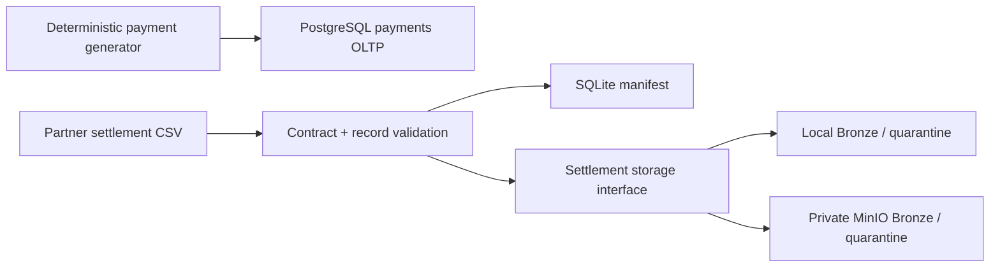
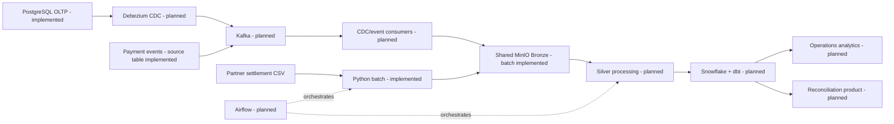

# Target Architecture

## Purpose and truthful status

The target supports near-real-time payment operations and daily settlement reconciliation. Through
Phase 3, only the OLTP source/generator, settlement batch ingestion, SQLite control state, and
selectable local/MinIO raw storage are implemented.

| Component | Status |
| --- | --- |
| PostgreSQL OLTP source and realistic generator | Implemented in Phase 1 |
| Settlement contract, validation, manifest, and local storage | Implemented in Phase 2 |
| Shared storage interface and private MinIO Bronze/quarantine | Implemented in Phase 3 |
| Kafka, Debezium, CDC/event consumers, and Silver | Planned; not implemented |
| Airflow, Snowflake, executable dbt models, BI, and observability | Planned; not implemented |

## Architecture principles

1. Preserve raw source bytes immutably before downstream transformation.
2. Keep transactional workflow state in SQLite/PostgreSQL rather than object metadata.
3. Separate domain validation from infrastructure SDKs through small typed interfaces.
4. Make identity, checksum, replay, collision, and failure ordering explicit and testable.
5. Use fixed-precision money and timezone-aware timestamps end to end.
6. Keep credentials outside source control and avoid secrets/absolute paths in logs and metadata.
7. Add infrastructure only when a bounded phase has an executable acceptance test.

## Implemented local architecture

The adapters share deterministic keys and immutable semantics. Local is the default; MinIO is an
explicit CLI/environment selection. Successful MinIO manifest paths use `s3://<bucket>/<key>`.
File-level invalid input is quarantine-only. Partial row failure preserves unchanged raw Bronze and
writes rejected JSON Lines to quarantine. Storage failure produces `FAILED`, not `PROCESSED`.

This is single-node local infrastructure. It makes no HA, production RPO/RTO, TLS, retention-lock,
throughput, or multi-writer claim.

## Planned production-like flow

## Layer responsibilities

| Layer | Responsibility | Current state |
| --- | --- | --- |
| Source | Authoritative payment state/events and partner evidence | Implemented locally |
| CDC/event ingestion | Ordered schema-aware changes, offsets, retries/DLQ | Planned |
| Batch ingestion | Contract validation and idempotent partner-file intake | Implemented |
| Bronze/quarantine | Immutable raw bytes, integrity metadata, rejected evidence | Local + MinIO implemented for settlement |
| Control | Transactional discovery/status/count/path lifecycle | SQLite implemented; PostgreSQL control planned |
| Silver | Normalize, deduplicate, apply CDC, quality gates | Planned |
| Warehouse/dbt | Dimensions, facts, SCD2, reconciliation marts | Planned |
| Orchestration/consumption | Scheduling, signals, governed analytics | Planned |

## Deferred decisions

- Kafka/Debezium topology, schemas, partitions, retention, and offset contract.
- CDC object layout and batching policy over the shared backend.
- SQLite-to-PostgreSQL manifest migration and distributed locking.
- Parquet/table format and whether measured scale warrants distributed processing.
- Production MinIO identity, TLS, KMS, object lock/versioning, lifecycle, replication, and backup.
- Warehouse sizing/access, catalog/lineage backend, dashboard tool, and platform SLOs.

Each decision belongs to a later phase or ADR with measured acceptance evidence.
