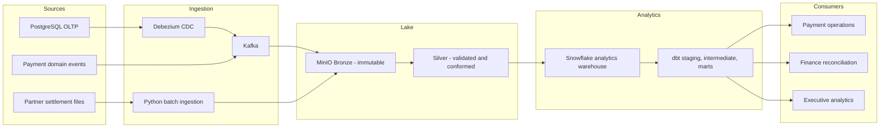

# Target Architecture

## Purpose

The target platform supports operational visibility into payment processing and daily financial
reconciliation. This document defines component boundaries only; Phase 0 does not deploy them.

## Implementation status

**Status: Planned. Not implemented in Phase 0.**

The architectures below define intended boundaries and an implementation sequence. Component names
must not be interpreted as deployed services or measured capabilities.

## Architecture principles

1. Preserve source data immutably before applying business transformations.
2. Separate CDC from business-domain event streams because they have different semantics.
3. Make every batch and streaming write replay-safe and auditable.
4. Treat event time, ingestion time, and processing time as separate concepts.
5. Publish governed data products instead of exposing raw storage to business users.
6. Keep secrets outside source control and grant services least-privilege access.
7. Add technology only when it supports an explicit business or reliability requirement.

## MVP architecture

The MVP proves both business use cases with the smallest coherent stack:

```text
PostgreSQL OLTP ---------------- Debezium + Kafka --------+
                                                        |
Partner settlement CSV -------- Python batch ingestion --+--> MinIO Bronze
                                                                    |
                                                                    v
                                                          Python Silver processing
                                                                    |
                                                                    v
                                                             Snowflake + dbt
                                                                    |
                                                    +---------------+--------------+
                                                    |                              |
                                            Operations mart              Reconciliation mart
```

Planned MVP constraints:

- A local, single-node development topology; no high-availability claim.
- Parquet Bronze objects with deterministic keys, checksums, and ingestion metadata.
- Python processing before introducing a distributed processing engine.
- Snowflake and dbt only after local source-to-Silver contracts are stable.
- Dashboard SQL or lightweight prototypes only after certified marts exist.

## Target production-like architecture

The production-like target extends the MVP with scalable deployment, explicit schema governance,
stream processing where measurements justify it, stronger security boundaries, lineage, and unified
observability.

### Target logical flow



## Layer responsibilities

| Layer | Planned responsibility | Primary consumers |
| --- | --- | --- |
| Sources | Authoritative payment, customer, merchant, refund, and settlement records. | Ingestion services |
| Streaming/CDC ingestion | Capture source changes and domain events with durable offsets and schema versions. | Bronze storage, operations processing |
| Batch ingestion | Discover, checksum, validate, register, and ingest partner files idempotently. | Bronze storage |
| Bronze | Retain immutable source payloads, source metadata, batch IDs, and checksums. | Replay and Silver processing |
| Silver | Validate contracts, normalize types/time zones, deduplicate, apply CDC, and quarantine failures. | Warehouse publishing and operational aggregates |
| Snowflake/dbt | Build governed dimensions, facts, SCD2 history, reconciliation marts, and semantic definitions. | Analysts and dashboards |
| Observability | Measure service health, freshness, volume, quality, lineage, and end-to-end latency. | Data engineering and operations |

## Cross-cutting controls

- Data contracts and backward-compatible schema evolution.
- Deterministic identifiers, manifests, checksums, and offset-range audit metadata.
- Dead-letter and quarantine paths with explicit reason codes.
- Role-based access, PII classification, masking, and retention policies.
- CI/CD promotion with isolated test schemas and rollback-safe changes.

## Decisions deferred beyond Phase 0

- Streaming processor selection and state-store design.
- Lakehouse table format, if one is required beyond Parquet.
- Near-real-time serving choice for dashboard latency requirements.
- Metadata catalog and lineage backend.
- Dashboard technology.

Each deferred choice requires an ADR tied to measured needs and local resource constraints.

## Future optional components

These components are not core dependencies and must be added only when a measured requirement
justifies their operating cost:

| Optional component | Trigger for adoption | Candidate choices |
| --- | --- | --- |
| Distributed stream processor | Stateful windows, high event volume, or latency targets exceed the Python design. | Spark Structured Streaming or Flink |
| Lakehouse table format | Silver requires concurrent updates, schema evolution, compaction, or time travel. | Iceberg or Delta Lake |
| Low-latency serving store | Warehouse refresh cannot meet the approved Operations SLA cost-effectively. | ClickHouse or an equivalent store |
| Metadata catalog | Dataset count and ownership workflows outgrow dbt docs and repository metadata. | OpenMetadata or DataHub |
| Query federation | Multiple governed stores require one SQL access layer. | Trino or Dremio |

Optional components must not block the MVP payment-monitoring or settlement-reconciliation slices.
