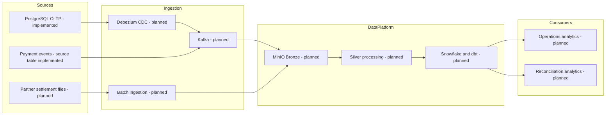

# Target Architecture

## Purpose and status

The target platform supports operational visibility into payment processing and daily financial
reconciliation. Phase 1 implements only the PostgreSQL OLTP source and its data generator.

| Component | Status |
| --- | --- |
| PostgreSQL OLTP source and realistic generator | Implemented in Phase 1 |
| Kafka, Debezium, MinIO, batch/streaming ingestion, and Silver | Planned; not implemented |
| Snowflake, executable dbt models, Airflow, BI, and observability | Planned; not implemented |
| Optional distributed processing or serving systems | Future option; no commitment |

## Architecture principles

1. Preserve source data immutably before applying downstream transformations.
2. Keep current OLTP state separate from immutable business lifecycle events.
3. Make generator and future ingestion writes deterministic, replay-safe, and auditable.
4. Treat event time, source commit time, ingestion time, and processing time separately.
5. Use fixed-precision money and timezone-aware timestamps end to end.
6. Keep secrets outside source control and grant services least privilege.
7. Add technology only for an explicit, tested requirement.

## Implemented Phase 1 architecture

```text
Python generator -- one database transaction per run --> PostgreSQL 16
                                                     payments schema
                                                       |-- reference data
                                                       |-- current OLTP state
                                                       `-- immutable events
```

This is a local development topology. It makes no high-availability, throughput, recovery-point, or
recovery-time claim.

## Planned MVP architecture

```text
PostgreSQL OLTP ---------------- Debezium + Kafka --------+
                                                        |
Partner settlement CSV -------- Python batch ingestion --+--> MinIO Bronze
                                                                    |
                                                                    v
                                                          Python Silver processing
                                                                    |
                                                                    v
                                                             Snowflake + dbt
                                                                    |
                                                    +---------------+--------------+
                                                    |                              |
                                            Operations mart              Reconciliation mart
```

Planned constraints:

- Local-first development before deployment hardening.
- Immutable Bronze objects with deterministic keys, checksums, and ingestion metadata.
- Python processing before a distributed engine is considered.
- Snowflake/dbt only after local source-to-Silver contracts are stable.
- Dashboards only after certified marts exist.

## Target production-like flow



## Layer responsibilities

| Layer | Responsibility | Phase 1 status |
| --- | --- | --- |
| Source | Authoritative customer, account, merchant, payment, event, and refund records. | Implemented locally |
| CDC/event ingestion | Durable offsets, deletes, ordering, and schema versions. | Planned |
| Batch ingestion | Validate and ingest partner files idempotently. | Planned |
| Bronze | Retain immutable payloads and source metadata. | Planned |
| Silver | Normalize, deduplicate, apply CDC, and quarantine failures. | Planned |
| Warehouse/dbt | Dimensions, facts, SCD2, and reconciliation marts. | Planned |
| Consumption/observability | Governed analytics and platform health. | Planned |

## Deferred decisions

- Debezium/Kafka topology, event contracts, and CDC publication settings.
- Streaming processor and state-store selection.
- Bronze object layout and possible lakehouse format.
- Warehouse sizing, production access model, catalog/lineage backend, and dashboard technology.
- Production PostgreSQL high availability, backup/restore, TLS, and secret-manager integration.

Each decision requires a later phase or ADR tied to measured needs. None is a Phase 1 dependency.
