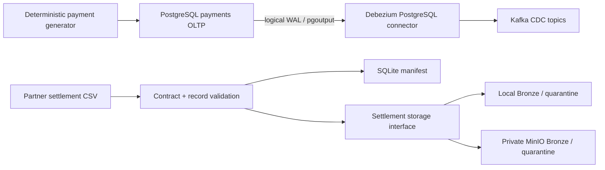
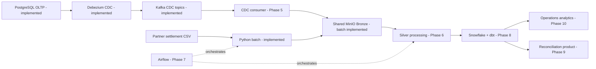

# Target Architecture

## Purpose and truthful status

The target supports near-real-time payment operations and daily settlement reconciliation. Through
Phase 4, the source/generator, settlement batch intake, selectable local/MinIO raw storage, and
PostgreSQL-to-Kafka CDC transport are implemented. CDC consumption and analytics remain planned.

| Component | Status |
| --- | --- |
| PostgreSQL OLTP source and realistic generator | Implemented in Phase 1 |
| Settlement contract, validation, manifest, and local storage | Implemented in Phase 2 |
| Shared storage interface and private MinIO Bronze/quarantine | Implemented in Phase 3 |
| PostgreSQL logical replication, Debezium, Kafka CDC topics | Implemented in Phase 4 |
| CDC consumer to Bronze and Silver processing | Planned for Phases 5-6 |
| Airflow, Snowflake, executable dbt models, BI, observability | Planned for Phases 7-10 |

## Architecture principles

1. Preserve raw source bytes/envelopes before downstream transformation.
2. Keep transactional workflow state in SQLite/PostgreSQL, not object metadata.
3. Preserve source LSN, transaction/time metadata, Kafka position, and the Debezium envelope.
4. Use fixed-precision money and timezone-aware timestamps end to end.
5. Separate domain behavior from infrastructure clients with small typed boundaries.
6. Keep credentials outside source control and redact inspection/log output.
7. Add one bounded, independently testable infrastructure responsibility per phase.

## Implemented local architecture

Kafka and Kafka Connect are single-node local services. Kafka persists records and Connect internal
state in a named Kafka volume. `connector-init` reconciles the PostgreSQL role/publication and
connector config after health dependencies are satisfied. It is an idempotent one-shot service.

## Planned production-like flow

## Layer responsibilities

| Layer | Responsibility | Current state |
| --- | --- | --- |
| Source | Authoritative payment state/events and partner evidence | Implemented locally |
| CDC transport | Schema-aware row changes, source offsets, restart continuity | Implemented to Kafka |
| Batch ingestion | Contract validation and idempotent partner-file intake | Implemented |
| Bronze/quarantine | Immutable raw bytes/envelopes and rejected evidence | Batch local + MinIO only |
| Control | Transactional lifecycle and coordination | SQLite batch manifest; Connect internal topics |
| Silver | Normalize, deduplicate, apply CDC, quality gates | Planned |
| Warehouse/dbt | Dimensions, facts, SCD2, reconciliation marts | Planned |
| Orchestration/consumption | Scheduling, signals, governed analytics | Planned |

## Deferred decisions

- CDC object layout, micro-batching, offset-to-object commit protocol, DLQ, and poison records.
- Schema compatibility governance/registry after real downstream requirements are known.
- SQLite-to-PostgreSQL manifest migration and distributed locking.
- Kafka partition/retention sizing, TLS/SASL/ACLs, multi-broker replication, and Connect scaling.
- Parquet/table format and whether measured scale warrants distributed processing.
- Production MinIO identity, TLS, KMS, object lock/versioning, lifecycle, replication, and backup.
- Warehouse sizing/access, catalog/lineage backend, dashboards, and platform SLOs.
