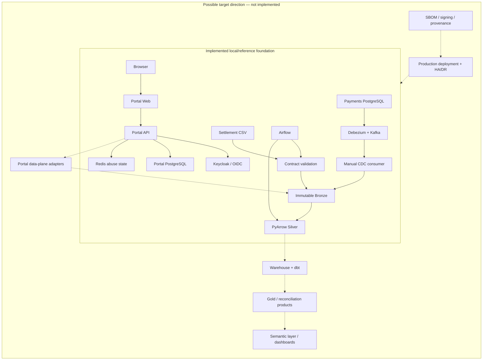

# Target and optional architecture

## Purpose and status

This document describes possible future expansion. It is not a statement of implemented
capability, an approved production topology, or a committed delivery schedule.

The authoritative implemented view is [current-state.md](current-state.md). External wording must
follow the [canonical claim matrix](claims.md).

Status terms used here:

| Status                   | Meaning                                                             |
| ------------------------ | ------------------------------------------------------------------- |
| **Implemented**          | Tracked executable assets and verification exist now                |
| **Optional extension**   | A plausible addition that requires a separate decision and evidence |
| **Deferred**             | Intentionally outside the current feature-frozen implementation     |
| **Out of current scope** | Not part of the present repository commitment                       |

## Current foundation


```mermaid
flowchart LR
    subgraph Implemented["Implemented local/reference foundation"]
        PG["Payments PostgreSQL"] --> CDC["Debezium + Kafka"]
        CDC --> Consumer["Manual CDC consumer"]
        CSV["Settlement CSV"] --> Batch["Contract validation"]
        Consumer --> Bronze["Immutable Bronze"]
        Batch --> Bronze
        Bronze --> Silver["PyArrow Silver"]
        Airflow["Airflow"] --> Batch
        Airflow --> Silver

        Browser["Browser"] --> Web["Portal Web"]
        Web --> API["Portal API"]
        API --> Identity["Keycloak / OIDC"]
        API --> PortalDB["Portal PostgreSQL"]
        API --> Redis["Redis abuse state"]
    end

    subgraph Possible["Possible target direction — not implemented"]
        Warehouse["Warehouse + dbt"]
        Products["Gold / reconciliation products"]
        BI["Semantic layer / dashboards"]
        Adapters["Portal data-plane adapters"]
        Production["Production deployment + HA/DR"]
        Attestation["SBOM / signing / provenance"]

        Silver -.-> Warehouse
        Warehouse -.-> Products
        Products -.-> BI
        API -.-> Adapters
        Adapters -.-> Bronze
        Production -.-> Implemented
        Attestation -.-> Production
    end
```

Dotted target edges express possible direction only. In particular, no Portal adapter currently
connects the API to Kafka, MinIO, Airflow, or Silver.

## Capability status

| Capability                                                 | Status               | Evidence or boundary                                    |
| ---------------------------------------------------------- | -------------------- | ------------------------------------------------------- |
| Deterministic payments source and generator                | Implemented          | PostgreSQL contracts, generator, tests                  |
| Settlement batch validation and quarantine                 | Implemented          | Versioned contract, ingestion code, fixtures            |
| PostgreSQL logical WAL, Debezium, Kafka CDC                | Implemented          | Compose services, connector scripts, integration tests  |
| Manual CDC consumer to immutable Bronze                    | Implemented          | Consumer, manifests, MinIO tests                        |
| PyArrow Silver history/current/quality outputs             | Implemented          | Processing code, schemas, lineage tests                 |
| Airflow orchestration and control state                    | Implemented          | DAGs, PostgreSQL control repository, tests              |
| Portal OIDC/session/provider lifecycle                     | Implemented          | API/Web code, migrations, tests                         |
| Portal distributed abuse and audit/outbox                  | Implemented          | Redis enforcement, audit worker, telemetry              |
| Reproducible inputs, hardened first-party images, scanning | Implemented          | Locks, build manifest, Docker verification, policy      |
| External secret manager adapter                            | Optional extension   | Provider interface exists; no vendor adapter selected   |
| Warehouse and executable dbt models                        | Deferred             | No executable warehouse/dbt assets                      |
| Gold/reconciliation data product                           | Deferred             | Intake evidence exists; classification/product does not |
| Semantic layer and dashboard                               | Deferred             | Empty placeholders are not implementation               |
| Portal operational data-plane adapters                     | Deferred             | No Kafka/MinIO/Airflow/Silver adapter                   |
| Production identity topology and policies                  | Deferred             | Local Keycloak and guarded development policies only    |
| Full platform observability/incident delivery              | Deferred             | Subsystem telemetry and evidence only                   |
| SBOM, signing, provenance, release attestation             | Deferred             | Not implemented by the reproducible-build task          |
| Production deployment, promotion, and rollback             | Deferred             | No approved deployment target                           |
| HA, multi-region, and DR                                   | Deferred             | No topology or recovery-objective evidence              |
| Service mesh or Kubernetes platform                        | Out of current scope | No repository evidence or approved need                 |

## Possible data-product direction

A future data-product expansion could add:

```text
Silver
  → governed warehouse staging
  → versioned transformations
  → reconciliation/Gold products
  → semantic and presentation surfaces
```

Each arrow would require its own source contract, authority model, quality gates, recovery
semantics, cost model, security controls, and executable verification. Naming a warehouse or BI
technology here does not commit the repository to it.

## Possible Portal direction

The implemented Portal is currently a security/runtime surface, not the platform control plane. A
future operational Portal could consume explicitly versioned application APIs or read models for:

- dataset discovery and evidence;
- bounded pipeline and backfill operations;
- quarantine/redrive workflows;
- schema and publication review;
- incident and recovery evidence.

This direction is deferred until each backend operation has an authoritative state machine,
authorization contract, idempotency/recovery behavior, and audit evidence. Direct browser or Portal
access to infrastructure administration endpoints remains prohibited.

## Possible production direction

A separately authorized deployment design would need decisions and evidence for:

- workload identity and runtime secret delivery;
- network, storage, and migration ownership;
- immutable promotion and rollback;
- backup/restore and cryptographic-key continuity;
- HA topology and recovery objectives;
- capacity, latency, and failure budgets;
- registry monitoring, SBOM, signing, and provenance verification.

The repository does not select Kubernetes, a cloud provider, a secrets vendor, or a specific
warehouse by default. Existing abstractions should be extended before a new subsystem is proposed.

## Principles that carry forward

1. Keep authoritative state with the owning system.
2. Preserve immutable source and processing evidence before derived products.
3. Use explicit identifiers and bounded replay rather than global exactly-once claims.
4. Expose operations only through versioned, authorized application boundaries.
5. Treat unknown dependency or security state as unavailable, not healthy.
6. Keep secrets out of source, browser bundles, build metadata, logs, and telemetry.
7. Require executable evidence before moving a capability from deferred to implemented.

## Decision and review triggers

A target item requires a new scoped decision when it introduces any of:

- a new data or security authority;
- a schema, state machine, or public contract;
- a deployment target or persistent service;
- a new secret, privileged identity, or network boundary;
- an externally visible reliability, scale, security, or compliance claim.

Feature freeze rejects implementation of these target items during FF-04 through FF-06.

## Related documents

- [Current implemented architecture](current-state.md)
- [Canonical claims](claims.md)
- [Roadmap](../roadmap.md)
- [Historical Portal product direction](../product/enterprise-data-platform-portal.md)
- [Portal architecture boundary](../portal/architecture-boundaries.md)
