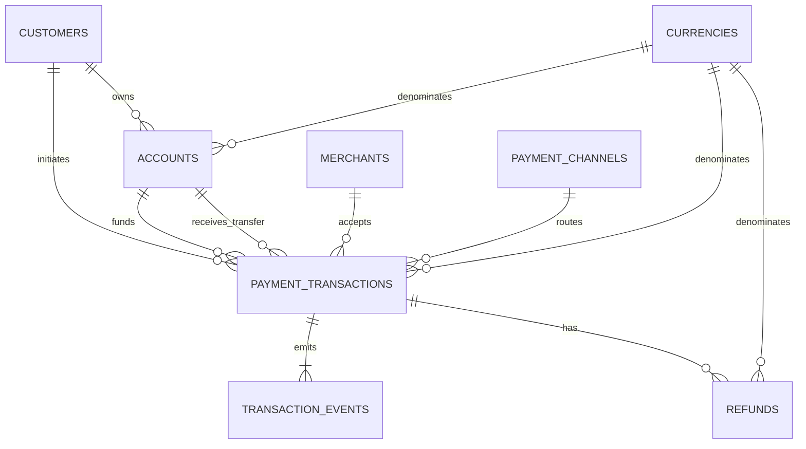

# Source Model

## Implemented source boundary through Phase 2

The PostgreSQL `payments` schema contains current OLTP entities and immutable transaction events.
Phase 2 adds a separate versioned settlement CSV source, SQLite control manifest, and immutable local
raw storage. No settlement table is added to PostgreSQL.

## Modeling rules

- Money is `NUMERIC(18,2)` in PostgreSQL and `Decimal` in Python.
- Timestamps are `TIMESTAMPTZ`; the generator emits UTC-aware values.
- UUID identifiers are generated by the application, enabling deterministic fixtures.
- Statuses use `CHECK` constraints rather than PostgreSQL enums so a later migration can extend an
  allowed set without enum-specific deployment behavior.
- Codes for currencies, payment channels, and merchant categories use reference tables because they
  carry reusable metadata and foreign-key relationships.
- Current-state records can update; `transaction_events` cannot update or delete in normal flow.
- The source stores no plaintext national ID, card PAN, CVV, bank credential, or access token.

## Implemented entities

| Entity | Grain | Key | Change semantics |
| --- | --- | --- | --- |
| `currencies` | One supported three-letter currency code | `currency_code` | Controlled reference update |
| `payment_channels` | One normalized payment channel | `payment_channel_code` | Controlled reference update |
| `merchant_categories` | One normalized merchant category | `category_code` | Controlled reference update |
| `customers` | One current customer | `customer_id` | Insert/update; email unique when present |
| `accounts` | One current single-currency customer account | `account_id` | Insert/update; nonnegative balance |
| `merchants` | One current merchant | `merchant_id` | Insert/update; business and external keys unique |
| `payment_transactions` | One current payment transaction | `transaction_id` | Insert/update through declared status lifecycle |
| `transaction_events` | One immutable lifecycle event for one transaction | `event_id` | Append only |
| `refunds` | One current refund request/lifecycle | `refund_id` | Insert/update through declared status lifecycle |
| Settlement CSV row | One partner-reported settlement item | Partner, date, settlement reference | Immutable raw file delivery |
| Settlement manifest | One unique partner/source SHA-256 content identity | Deterministic `file_id` | Controlled lifecycle updates |

Detailed columns, constraints, indexes, and lifecycle semantics are in
[OLTP schema](oltp-schema.md).

## Relationships

A merchant payment has a merchant and no destination account. An account transfer has a destination
account and no merchant. Source and destination accounts must differ; the generator also ensures
their currencies match.

## Settlement file relationship

`internal_transaction_id` is nullable partner input and will later reference
`payments.payment_transactions.transaction_id` logically. Phase 2 validates UUID shape only and does
not query PostgreSQL. `partner_transaction_reference`, amounts, currency, and status provide later
matching evidence.

The executable contract and detailed rules are documented in
[Banking Partner Settlement Contract](settlement-contract.md).

## Deferred source entities and metadata

Warehouse/Silver settlement tables and reconciliation results are not created in Phase 2. The raw
file, rejected-record evidence, and SQLite manifest are local ingestion artifacts rather than
analytics models.

Future CDC records will add source LSN, source transaction, commit time, topic/partition/offset,
ingestion time, and processing time outside the OLTP tables. Those metadata fields are not simulated
as if CDC already existed.
