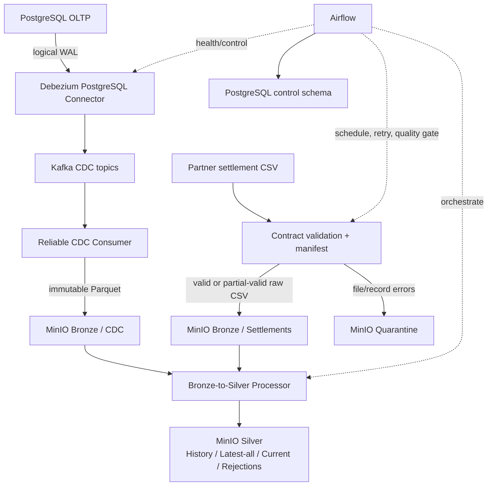

# Fintech Payments Data Platform — Demo Guide

## 1. Mục đích và phạm vi

Tài liệu này hướng dẫn demo toàn bộ năng lực đã triển khai từ Phase 0 đến Phase 7. Buổi demo kết thúc tại Silver và Airflow control plane; Snowflake, dbt, Gold marts, dashboard và observability platform chưa thuộc phạm vi hiện tại.

Các lệnh `make` giả định Git Bash, WSL hoặc môi trường Linux có GNU Make. Trên PowerShell, có thể chạy trực tiếp lệnh Python hoặc Docker Compose tương ứng được nêu bên cạnh.

> Security note: chỉ dùng môi trường local development. Không trình chiếu `.env`, connection URI, raw customer payload hoặc password. Mọi giá trị nhạy cảm dưới đây đều là tên biến hoặc placeholder.

## 2. Kiến trúc tổng thể



Source-of-truth boundaries:

- PostgreSQL `payments`: business transaction state.
- Kafka: ordered CDC log by topic-partition.
- Bronze: immutable raw source evidence.
- Component SQLite manifests: file, CDC batch và Silver object-level state.
- Silver: normalized history, latest-all, current, settlements và quality outputs.
- Airflow metadata DB: scheduler/task execution state.
- PostgreSQL `control`: cross-pipeline runs, quality results và backfill requests.

## 3. Services, ports và UI

| Service | Vai trò | Host port mặc định | UI/API | Credential khi demo |
| --- | --- | ---: | --- | --- |
| `postgres` | OLTP payments và CDC source | `5432` | Không có UI tích hợp | `${POSTGRES_USER}` / `<POSTGRES_PASSWORD from .env>` |
| `minio` | Bronze, quarantine và Silver object storage | API `9000`, Console `9001` | [MinIO Console](http://localhost:9001) | `${MINIO_ACCESS_KEY}` / `<MINIO_SECRET_KEY from .env>` |
| `minio-init` | Tạo ba private buckets idempotently | Không expose | One-shot bootstrap, không có UI | Không áp dụng |
| `kafka` | CDC topics, partitions, offsets và consumer groups | `29092` trên loopback | Không có UI tích hợp | Không bật SASL trong local phase |
| `kafka-connect` | Debezium Connect runtime | `8083` trên loopback | REST API, không phải UI: [Connectors API](http://localhost:8083/connectors) | Không có UI login |
| `connector-init` | PostgreSQL CDC grants/publication và connector bootstrap | Không expose | One-shot bootstrap, không có UI | Dùng env nội bộ |
| `cdc-consumer` | Kafka CDC → immutable Bronze Parquet | Không expose | Không có UI; chạy qua Compose profile | Dùng env nội bộ |
| `airflow-postgres` | Airflow metadata và `control` schema | Không expose | Không có UI | Dùng env nội bộ |
| `airflow-init` | DB migration và control schema bootstrap | Không expose | One-shot bootstrap | Không áp dụng |
| `airflow-webserver` | Airflow 3 API server và UI | `8080` trên loopback | [Airflow UI](http://localhost:8080) | `${AIRFLOW_ADMIN_USER}` / `<generated runtime password>` |
| `airflow-scheduler` | DAG scheduling và task execution | Không expose | Quan sát qua Airflow UI | Không áp dụng |
| `airflow-dag-processor` | Parse DAG độc lập | Không expose | DAG import state trong Airflow UI | Không áp dụng |

Port có thể khác nếu `.env` override `POSTGRES_PORT`, `MINIO_API_PORT`, `MINIO_CONSOLE_PORT`, `KAFKA_EXTERNAL_PORT`, `KAFKA_CONNECT_PORT` hoặc `AIRFLOW_WEB_PORT`.

### Airflow login

- Username: giá trị `${AIRFLOW_ADMIN_USER}`; placeholder trong `.env.example` là `platform-admin`.
- Password: Airflow Simple Auth Manager sinh khi API server khởi tạo user và lưu tại path cấu
  hình trong private logs volume.
- Lệnh an toàn khi share screen: `make airflow-demo-login-info`; lệnh này không in password.
- Chỉ trong terminal riêng tư: `make airflow-show-demo-password CONFIRM=1`; target đọc đúng user từ
  file credential đã cấu hình, không scan toàn bộ logs.
- Không copy password thật vào tài liệu, chat, slide hoặc screenshot.

### Công cụ UI được đề xuất nhưng không thuộc Compose

- **DBeaver**: kết nối PostgreSQL tại `localhost:${POSTGRES_PORT}` để xem schema và chạy câu lệnh demo. Không lưu password vào repository.
- **VS Code**: xem source, contracts và file Parquet đã tải từ MinIO.
- **Kafka UI hoặc AKHQ**: rất hữu ích để trình chiếu topic, partition, offset và consumer lag, nhưng hiện chưa được cài. Phase hiện tại dùng script `cdc-inspect` và Airflow health DAG; tài liệu này không thêm dependency/service.

## 4. Demo modes

### Mode A — Prepared demo

Dùng acceptance/rehearsal data đã tồn tại: MinIO objects, sanitized CLI output, DAG runs và control
evidence đã được kiểm tra trước. Đây là mode ít rủi ro nhất, không phụ thuộc event mới và phù hợp
phần lớn portfolio walkthrough.

### Mode B — Live incremental demo

Dùng seed và consumer group riêng, tạo một lượng nhỏ OLTP changes, quan sát CDC, chạy consumer có
`--max-messages`, rồi xử lý Silver với `--max-objects`. Mode này trực quan hơn nhưng phụ thuộc
runtime health, backlog và namespace chưa từng dùng.

### Mode C — Offline fallback

Dùng architecture diagram, screenshots và saved sanitized command output. Không phụ thuộc Docker,
network hoặc services, và không dùng raw payload/credential artifacts.

**Khuyến nghị cho interview:** Mode A làm nền, cộng một live CDC change nhỏ của Mode B. Chuẩn bị
Mode C để tiếp tục câu chuyện reliability nếu laptop hoặc Docker gặp sự cố.

## 5. Chuẩn bị môi trường sạch

### 5.1 Yêu cầu

- Docker Desktop với Docker Compose v2.
- Python 3.11+.
- Git Bash/WSL/Linux nếu dùng Makefile; PowerShell vẫn dùng được các lệnh Docker/Python trực tiếp.
- Ít nhất các port local `5432`, `8080`, `8083`, `9000`, `9001`, `29092` chưa bị chiếm, hoặc đã override trong `.env`.

### 5.2 Tạo cấu hình local

PowerShell:

```powershell
Copy-Item .env.example .env
python -m venv .venv
.venv\Scripts\Activate.ps1
python -m pip install --upgrade pip
pip install -e ".[dev]"
```

Git Bash/WSL/Linux:

```bash
cp .env.example .env
python -m venv .venv
source .venv/bin/activate  # Git Bash on Windows: source .venv/Scripts/activate
python -m pip install --upgrade pip
pip install -e ".[dev]"
```

Trong `.env`, thay mọi placeholder `change_me` và sinh giá trị riêng cho Airflow Fernet/JWT secrets. Không trình chiếu file này.

### 5.3 Preflight

```bash
make validate
docker compose --env-file .env config --services
```

Expected output:

- lint, format, unit/default tests, YAML và Compose validation thành công;
- danh sách service không có Snowflake, dbt, Spark, Flink hoặc dashboard service.

## 6. Startup lifecycle

### 6.1 Cold start

Dùng sau fresh clone, khi container/volume chưa tồn tại, hoặc khi Airflow image/dependencies đã đổi.
Khởi động theo tầng giúp lỗi dễ khoanh vùng:

```bash
make postgres-up
make minio-up
make cdc-up
make airflow-build
make airflow-init
make airflow-up
make airflow-dags-list
```

`airflow-build` rebuild custom image; `airflow-init` chạy metadata migration và control bootstrap;
`airflow-up` khởi động API server, scheduler và DAG processor. Không chạy reset trong normal demo.

Sau khi core services healthy, chọn một CDC consumer mode:

```bash
# Bounded, phù hợp rehearsal/interview
make cdc-consumer-once CDC_CONSUMER_ARGS="--storage-backend minio --group-id ${CDC_CONSUMER_GROUP_ID} --max-messages 100"

# Hoặc long-running service ngoài Airflow
docker compose --env-file .env --profile cdc-consumer up -d --build cdc-consumer
```

`cdc-consumer` là profile-gated và không được biến thành task Airflow vô hạn.

### 6.2 Warm start

Dùng cho checkout và named volumes đã được khởi tạo:

```bash
docker compose --env-file .env up -d
make cdc-status
make airflow-dags-list
```

Không dùng `docker compose start` làm hướng dẫn mặc định: lệnh đó chỉ chạy container đã tồn tại,
không tạo service mới, không áp dụng thay đổi Compose và không rebuild image. `up -d` reconcile cấu
hình hiện tại và tái sử dụng container phù hợp. Chỉ thêm `--build` hoặc chạy `make airflow-build`
khi image/project dependency đã đổi; chỉ chạy `make airflow-init` khi metadata chưa được khởi tạo
hoặc migration được yêu cầu rõ ràng.

### 6.3 Start, initialize, rebuild và reset

| Hành động | Lệnh | Khi dùng |
| --- | --- | --- |
| Start/reconcile services | `docker compose --env-file .env up -d` | Warm start thông thường |
| Rebuild Airflow image | `make airflow-build` | Dockerfile/package dependency đổi |
| Initialize/migrate metadata | `make airflow-init` | Fresh metadata volume hoặc migration có chủ đích |
| Start Airflow runtime | `make airflow-up` | API/scheduler/DAG processor cần chạy |
| Reset state | Guarded `*-reset`/`reset-*` targets | Không dùng trong normal demo |

## 7. Startup estimates

Đây là ước lượng local để lập rehearsal buffer, không phải benchmark hoặc production SLA.

| Bước | Ước lượng local |
| --- | ---: |
| PostgreSQL start + health | 10–30 giây |
| MinIO start + bucket bootstrap | 10–30 giây |
| Kafka start + health | 30–90 giây |
| Kafka Connect start + health | 30–90 giây |
| Debezium connector bootstrap | 10–30 giây |
| Airflow image build | 60–300 giây khi cold cache |
| Airflow metadata initialization | 20–90 giây |
| Airflow API/scheduler/DAG processor | 30–120 giây |
| Bounded CDC consumer | khoảng 5–60 giây, tùy backlog/assignment |
| Bounded Silver processor | khoảng 5–120 giây, tùy số lượng/kích thước objects |

Thời gian phụ thuộc Docker Desktop, CPU, RAM, disk, image cache, Kafka backlog và số Bronze objects.
Chuẩn bị ít nhất 5 phút trước khi share screen.

## 8. Demo namespace

Ghi namespace của từng rehearsal trong private operator notes để không đoán seed/group/request đã
dùng. Chỉ các biến/option thực sự được implementation hỗ trợ mới được đưa vào command.

| Tên | Support thực tế | Cách dùng |
| --- | --- | --- |
| `DEMO_ID` | Operator convention | Nhãn notes/screenshots; không phải application env |
| `GENERATOR_SEED` | Env và `--seed` | Seed mới cho OLTP changes |
| `CDC_CONSUMER_GROUP_ID` | Env và `--group-id` | Group riêng cho live demo nếu muốn đọc history |
| `DEMO_DATE` | Operator convention; settlement CLI có `--settlement-date` | Ngày rehearsal/input |
| `SETTLEMENT_SEQUENCE` | Operator convention | Fixture generator hiện tự sinh sequence `001`–`007`; không có `--sequence` |
| `BACKFILL_REQUEST_ID` | DAG parameter `request_id`, không phải env | UUID mới cho mỗi manual request |
| `SILVER_RUN_NAMESPACE` | Không hỗ trợ | Silver tự sinh run ID; `--force-reprocess` tạo lineage mới |

Git Bash/WSL example:

```bash
export DEMO_ID=demo-20260723-01
export GENERATOR_SEED=9231
export CDC_CONSUMER_GROUP_ID=fintech-demo-20260723-01
export DEMO_DATE=2026-07-23
export BACKFILL_REQUEST_ID="$(python -c 'import uuid; print(uuid.uuid4())')"
```

PowerShell example:

```powershell
$env:DEMO_ID = "demo-20260723-01"
$env:GENERATOR_SEED = "9231"
$env:CDC_CONSUMER_GROUP_ID = "fintech-demo-20260723-01"
$env:DEMO_DATE = "2026-07-23"
$env:BACKFILL_REQUEST_ID = [guid]::NewGuid().ToString()
```

Không reuse UUID cố định cho backfill live. `DEMO_ID`, `DEMO_DATE` và `SETTLEMENT_SEQUENCE` không tự
động thay đổi object key; chúng chỉ là operator convention cho việc chuẩn bị artifacts.
Passing `--group-id` đổi group của bounded CLI run nhưng không đổi group mà Airflow health DAG đang
theo dõi. Muốn Airflow theo dõi demo group phải cập nhật ignored `.env` và reconcile services trước
rehearsal; không đổi giữa live interview.

## 9. Health checks

```bash
docker compose --env-file .env ps
make cdc-status
make airflow-dags-list
```

PowerShell endpoint checks:

```powershell
Invoke-WebRequest http://localhost:9000/minio/health/ready -UseBasicParsing
Invoke-WebRequest http://localhost:8080/api/v2/monitor/health -UseBasicParsing
Invoke-RestMethod http://localhost:8083/connectors/payments-postgres-cdc/status
```

Expected state:

- `postgres`, `minio`, `kafka`, `kafka-connect`, `airflow-postgres`, `airflow-webserver`, `airflow-scheduler` và `airflow-dag-processor` healthy;
- Debezium connector và task `RUNNING`;
- bốn DAG IDs xuất hiện: `settlement_batch_pipeline`, `cdc_bronze_control`, `cdc_silver_processing_pipeline`, `data_platform_backfill`;
- `minio-init`, `connector-init`, `airflow-init` đã hoàn thành thành công;
- `cdc-consumer` chỉ xuất hiện nếu profile được bật.

## 10. Bounded-command stop conditions

| Command | Điều kiện dừng | Exit code mong đợi | Dấu hiệu không bị treo |
| --- | --- | --- | --- |
| `make cdc-consumer-once CDC_CONSUMER_ARGS="--storage-backend minio --group-id ${CDC_CONSUMER_GROUP_ID} --max-messages 100"` | Đủ 100 polled messages, hoặc sau assignment có hai poll rỗng liên tiếp; assignment timeout tối đa 30 giây | `0` khi flush/commit sạch; non-zero khi config, Kafka, upload hoặc commit lỗi | Structured JSON run result được in; default poll là 1 giây nên empty backlog thường kết thúc nhanh sau assignment |
| `make silver-process-cdc SILVER_CDC_ARGS="--storage-backend minio --input-prefix cdc/ --max-objects 20"` | Discovery hữu hạn, xử lý tối đa 20 objects rồi trả về | `0` nếu mọi discovered object `COMPLETED` hoặc không có object; `2` nếu result chứa skip/failure hoặc config/runtime lỗi | Một JSON object chứa `discovered` và `results` được in |
| `make silver-process-settlements SILVER_SETTLEMENT_ARGS="--storage-backend minio --input-prefix settlements/ --max-objects 20"` | Như CDC Silver nhưng chỉ settlement prefix, tối đa 20 objects | Cùng semantics với Silver CDC | Structured JSON xuất hiện sau từng bounded discovery run |
| `make trigger-settlement-pipeline` / `make trigger-cdc-silver-pipeline` | CLI dừng ngay khi Airflow chấp nhận hoặc từ chối trigger; DAG tiếp tục bất đồng bộ | `0` nghĩa trigger được chấp nhận, không có nghĩa DAG đã success | Run ID được in; theo dõi completion trong Grid/UI |
| `make trigger-backfill BACKFILL_CONF='<json>'` | CLI dừng sau khi submit manual run; dry-run DAG vẫn phải execute để validate/read | `0` nghĩa request được Airflow chấp nhận | Run ID xuất hiện; xem `validate_backfill_request` và `execute_backfill` trong UI |

`--once` có SIGINT/SIGTERM handler: Ctrl+C dừng poll mới, flush pending valid batches, commit uploaded
ranges và đóng consumer. Silver CLI không có custom signal handler; không chủ động Ctrl+C giữa object
write. Nếu buộc phải dừng, chạy lại dựa trên immutable output/manifest và kiểm tra status thay vì sửa
state thủ công.

Thời lượng trong bảng startup chỉ là rehearsal estimate. Backlog lớn, cold image cache hoặc object
lớn có thể lâu hơn; dùng terminal JSON, Airflow run ID và UI task state làm progress evidence.

## 11. Demo theo phase

### Phase 0 — Project Foundation

**Mục tiêu:** chứng minh repository có boundaries rõ, quality gates và tài liệu làm nền cho các phase độc lập.

**Services:** không yêu cầu runtime service.

**Command:**

```bash
make validate
```

**Expected output:** Ruff, format check, default tests, YAML validation và Compose validation đều thành công.

**Verify:** mở `README.md`, `docs/roadmap.md`, `.github/workflows/ci.yml` và cây `src/`, `tests/`, `infrastructure/`, `airflow/`, `contracts/`.

> Screenshot placeholder — Repository tree, CI quality gates và roadmap Phase 0–7.

### Phase 1 — PostgreSQL OLTP và realistic data generator

**Mục tiêu:** tạo dữ liệu payments có quan hệ, lifecycle hợp lệ, `NUMERIC(18,2)` và timestamps timezone-aware.

**Services:** `postgres`; DBeaver là UI ngoài Compose được khuyến nghị.

**Command:**

```bash
make postgres-up
make generate-data GENERATOR_ARGS="--once --seed ${GENERATOR_SEED} --customers 10 --merchants 5 --transactions 50 --invalid-rate 0 --duplicate-rate 0"
```

PowerShell không dùng Make:

```powershell
.venv\Scripts\python.exe -m generators.cli --once --seed $env:GENERATOR_SEED --customers 10 --merchants 5 --transactions 50 --invalid-rate 0 --duplicate-rate 0
```

**Expected output:** generator log một transaction commit với số customers, accounts, merchants, transactions, events và refunds đã tạo. Cùng seed tạo cùng domain plan; database constraints bảo vệ dữ liệu persisted.

**Verify trong DBeaver/psql:**

```sql
SELECT 'customers' AS entity, COUNT(*) FROM payments.customers
UNION ALL SELECT 'accounts', COUNT(*) FROM payments.accounts
UNION ALL SELECT 'merchants', COUNT(*) FROM payments.merchants
UNION ALL SELECT 'payment_transactions', COUNT(*) FROM payments.payment_transactions
UNION ALL SELECT 'transaction_events', COUNT(*) FROM payments.transaction_events
UNION ALL SELECT 'refunds', COUNT(*) FROM payments.refunds;

SELECT transaction_id, amount, currency, status, requested_at
FROM payments.payment_transactions
ORDER BY requested_at DESC
LIMIT 10;
```

Điểm cần nói: `amount`/`balance` không dùng float; transaction status có event lifecycle; secrets không nằm trong code.

> Screenshot placeholder — DBeaver hiển thị sáu business tables, counts và một transaction lifecycle.

### Phase 2 — Settlement batch ingestion foundation

**Mục tiêu:** chứng minh versioned contract, filename/checksum validation, manifest idempotency, Bronze raw và quarantine tách biệt.

**Services:** Python ingestion service; `minio` nếu chọn backend MinIO.

**Command tạo deterministic scenarios:**

```bash
make generate-settlement-fixtures SETTLEMENT_FIXTURE_SEED=42
```

Happy-path ingest một file cụ thể:

```bash
make ingest-settlements-minio SETTLEMENT_INGEST_ARGS="--file data/inbound/settlements/settlement_VCB_2026-07-22_001.csv --partner-id VCB --contract contracts/batch/settlement_v1.yml"
```

Quality-path ingest toàn bộ fixture directory:

```bash
make ingest-settlements-minio
```

**Expected output:** CLI trả structured JSON cho từng file. Valid/partial-valid source được copy byte-for-byte vào Bronze; invalid rows hoặc file-level invalid được ghi quarantine; manifest lưu SHA-256 và lifecycle. Quality-path có thể trả exit code khác 0 vì fixture set cố ý chứa invalid file — đây là expected quality evidence, không phải platform outage.

**Verify:** mở MinIO Console:

- `fintech-bronze/settlements/partner_id=VCB/...`;
- `fintech-quarantine/settlements/...`;
- đối chiếu record/accepted/rejected counts trong CLI result và manifest.

> Screenshot placeholder — Contract `settlement_v1.yml`, structured ingestion result và Bronze/quarantine objects.

### Phase 3 — MinIO-backed shared Bronze storage

**Mục tiêu:** trình bày local/MinIO storage abstraction, private buckets và immutable collision semantics.

**Services/UI:** `minio`, `minio-init`, [MinIO Console](http://localhost:9001).

**Command:**

```bash
make minio-up
docker compose --env-file .env ps minio minio-init
```

**Expected output:** MinIO healthy; init service exit thành công; buckets `fintech-bronze`, `fintech-quarantine`, `fintech-silver` tồn tại và không public.

**Verify trong MinIO Console:**

1. Mở bucket `fintech-bronze`.
2. Đi theo prefix `settlements/partner_id=VCB/settlement_date=2026-07-22/`.
3. Chọn raw CSV và xem metadata/checksum.
4. Chạy lại happy-path Phase 2: cùng key + cùng checksum là idempotent; không tạo bản sao.

Điểm cần nói: cùng key nhưng checksum khác làm explicit immutable collision; hệ thống không silently overwrite.

> Screenshot placeholder — MinIO Console với ba private buckets, partitioned object path và SHA-256 metadata.

### Phase 4 — PostgreSQL CDC với Debezium và Kafka

**Mục tiêu:** chứng minh initial snapshot và các thay đổi OLTP được phát thành Debezium envelope trên table-specific Kafka topics.

**Services:** `postgres`, `kafka`, `kafka-connect`, `connector-init`. Kafka hiện chưa có UI.

**Command:**

```bash
make cdc-up
make cdc-status
make cdc-inspect CDC_TABLE=payment_transactions
```

Tạo thêm thay đổi live an toàn bằng một seed mới:

```bash
make generate-data GENERATOR_ARGS="--once --seed $((GENERATOR_SEED + 1)) --customers 1 --merchants 1 --transactions 5 --invalid-rate 0 --duplicate-rate 0"
make cdc-inspect CDC_TABLE=customers
make cdc-inspect CDC_TABLE=payment_transactions
make cdc-inspect CDC_TABLE=transaction_events
make cdc-inspect CDC_TABLE=refunds
```

**Expected output:** connector/task `RUNNING`; inspector chỉ hiển thị key, `op`, table, snapshot flag, LSN, partition và offset — không in full PII payload. Snapshot dùng `op=r`; inserts/updates/deletes tương ứng `c/u/d` khi thao tác đó xảy ra. Decimal được Debezium giữ ở `precise` mode, không chuyển thành double.

**Verify:**

- REST `GET /connectors/payments-postgres-cdc/status`;
- topics theo convention `fintech.cdc.payments.<table>`;
- source LSN và Kafka coordinates hiện diện trong inspector output.

> Screenshot placeholder — Connector RUNNING và sanitized CDC inspector output cho customer/payment/event/refund.

### Phase 5 — Reliable CDC Consumer → Bronze Parquet

**Mục tiêu:** trình bày partition-aware micro-batching, upload-before-commit và replay-safe immutable Parquet.

**Services:** `kafka`, `cdc-consumer`, `minio`.

**Command bounded:**

```bash
make cdc-consumer-once CDC_CONSUMER_ARGS="--storage-backend minio --group-id ${CDC_CONSUMER_GROUP_ID} --max-messages 100"
make inspect-cdc-bronze
```

Hoặc consumer liên tục:

```bash
docker compose --env-file .env --profile cdc-consumer up -d --build cdc-consumer
make cdc-consumer-logs
```

**Expected output:** consumer tạo object theo entity/topic/partition/contiguous offset range, upload Parquet và metadata, ghi manifest `UPLOADED`, commit `offset_end + 1`, rồi ghi `COMMITTED`. Bounded run dừng sạch sau giới hạn/idle condition.

**Verify trong MinIO Console:**

- `fintech-bronze/cdc/entity=<entity>/event_date=<date>/topic=<topic>/partition=<n>/...`;
- object metadata có offset range, checksum, schema version và consumer group;
- không có credentials hoặc raw payload trong object metadata;
- chạy lại cùng group không tạo object khác cho range đã commit.

> Screenshot placeholder — CDC Bronze Parquet path, metadata, offset range và committed manifest summary.

### Phase 6 — Bronze-to-Silver processing

**Mục tiêu:** chuẩn hóa CDC/settlement data thành history, latest-all, active-current, settlements, rejections và unresolved references.

**Services:** Python Silver processor và `minio`.

**Command:**

```bash
make silver-process-cdc SILVER_CDC_ARGS="--storage-backend minio --input-prefix cdc/ --max-objects 20"
make silver-process-settlements SILVER_SETTLEMENT_ARGS="--storage-backend minio --input-prefix settlements/ --max-objects 20"
make silver-inspect SILVER_INSPECT_ARGS="--storage-backend minio"
```

**Expected output:** structured processing results gồm discovered/skipped/completed/rejected counts và immutable output URIs. Same input checksum + code/schema version được skip; `--force-reprocess` tạo lineage run mới thay vì overwrite.

**Verify trong MinIO Console:**

- `fintech-silver/silver/cdc/history/` giữ event grain;
- `fintech-silver/silver/cdc/latest_all/` giữ latest state kể cả delete;
- `fintech-silver/silver/cdc/current/` chỉ giữ active latest state;
- `fintech-silver/silver/settlements/` chứa normalized settlement Parquet;
- `fintech-silver/silver/rejections/` và `silver/unresolved_references/` chứa quality evidence khi có.

Điểm cần nói: Kafka coordinates quyết định ordering trong partition; Decimal dùng Arrow decimal; timestamps được normalize UTC; delete không bị loại trước latest-all.

> Screenshot placeholder — Silver history/latest-all/current folders và schema/Decimal/timestamp inspection.

### Phase 7 — Airflow orchestration và central control plane

**Mục tiêu:** chứng minh DAG dependency, retries, schedules, quality gates, backfill và orchestration-level state mà không nhúng business logic vào DAG.

**Services/UI:** `airflow-postgres`, `airflow-init`, `airflow-webserver`, `airflow-scheduler`, `airflow-dag-processor`, [Airflow UI](http://localhost:8080).

**Command:**

```bash
make airflow-build
make airflow-init
make airflow-up
make airflow-dags-list
make airflow-demo-login-info
```

Trigger các flow:

```bash
make trigger-settlement-pipeline
make trigger-cdc-silver-pipeline
docker compose --env-file .env exec airflow-scheduler airflow dags trigger cdc_bronze_control
make trigger-backfill BACKFILL_CONF="{\"request_id\":\"${BACKFILL_REQUEST_ID}\",\"source_type\":\"CDC\",\"dry_run\":true}"
```

PowerShell không có GNU Make:

```powershell
$backfillConf = @{
    request_id = $env:BACKFILL_REQUEST_ID
    source_type = "CDC"
    dry_run = $true
} | ConvertTo-Json -Compress

docker compose --env-file .env exec airflow-scheduler `
    airflow dags trigger data_platform_backfill --conf $backfillConf
```

**Expected output:** bốn DAG được parse; trigger trả run ID; Grid/Graph thể hiện task dependencies. Quality gate trả `PASS`, `WARN` hoặc `FAIL`; dry-run backfill validate plan nhưng không ghi output hoặc processing completion.

Trước khi share screen, chỉ chạy `make airflow-demo-login-info`. Chạy
`make airflow-show-demo-password CONFIRM=1` trong terminal riêng tư, đăng nhập, rồi đóng/clear
terminal đó trước khi bắt đầu recording.

**Verify trong Airflow UI:**

1. `settlement_batch_pipeline`: discover → ingest → validate → Silver → quality → record success.
2. `cdc_bronze_control`: PostgreSQL/Kafka/Connect/connector/lag/freshness health checks; không chạy consumer vô hạn.
3. `cdc_silver_processing_pipeline`: entity dependencies customers → accounts và customers/accounts/merchants → payments → events/refunds.
4. `data_platform_backfill`: validated parameters, request ID, bounded concurrency và safe dry-run.
5. XCom chỉ chứa IDs, URIs, counts hoặc metadata nhỏ — không có file/payload/customer data.

Control evidence, Git Bash/WSL:

```bash
docker compose --env-file .env exec airflow-postgres sh -c \
  'psql -U "$POSTGRES_USER" -d "$POSTGRES_DB" -c \
  "SELECT pipeline_name, status, records_read, records_written, records_rejected, started_at FROM control.pipeline_runs ORDER BY started_at DESC LIMIT 10;"'

docker compose --env-file .env exec airflow-postgres sh -c \
  'psql -U "$POSTGRES_USER" -d "$POSTGRES_DB" -c \
  "SELECT pipeline_run_id, rule_name, classification, observed_value, warn_threshold, fail_threshold FROM control.data_quality_results ORDER BY evaluated_at DESC LIMIT 10;"'
```

PowerShell (giữ mỗi `sh -c` payload trên một dòng):

```powershell
docker compose --env-file .env exec -T airflow-postgres sh -c 'psql -U "$POSTGRES_USER" -d "$POSTGRES_DB" -c "SELECT pipeline_name, status, records_read, records_written, records_rejected, started_at FROM control.pipeline_runs ORDER BY started_at DESC LIMIT 10;"'

docker compose --env-file .env exec -T airflow-postgres sh -c 'psql -U "$POSTGRES_USER" -d "$POSTGRES_DB" -c "SELECT pipeline_run_id, rule_name, classification, observed_value, warn_threshold, fail_threshold FROM control.data_quality_results ORDER BY evaluated_at DESC LIMIT 10;"'
```

Các biến trong các lệnh trên được đọc bên trong container; password không xuất hiện trên command
line. Không đưa query output chứa error detail nhạy cảm vào screenshot.

> Screenshot placeholder — Airflow Grid/Graph của ba pipeline, backfill dry-run và control/quality result counts.

## 12. Câu chuyện failure/recovery ngắn

Khi interviewer hỏi “nếu lỗi giữa chừng thì sao?”, dùng ba ví dụ:

1. **Batch:** raw Bronze write chỉ xảy ra sau validation; file-level invalid vào quarantine; checksum đã processed được skip.
2. **CDC consumer:** upload → manifest `UPLOADED` → commit Kafka `offset_end + 1` → manifest `COMMITTED`. Crash sau upload/trước commit sẽ replay và verify deterministic object/checksum trước khi commit lại.
3. **Silver/Airflow:** Silver chỉ `COMPLETED` sau mọi required output; Airflow retry dựa trên component idempotency. Airflow state không thay thế component manifests.

Không tuyên bố exactly-once end-to-end; semantics là effectively-once tại Bronze với replay/dedup bằng Kafka coordinates và checksum.

## 13. Dừng services sau demo

Các lệnh này dừng container nhưng không xóa named volumes:

```bash
make airflow-down
docker compose --env-file .env --profile cdc-consumer rm --stop --force cdc-consumer
make cdc-down
make minio-down
make postgres-down
```

Không chạy `docker compose down -v`, `postgres-reset`, `minio-reset`, `reset-airflow-metadata`, `reset-cdc-consumer-state` hoặc `reset-silver-state` trong demo trừ khi đã backup và chủ động xác nhận phạm vi xóa.

## 14. Known limitations cần nói rõ

### Implemented

- PostgreSQL OLTP, deterministic generator và constraints.
- Settlement contract, manifest, Bronze/quarantine và local/MinIO adapters.
- Debezium PostgreSQL CDC, Kafka topics và reliable CDC consumer.
- Bronze-to-Silver history/latest-all/current/settlement/quality outputs.
- Airflow LocalExecutor, metadata PostgreSQL riêng, control schema, quality gates và backfill dry-run.

### Planned

- Snowflake publication, dbt transformations và Gold marts trong các phase sau.
- Distributed control manifests/locking, production credentials, TLS/SASL/ACL/KMS và centralized observability.
- Kafka UI/AKHQ nếu demo tooling được mở rộng có chủ đích.

### Out of scope hiện tại

- Dashboard/BI, reconciliation Gold logic, Spark/Flink, metadata catalog và production Kubernetes deployment.
- Kafka UI, DBeaver và VS Code không phải service của repository.
