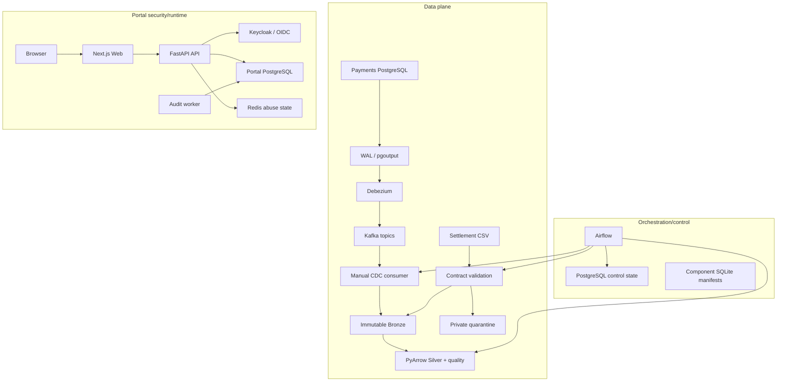

# System-context evidence

| Field         | Value                                                |
| ------------- | ---------------------------------------------------- |
| Provenance    | `generated-from-source`                              |
| Source commit | `11ba97f539f9f3ed7e16c2e772a9988afce7e9e5`           |
| Sanitization  | `reviewed-safe`                                      |
| Runtime proof | No; architecture derived from tracked implementation |

There is deliberately no Portal-to-data-plane edge. The Portal does not operate Kafka, MinIO,
Airflow, or Silver.
