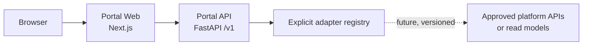

# Portal architecture boundaries

## Purpose

PR-PORTAL-001 introduces an independently deployable web shell and Backend for Frontend (BFF).
It establishes safe control-plane boundaries; it does not implement operational platform
capabilities.

The Portal is a client of authoritative platform state. It is not a replacement source of truth.

## Enforced boundaries

- Browser requests use the Portal Web origin. API traffic is forwarded through the explicit
  `/portal-api/*` rewrite to the BFF.
- Browser bundles contain no PostgreSQL, Kafka, Kafka Connect, MinIO, Airflow, warehouse, or
  control-database credentials.
- Frontend code imports only generated Portal API contracts. Infrastructure response shapes end
  at future adapter boundaries.
- The BFF has no database, arbitrary proxy, Docker socket, infrastructure client, or mutation
  endpoint.
- The adapter registry is empty by default. An absent health check is never reported as healthy.
- Liveness is process-local. Readiness aggregates only enabled adapters and distinguishes optional
  degradation from required dependency failure.

Next.js App Router emits inline bootstrap scripts, so the foundation CSP permits inline scripts in
both modes and adds `unsafe-eval` only for development tooling. A nonce-based dynamic CSP is
deferred until the authentication/session boundary is introduced; production already excludes
`unsafe-eval`, external scripts, frames, objects, and non-self connections.

## Explicitly prohibited

The browser and BFF must not bypass application state machines, connect to infrastructure
databases, execute arbitrary SQL, return upstream bodies, expose raw financial records, or derive
authoritative state from browser input.

## Scope of this release

Implemented: application shell, health/status UI, FastAPI BFF, `/v1` contract, generated client,
Problem Details, correlation, structured logging, telemetry abstractions, security headers,
containers, tests, and local operations.

Deferred: authentication, authorization, capability registry business logic, sources, datasets,
pipelines, CDC administration, object browsing, previews, SQL, backfills, recovery, DLQ, approvals,
and all platform mutations.
