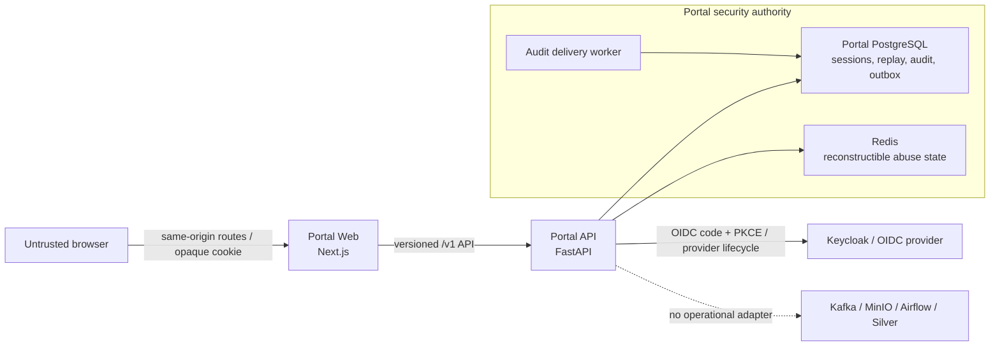

# Portal architecture boundaries

## Status and authority

The Portal Web/API foundation and PR-PORTAL-002 security runtime are implemented. This document
describes the current boundary; the original design-freeze and ADR documents remain historical
decision evidence.

The Portal is a separate identity, session, abuse-protection, audit, and operational-status
runtime. It is not the data platform's operational control plane and has no implemented adapter for
Kafka, MinIO, Airflow, or Silver.

See the [current platform architecture](../architecture/current-state.md) and
[canonical claims](../architecture/claims.md).

## Current trust boundary

```mermaid
flowchart LR
    Browser["Untrusted browser"] -->|"same-origin routes / opaque cookie"| Web["Portal Web<br/>Next.js"]
    Web -->|"versioned /v1 API"| API["Portal API<br/>FastAPI"]

    subgraph SecurityAuthority["Portal security authority"]
        Postgres["Portal PostgreSQL<br/>sessions, replay, audit, outbox"]
        Redis["Redis<br/>reconstructible abuse state"]
        Worker["Audit delivery worker"]
    end

    API -->|"OIDC code + PKCE / provider lifecycle"| OIDC["Keycloak / OIDC provider"]
    API --> Postgres
    API --> Redis
    Worker --> Postgres

    Platform["Kafka / MinIO / Airflow / Silver"]
    API -. "no operational adapter" .-> Platform
```

The dotted edge is a non-integration marker, not a request path.

## Implemented boundary

- Browser bundles receive only validated public configuration and never provider tokens or
  infrastructure credentials.
- Portal Web is a BFF-facing Next.js application; browser API requests remain same-origin.
- Portal API performs OIDC Authorization Code with PKCE and exact token validation.
- Browser sessions are opaque; server-side lifecycle and encrypted provider-token envelopes live
  under PostgreSQL authority.
- Provider refresh, rotation/reuse detection, revocation, logout, back-channel logout, fencing,
  replay defense, and crypto-erasure are implemented.
- Redis provides distributed abuse enforcement and bounded penalties, but is not session,
  provider-token, logout, or durable replay authority.
- Security audit and outbox rows commit transactionally; the worker delivers asynchronously with
  leases, fencing, retries, receipts, and explicit dead-letter/requeue behavior.
- Readiness requires PostgreSQL and OIDC when security runtime is enabled. Redis is optional and
  observable.
- Configuration, secret-reference, resolved-secret, runtime-state, and persisted-state boundaries
  are explicit.
- First-party containers and security scanning have bounded hardening/policy evidence.

## Authority model

| Concern                                | Authority                              | Not authoritative          |
| -------------------------------------- | -------------------------------------- | -------------------------- |
| External identity and provider session | OIDC provider                          | Browser claims             |
| Local principal/session/token envelope | Portal PostgreSQL                      | Redis or browser           |
| Durable logout/replay evidence         | Portal PostgreSQL                      | Redis fast hint            |
| Abuse counters and penalties           | Redis with bounded local fallback      | Session database           |
| Authorization decision                 | Portal API policy + server-owned state | Hidden/visible UI          |
| Security audit                         | Append-only Portal PostgreSQL ledger   | Application logs           |
| Archive delivery lifecycle             | PostgreSQL outbox/receipts             | In-memory worker state     |
| Data-platform operations               | Owning data-plane components           | Portal (no adapter exists) |

## Frontend boundary

- Public variables are typed and explicitly allowlisted.
- Internal Portal API URL and server runtime configuration are not exposed to browser bundles.
- Provider access, ID, and refresh tokens never enter the browser.
- Cookies use the documented HTTP-only, secure, same-site, path, expiry, rotation, and CSRF
  contracts.
- UI permission projection improves usability but is not authorization.
- Problem Details, logs, and browser telemetry exclude credentials and raw identity/provider data.

## Backend boundary

- Public application APIs use the versioned `/v1` contract; health endpoints remain outside it.
- The API does not expose arbitrary proxy, SQL, object-store, Docker socket, or infrastructure
  administration behavior.
- PostgreSQL roles separate migration, runtime, audit, and archive responsibilities.
- Missing/incompatible required readiness adapters fail closed.
- Callback and refresh transactions use deterministic sequencing and recovery/fencing.
- Logout and local crypto-erasure do not depend on Redis or provider availability.

## Data-platform boundary

The Portal cannot currently:

- administer Kafka topics, groups, or connectors;
- browse or mutate MinIO Bronze/Silver objects;
- trigger or inspect Airflow beyond external/manual repository workflows;
- query Silver datasets;
- run backfill, redrive, reconciliation, warehouse, dbt, or dashboard operations.

Those capabilities remain deferred until versioned backend APIs/read models, state machines,
authorization, idempotency, recovery, and audit contracts exist.

## Readiness and degradation

- `READY` requires every required dependency to pass.
- An empty dependency registry is `NOT_READY`.
- PostgreSQL and OIDC are required for the enabled security runtime.
- Redis failure is optional/degraded and activates operation-specific bounded behavior.
- Audit worker `DEGRADED` is operationally available when database, destination, and outbox are
  `UP` but bounded degraded evidence exists.
- One intentional poison event remains dead-lettered and must not be removed to make a demo green.

## Production boundary

The runtime is production-oriented but not production-authorized:

- staging/production security runtime authorization remains guarded;
- callback and abuse production policies remain deferred;
- no production workload identity, external secret-provider adapter, deployment target, HA/DR, or
  promotion process is approved;
- security findings are governed with bounded exceptions, not absent.

Do not describe the Portal or repository as production-ready.

## Historical design relationship

The PR-PORTAL-002 design freeze, threat model, authorization/failure matrices, implementation
prompt, and Portal ADRs record the original design and review intent. Implemented behavior has
advanced beyond statements that authentication/session runtime did not yet exist.

When historical wording conflicts with current behavior, use:

1. tracked implementation and tests;
2. [current architecture](../architecture/current-state.md);
3. current subsystem documentation;
4. historical design as rationale, not runtime status.
