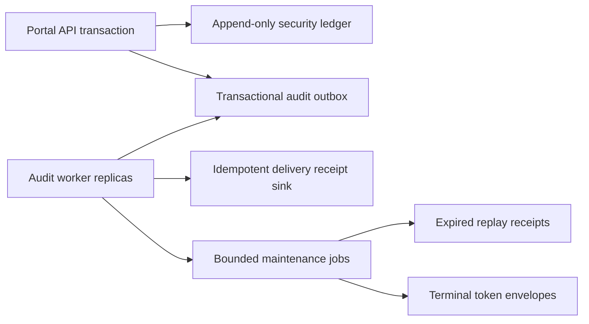

# Audit outbox delivery and background maintenance

Portal security actions and their audit evidence commit in one PostgreSQL transaction. Delivery is
asynchronous and at least once: a destination outage cannot roll back an authentication, logout,
revocation, or crypto-erasure that has already committed.

## Authority and failure boundaries



- PostgreSQL is the durable outbox, replay, session, and maintenance authority.
- Redis is not an audit or replay authority.
- The ledger and delivery-receipt sink are append only. Mutable delivery state lives only in the
  outbox.
- Delivery never runs inside the request transaction or while a claim transaction remains open.
- Maintenance never deletes active or refresh-required session authority.
- Worker-generated operational audit events set `local_only=true`; they enter the ledger but do
  not recursively enqueue another delivery.

## Delivery lifecycle

| State | Meaning | Next states |
| --- | --- | --- |
| `PENDING` | Committed and eligible | `LEASED` |
| `LEASED` | Owned by an expiring worker lease | `DELIVERED`, `RETRY_SCHEDULED`, `DEAD_LETTERED` |
| `RETRY_SCHEDULED` | Retry waits for bounded backoff | `LEASED` |
| `DELIVERED` | Idempotent destination receipt persisted | terminal |
| `DEAD_LETTERED` | Permanent failure or retry budget exhausted | `PENDING` after bounded operator requeue |
| `CANCELLED` | Administratively terminal | terminal |

Workers claim ordered bounded batches with `FOR UPDATE SKIP LOCKED`. Each claim receives a random
lease token. Finalization succeeds only when the record is still `LEASED` with the same token, so
a recovered or superseded worker cannot finalize stale work.

The current `local_postgres` destination persists an append-only receipt keyed by
`event_id:destination:payload_version`. Re-delivery returns `ALREADY_DELIVERED`; it never creates a
second receipt. Payloads are versioned, bounded to 64 KiB, and revalidated by the audit redaction
boundary before delivery.

Retryable connection, timeout, and destination failures use bounded exponential backoff with
jitter. Invalid payloads and explicit permanent rejection dead-letter immediately. The retry
budget is also bounded. Dead letters remain inspectable and may be requeued at most ten times.

## Maintenance jobs

Each job uses a stable PostgreSQL advisory transaction lock, a bounded row limit, a maximum runtime,
and a durable checkpoint in `portal_maintenance_jobs`.

| Job | Scope | Safety boundary |
| --- | --- | --- |
| `recover_outbox_leases` | Expired `LEASED` rows | Clears ownership and schedules retry; stale tokens remain fenced |
| `cleanup_delivered_outbox` | Old delivered delivery-state rows | Never deletes the immutable ledger or delivery receipts |
| `cleanup_expired_replays` | Back-channel logout receipts past expiry plus buffer | Never removes an unexpired durable replay fence |
| `cleanup_terminal_envelopes` | Old crypto-erased terminal envelopes | Excludes every family with an `ACTIVE` or `REFRESH_REQUIRED` session |

Concurrent replicas skip a job when its advisory lock is held. A job failure is recorded in its
checkpoint and as a local-only operational audit event; other jobs continue independently.

## Process configuration

The Compose service is `portal-audit-worker`. It runs with the least-privileged `portal_archive`
database role and starts only after migration `008_audit_outbox_and_maintenance`.

Important settings:

| Setting | Local default | Purpose |
| --- | --- | --- |
| `PORTAL_API_AUDIT_OUTBOX_ENABLED` | `true` | Enables worker execution |
| `PORTAL_API_AUDIT_WORKER_DATABASE_URL` | local archive-role URL | Separate least-privileged connection |
| `PORTAL_API_AUDIT_OUTBOX_POLL_INTERVAL_SECONDS` | `1` | Idle polling interval |
| `PORTAL_API_AUDIT_OUTBOX_BATCH_SIZE` | `100` | Maximum records per claim |
| `PORTAL_API_AUDIT_OUTBOX_WORKER_CONCURRENCY` | `4` | Bounded in-process deliveries |
| `PORTAL_API_AUDIT_OUTBOX_LEASE_SECONDS` | `30` | Claim recovery deadline |
| `PORTAL_API_AUDIT_OUTBOX_MAX_ATTEMPTS` | `5` | Default retry budget |
| `PORTAL_API_AUDIT_OUTBOX_BASE_BACKOFF_SECONDS` | `1` | Initial retry delay |
| `PORTAL_API_AUDIT_OUTBOX_MAX_BACKOFF_SECONDS` | `60` | Backoff ceiling |
| `PORTAL_API_AUDIT_OUTBOX_DELIVERY_TIMEOUT_SECONDS` | `5` | Per-delivery timeout |
| `PORTAL_API_AUDIT_OUTBOX_RETENTION_DAYS` | `7` | Delivered mutable-state retention |
| `PORTAL_API_AUDIT_DEAD_LETTER_RETENTION_DAYS` | `30` | Reserved dead-letter retention boundary |
| `PORTAL_API_MAINTENANCE_INTERVAL_SECONDS` | `60` | Job schedule interval |
| `PORTAL_API_MAINTENANCE_BATCH_SIZE` | `100` | Maximum rows per maintenance action |
| `PORTAL_API_MAINTENANCE_MAX_RUNTIME_SECONDS` | `30` | Runtime budget per job |
| `PORTAL_API_REPLAY_RETENTION_BUFFER_SECONDS` | `300` | Post-expiry replay-fence buffer |
| `PORTAL_API_TERMINAL_ENVELOPE_RETENTION_DAYS` | `7` | Crypto-erased envelope retention |

The lease must exceed the delivery timeout. Dead-letter retention cannot be shorter than delivered
outbox retention. Production must inject the archive database credential as a secret.

## Operations

### Health and one-shot execution

```bash
docker compose run --rm portal-audit-worker \
  python -m portal_api.audit.worker --healthcheck

docker compose run --rm portal-audit-worker \
  python -m portal_api.audit.worker --once
```

The health check validates the authoritative schema and archive-role table privileges. It does not
claim or deliver work.

### Inspect and requeue dead letters

```bash
docker compose run --rm portal-audit-worker \
  python -m portal_api.audit.worker --list-dead-letter

docker compose run --rm portal-audit-worker \
  python -m portal_api.audit.worker --requeue <outbox-uuid>
```

The listing contains bounded identifiers and failure classes, not payloads or identities. Requeue
is refused for non-dead-letter records and after ten operator requeues.

### Validate backlog

Scrape these low-cardinality metrics:

- `portal.audit.outbox.enqueued`
- `portal.audit.outbox.claimed`
- `portal.audit.outbox.deliveries`
- `portal.audit.outbox.delivery.duration`
- `portal.audit.outbox.retries`
- `portal.audit.outbox.dead_lettered`
- `portal.audit.outbox.lease_recovered`
- `portal.audit.outbox.backlog`
- `portal.audit.outbox.oldest_pending_age`
- `portal.maintenance.runs`
- `portal.maintenance.duration`
- `portal.maintenance.rows_processed`
- `portal.maintenance.failures`

Labels are bounded to destination, result, failure class, event family, attempt bucket, job, and
status. Never add event IDs, session IDs, subjects, raw IPs, tokens, exception messages, or payloads
as metric attributes.

Alert on sustained oldest-pending age, dead-letter growth, repeated lease recovery, worker database
failures, or a maintenance checkpoint that stops advancing.

## Failure recovery

- **Worker restart:** wait for old leases to expire; recovery schedules them again. Destination
  idempotency handles a crash after delivery but before finalization.
- **Destination unavailable:** delivery retries with bounded backoff; request processing remains
  independent.
- **PostgreSQL unavailable:** the worker backs off without spinning. Previously committed security
  actions remain durable.
- **Poison payload:** the row dead-letters without exposing the payload. Investigate the producing
  code and use bounded requeue only after correction.
- **Stuck lease:** verify the owner process is gone, then run `--once`; the lease recovery job does
  not require manual row editing.
- **Maintenance failure:** inspect the checkpoint, safe structured log, and trace. Never bypass the
  active-session predicate to make cleanup succeed.

Do not delete ledger rows, delivery receipts, active sessions, unexpired replay receipts, or active
token envelopes during incident response.

## Production limitations

This sprint deliberately keeps the immutable audit ledger and dead-letter records indefinitely.
Automated dead-letter deletion requires an approved compliance retention policy. Production
PostgreSQL partition creation, archival export, legal-hold integration, and partition retirement
remain deployment responsibilities; the local worker does not create or drop ledger partitions.
Destination configuration is currently bounded to the idempotent local PostgreSQL receipt sink.

## Verification

Focused PostgreSQL validation:

```bash
make portal-api-integration-test
cd apps/portal-api
python scripts/validate_audit_outbox_load.py
```

The load harness defaults to 10,000 committed events and eight competing workers. It fails on
incomplete delivery, duplicate receipts, stale finalization, excessive p95 delivery latency, or
excessive traced allocation. The automated integration target creates and owns its disposable
database; repository defaults do not contain test database URLs. The standalone load harness is
operator-controlled evidence and must receive separate runtime, archive, and migration URLs for
an explicitly isolated database. It must never target the normal `portal_control` database.
