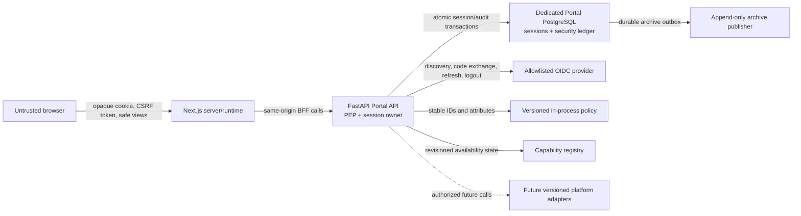

# PR-PORTAL-002 Security Design Freeze

- Status: **ACCEPTED — DESIGN FROZEN**
- Revision: 1
- Date: 2026-07-24
- Scope: Identity, OIDC, server sessions, authorization, environment and tenant context,
  capability projection, navigation, and security audit
- Runtime implementation: **AUTHORIZED WITH CONDITIONS BY GD-001; NOT STARTED**
- Product authority: `docs/product/enterprise-data-platform-portal.md`
- Threat model: `docs/portal/pr-portal-002-threat-model.md`
- Authorization matrix: `docs/portal/pr-portal-002-authorization-matrix.md`
- Failure matrix: `docs/portal/pr-portal-002-failure-matrix.md`

## 1. Executive decision

The five PR-PORTAL-002 contracts are accepted and frozen. No open security-critical question is
delegated to implementation.

This decision freezes the Portal security architecture; it does not authorize production use or
claim that authentication exists. `GD-001` grants a bounded implementation exception after that
governance decision is merged into the protected default branch. The repository-wide Design Freeze
remains open for every other runtime feature and production-remediation blocker.

| Contract                          | Status   | Governing ADR                        |
| --------------------------------- | -------- | ------------------------------------ |
| OIDC and server-session lifecycle | Accepted | ADR-PORTAL-002-01, ADR-PORTAL-002-02 |
| Authorization policy              | Accepted | ADR-PORTAL-002-03, ADR-PORTAL-002-05 |
| Capability Registry               | Accepted | ADR-PORTAL-002-04                    |
| Route/API enforcement             | Accepted | ADR-PORTAL-002-03, ADR-PORTAL-002-07 |
| Append-only security audit        | Accepted | ADR-PORTAL-002-06                    |

## 2. Frozen invariants

1. Browser code never receives an OIDC access, refresh, or ID token.
2. Browser state, navigation, hidden controls, and capability projections never grant access.
3. FastAPI is the authentication and authorization enforcement point for every protected API.
4. Only `ALLOW` authorizes. `DENY`, `NOT_APPLICABLE`, unknown, stale, and `INDETERMINATE` fail
   closed.
5. Environment and tenant are validated on every scoped request and participate in every policy
   decision and cache key.
6. Capability availability and principal authorization remain separate decisions.
7. Session identifiers are opaque, high entropy, server-side, rotated, and unusable after
   rotation or revocation.
8. Absolute session lifetime cannot be extended. Identity and privilege staleness are bounded.
9. Authentication and privilege state changes commit atomically with append-only audit evidence.
10. Production cannot start with development identity, insecure cookies, arbitrary issuer,
    missing encryption, mutable policy, or an unversioned security schema.

## 3. Trust boundaries



| Boundary            | Authority                                                              | Permitted data crossing the boundary                                            |
| ------------------- | ---------------------------------------------------------------------- | ------------------------------------------------------------------------------- |
| Browser             | None                                                                   | Opaque cookie, anti-CSRF token, safe principal/session views, safe policy hints |
| Next.js             | UX composition only                                                    | Same safe API views; never OIDC tokens or authoritative roles                   |
| FastAPI             | Session owner and policy enforcement point                             | Validated identity/context and bounded adapter requests                         |
| IdP                 | Authentication and external subject authority                          | Code flow, signed claims, server-held tokens                                    |
| Portal PostgreSQL   | Durable session, revocation, policy revision, security audit authority | Encrypted token envelopes and minimized security records                        |
| Policy module       | Authorization decision authority                                       | Stable IDs, normalized attributes, immutable policy revision                    |
| Capability registry | Product-availability authority                                         | Revisioned capability definitions and observed safe health                      |
| Audit archive       | Long-term tamper-evident evidence                                      | Redacted versioned security events only                                         |

## 4. OIDC lifecycle contract

### Provider configuration and discovery

- Authorization Code Flow with PKCE S256 is mandatory.
- Provider configuration is server-owned and selected by a stable configured provider ID. The
  browser cannot submit an issuer or endpoint.
- Production issuers are exact-match allowlisted HTTPS URLs. HTTP is permitted only for loopback
  or containerized integration tests.
- Discovery issuer must exactly equal configured issuer. Authorization, token, JWKS, user-info,
  revocation, and logout endpoints are taken only from validated discovery.
- Discovery and JWKS cache TTL is 15 minutes. Previously trusted discovery and known keys may be
  used for at most one hour during a provider outage. An unknown `kid` always requires a successful
  refresh; failure rejects the token.
- Redirect URIs are exact configured values. Wildcards and browser-supplied redirect URIs are
  forbidden.

### Login initiation

`POST /v1/auth/login` is the canonical initiation endpoint. It requires:

- exact same-origin `Origin` or validated `Referer`;
- a short-lived login-intent anti-CSRF value issued by the Portal;
- allowlisted local `return_to`;
- configured provider ID, or the deployment default;
- no trusted role, tenant, environment, or authorization context from browser input.

The server creates a one-use login transaction containing:

- 256-bit random state;
- 256-bit nonce;
- PKCE verifier with S256 challenge;
- redirect binding and normalized local return path;
- browser-binding hash;
- provider ID;
- creation and five-minute expiry;
- consumed state and optimistic version.

State, nonce, verifier, authorization code, and tokens are never logged or audited. The verifier
is envelope-encrypted in the transaction store.

### Callback validation

`GET /v1/auth/callback` is the sole safe-method exception that may create authoritative state. It
is a one-time protocol receiver, not a general resource endpoint. The exception is necessary to
retain `SameSite=Lax` browser binding across standards-compliant top-level OIDC redirects.

Validation order is frozen:

1. Parse bounded provider response and reject duplicate parameters.
2. Resolve and constant-time validate state plus browser binding.
3. Atomically claim the unconsumed, unexpired login transaction.
4. Validate configured redirect/provider binding.
5. Exchange the code using PKCE and bounded timeout.
6. Validate signature using the allowlisted issuer's JWKS.
7. Validate exact issuer, audience, authorized party, nonce, algorithm, token type, and time claims.
8. Apply at most 60 seconds clock skew.
9. Enforce claim size and authentication-context requirements.
10. Map `(issuer, subject)` to stable Portal principal ID.
11. Map allowlisted group claim paths to roles and environment entitlements.
12. Create the new session and audit evidence atomically.
13. Rotate/replace every pre-authentication browser identifier.
14. Mark the transaction consumed; it can never be reused.
15. Redirect only to the stored normalized local path.

Missing, mismatched, repeated, expired, oversized, unknown-key, invalid-signature, issuer,
audience, nonce, disabled-user, or provider-error outcomes fail closed with sanitized Problem
Details and correlation ID.

### Claims

Required claims are `iss`, `sub`, `aud`, `exp`, `iat`, and callback `nonce`. `azp` is required when
the audience is multi-valued. Authentication time and ACR/AMR are required for production access.

- `(issuer, subject)` is the external identity key. Email and display name are mutable display
  attributes only.
- Accepted claim document size: 32 KiB maximum.
- Group count: 100 maximum; group value: 256 characters maximum.
- Effective Portal role count: 20 maximum.
- Group and role claim paths are configured per allowlisted issuer.
- Unknown groups grant nothing. A user with no mapped role may retain a session only to view
  session/logout information; protected Portal capabilities remain denied.
- Tenant is not taken directly from arbitrary IdP claims.

### Token handling

- Access, ID, and refresh tokens remain inside FastAPI and encrypted Portal persistence.
- Refresh tokens are retained only when issued and needed for bounded identity refresh or provider
  logout. `offline_access` is not requested.
- Token envelopes use per-record AES-256-GCM data keys wrapped by a production KMS/secret-manager
  key. Local tests may use an explicit ephemeral test key.
- Refresh-token rotation is mandatory when supported. Reuse of an invalidated refresh token
  revokes the complete session chain.
- Tokens are erased when the session terminates and are never returned by OpenAPI models.

## 5. Server-session lifecycle contract

### Store choice

PostgreSQL is the authoritative session store. Production uses a dedicated `portal_control`
database or an independently budgeted PostgreSQL service—not the OLTP database, Airflow metadata
database, or pipeline-control connection pool. Redis may later be a non-authoritative cache but
cannot own revocation or token material in PR-PORTAL-002.

PostgreSQL was selected because session transition, revocation, token-envelope update, and audit
evidence must share one ACID transaction. It also supplies compare-and-set, row locking, PITR, and
versioned migration behavior already understood by the platform.

### Identity and session records

The cookie contains 256 random bits encoded base64url. Persistence stores only an HMAC-SHA-256
lookup hash and lookup-key version.

A session record contains:

- session ID hash, session family ID, previous-session link, version, and security epoch;
- principal ID, issuer, subject reference, tenant, normalized role/group mapping revision;
- allowed environments and policy revision;
- created/authenticated/last-activity/idle-expiry/absolute-expiry/provider-expiry timestamps;
- authentication assurance and identity-verified-until timestamp;
- status, revoked timestamp/reason, last refresh, token-envelope reference;
- protected client-signal classifications and audit correlation.

Raw IP addresses and user-agent strings are not session authority. Bounded classifications or
protected hashes may support risk analysis and audit.

### State machines

Login transactions:

```text
PENDING -> CLAIMED -> CONSUMED
PENDING | CLAIMED -> EXPIRED | INVALIDATED
```

Authenticated sessions:

```text
ACTIVE -> REFRESH_REQUIRED -> ACTIVE (new rotated session ID)
ACTIVE | REFRESH_REQUIRED -> EXPIRED_IDLE
ACTIVE | REFRESH_REQUIRED -> EXPIRED_ABSOLUTE
ACTIVE | REFRESH_REQUIRED -> REVOKED
ACTIVE | REFRESH_REQUIRED -> PROVIDER_REVOKED
ACTIVE | REFRESH_REQUIRED -> INVALID
any terminal state -> TERMINATED after token disposal
```

Terminal states cannot return to active. A successor session is a new row in the same session
family; old identifiers remain terminal.

### Time and concurrency

- Production idle timeout: 30 minutes.
- Production absolute lifetime: 8 hours.
- Login transaction lifetime: 5 minutes.
- Identity/role entitlement staleness: at most 5 minutes in staging/production and 15 minutes in
  local/development.
- Activity writes may be throttled to once per 60 seconds but the effective idle deadline is
  calculated conservatively.
- Absolute expiry is fixed at authentication and never extended.
- Session changes use row lock plus optimistic version. Concurrent refresh has one winner.
- Concurrent revocation wins over refresh. A refresh transaction must re-read state immediately
  before commit.
- Maximum active sessions per principal: five. Creating a sixth revokes the oldest active session
  with audit evidence.

### Rotation and restore

Session ID rotates after login, step-up, refresh that changes privilege context, security-key
rotation, and any administrator-required reauthentication. Environment selection does not rotate
the session because environment is request-scoped, but it invalidates environment-scoped caches.

Production configuration supplies a `session_security_epoch`. Every session must match it. After
database restore or suspected session-store compromise, operations increment the external epoch
before Portal startup, invalidating every restored cookie and session. No restored session is
trusted automatically.

## 6. Cookie and CSRF contract

### Session cookie

Production cookie:

```text
Name: __Host-fintech_portal_session_v1
HttpOnly: true
Secure: true
SameSite: Lax
Path: /
Domain: absent
Max-Age: no longer than remaining absolute session lifetime
```

Local loopback may use `fintech_portal_session_v1` without `Secure`; startup rejects that
exception in staging/production. Cookie deletion repeats the exact Path, host, and security
attributes with zero lifetime.

The cookie never contains a token, role, environment grant, capability, profile, or signed
authorization context.

### CSRF

PR-PORTAL-002 uses a synchronizer token:

- a 256-bit value generated with the session and stored as a hash plus generation;
- returned only in a `Cache-Control: no-store` session/CSRF response;
- held in browser memory, never local/session storage;
- sent in `X-CSRF-Token` on every unsafe method;
- bound to the current session family and version;
- rotated with session rotation and invalid after logout.

Unsafe methods require both a valid token and exact allowed `Origin`; validated `Referer` is a
fallback only for user agents that legitimately omit Origin. Missing both fails closed.
Wildcard/subdomain suffix matching is forbidden.

`GET`, `HEAD`, and `OPTIONS` are side-effect free except the documented OIDC callback protocol
receiver. Logout is POST and requires CSRF. Callback security is supplied by one-use
state/nonce/PKCE plus browser transaction binding; CSRF success never grants authorization.

## 7. Authorization policy contract

### Policy engine

PR-PORTAL-002 uses an in-process, pure, deny-by-default policy module. The policy source is a
schema-validated immutable bundle packaged with the Portal API artifact. Its canonical digest is
the policy revision.

OPA and IdP-native authorization are rejected initially because they add another availability and
deployment boundary before the read-only policy model requires one. Policy interfaces and
decision contracts remain engine-neutral.

Every decision evaluates:

```text
principal + roles/groups + tenant + environment + domain
+ capability + resource attributes + action + classification
+ purpose + assurance + policy revision + capability revision
```

Decision values are `ALLOW`, `DENY`, `NOT_APPLICABLE`, and `INDETERMINATE`. Only `ALLOW` grants.

The internal decision record includes decision ID, principal, action, resource, tenant,
environment, reason code, obligations, revisions, evaluation time, expiry, and cacheability. The
frontend receives only bounded rendering hints.

### Roles

- `portal_viewer`
- `data_engineer_viewer`
- `platform_operator_viewer`
- `security_auditor_viewer`
- `portal_admin_viewer`

Roles are not hierarchical. Any shared permission is explicit in the policy matrix. PR-PORTAL-002
grants no production mutation.

Production reads require both explicit production entitlement and AAL2. Non-production metadata
reads require AAL1. Missing assurance is `DENY/STEP_UP_REQUIRED`.

### Caching

- Policy bundles are immutable per process; deployment changes the revision.
- ALLOW caching is permitted only for exact session version, tenant, environment, action,
  resource revision, policy revision, and capability revision, and never beyond 30 seconds or the
  decision expiry.
- A revision mismatch, unavailable registry, expired identity verification, unknown action, or
  unknown resource attribute invalidates ALLOW.
- DENY may be cached for up to 30 seconds using the same dimensions.

The normalized executable matrix is frozen in
`docs/portal/pr-portal-002-authorization-matrix.md`.

## 8. Environment and tenant isolation

### Environment model

Model **B** is selected: environment is explicit in every environment-scoped request and validated
against the current server session.

- Canonical route context is `/environments/{environment_id}/...` for Portal pages.
- Canonical API context is `X-Portal-Environment-ID` for scoped APIs.
- Stable IDs are `local`, `development`, `staging`, and `production`.
- Browser-supplied IDs are selectors, never grants.
- Server intersects the requested environment with current session entitlements, tenant,
  environment registry state, assurance, policy, and capability.
- Multiple tabs may use different environments safely because there is no mutable global selected
  environment in the session.
- `POST /v1/session/environment` validates a selection, records audit, and returns current
  environment/policy/capability revisions. It does not elevate or mutate roles.
- Deep links fail closed before resource retrieval. An inaccessible environment returns 403;
  protected resource classes may mask existence with 404.
- Frontend caches and open operation/dialog context are pinned to the explicit environment and
  invalidated on environment change.

No selected environment is an incomplete context: global safe session endpoints work, while
environment-scoped APIs return `INVALID_REQUEST/ENVIRONMENT_REQUIRED`.

### Tenant model

The first version is single organization. Canonical tenant ID
`fintech-platform-primary` comes from immutable server deployment configuration and is stored in
session, policy, resource, capability, and audit records.

- Tenant is not selected by the browser.
- Optional issuer organization claims may be checked as an additional constraint but never become
  the tenant authority.
- Missing, unknown, or mismatched tenant fails closed.
- Resource tenant mismatch uses masked 404 for non-inventory resource IDs and 403 for explicit
  environment/tenant administration routes.
- The design is tenant-aware but is not described as multi-tenant. True multi-tenancy requires a
  later isolation ADR.

## 9. Capability Registry contract

### Source and record

Capability definitions are an immutable, versioned, schema-validated deployment bundle.
Environment administrative overlays are revisioned Portal-control records. Native Portal support
and future adapter health provide observed evidence. The registry revision is a canonical digest
of definitions, overlays, adapter contracts, and health generation.

Each record includes all required product fields: stable capability ID, environment, tenant,
state, version, API contract, read/write mode, safe health, observation/expiry, reason, dependency
IDs, source, owner, documentation/runbook references, required permissions, preview flag, and
registry revision.

Canonical record fields are:

```text
capability_id, display_name, environment_id, tenant_id, state
capability_version, api_contract_version, read_write_mode, health
observed_at, expires_at, freshness_policy, reason_code, safe_reason
dependency_ids, source, owner, documentation_url, runbook_url
required_actions, feature_preview, registry_revision
```

### Effective-state precedence

From strongest to weakest:

1. Unknown definition, invalid contract, tenant mismatch, or expired authority -> fail closed;
   no available projection.
2. Administrative `DISABLED` -> `DISABLED`.
3. Definition marked roadmap-only -> `PLANNED`.
4. Required implementation/adapter absent or incompatible -> `PLANNED` before release,
   `DISABLED` after an expected deployment contract is violated.
5. Required dependency unavailable or health evidence stale -> `DEGRADED`.
6. Product implementation configured read-only -> `READ_ONLY`.
7. Implemented, enabled, compatible, and healthy -> `AVAILABLE`.

Authorization never changes this state; it changes visibility and allowed actions. `READ_ONLY`
describes product support, not a user's lack of write permission.

Registry health cache TTL is 30 seconds. An expired or unavailable registry cannot enable a route
or operation. Previously verified read-only data may be shown as `DEGRADED` with observation time,
but mutation support becomes false.

Initially:

- `portal.foundation`, `portal.authentication`, `portal.system_status`, and
  `portal.capabilities` may be native capabilities when their real contracts are present.
- Source, CDC, dataset, pipeline, audit UI, and admin capabilities remain `PLANNED` until their
  supported APIs exist.

## 10. Route and API enforcement

Enforcement order is:

1. Parse and bound request metadata.
2. Resolve cookie to current server session.
3. Validate status, epoch, idle/absolute expiry, identity freshness, and revocation.
4. Resolve configured tenant and explicit environment.
5. Resolve effective capability using current revision.
6. Determine whether resource existence is safe to reveal.
7. Evaluate policy before protected resource retrieval where possible.
8. Retrieve through an approved service/repository and re-check attributes if needed.
9. Filter response fields according to obligations.
10. Commit required security audit evidence.

Next.js redirects anonymous users, presents denial, and uses server-projected navigation. It never
grants access. Direct calls to FastAPI receive the same enforcement without Next.js.

## 11. HTTP semantics

| Status | Use                                                                                   |
| ------ | ------------------------------------------------------------------------------------- |
| 401    | Missing, invalid, idle/absolute-expired, revoked, or provider-invalid session         |
| 403    | Valid session but policy, environment, tenant, capability access, or assurance denies |
| 404    | Missing resource or resource class whose existence must be concealed                  |
| 409    | Concurrent session/environment/policy revision conflict that can be retried           |
| 503    | Required IdP, session, policy, capability, or audit authority unavailable             |

An invalid/revoked cookie is cleared on 401 when response context is safe. 403 never redirects or
silently changes environment. All errors use Problem Details and correlation ID.

Stable codes added by PR-PORTAL-002:

```text
AUTHENTICATION_REQUIRED
SESSION_EXPIRED
SESSION_REVOKED
SESSION_INVALID
OIDC_PROVIDER_UNAVAILABLE
OIDC_CALLBACK_INVALID
AUTHORIZATION_DENIED
ENVIRONMENT_REQUIRED
ENVIRONMENT_ACCESS_DENIED
TENANT_ACCESS_DENIED
CAPABILITY_UNAVAILABLE
CAPABILITY_DEGRADED
CAPABILITY_DISABLED
CAPABILITY_PLANNED
POLICY_UNAVAILABLE
STEP_UP_REQUIRED
CSRF_VALIDATION_FAILED
SESSION_CONFLICT
AUDIT_UNAVAILABLE
```

## 12. Navigation projection

`GET /v1/navigation` is a server-derived projection using the exact session version, tenant,
explicit environment, policy revision, capability revision, assurance, and preview entitlement.

The response contains groups/routes/labels, capability state, disabled reason, badges, safe access
request hint, and allowlisted external links. It never contains raw claims or complete policy.

Navigation cache keys include:

```text
session version + principal reference + tenant + environment
+ policy revision + capability revision
```

Login, logout, session rotation/refresh, environment switch, entitlement change, policy change,
capability change, or revocation invalidates the projection. Static frontend metadata may provide
labels/layout only. Effective visibility always comes from the server.

## 13. Audit architecture

### Source of truth

The dedicated Portal PostgreSQL database contains an append-only `security_audit_events` ledger.
Authentication/session transactions insert their audit event and archive-outbox row in the same
database transaction. This avoids a synchronous cross-system dual write.

Database controls:

- a migration owner creates schema;
- runtime role may execute the append function and read only permitted session state;
- no runtime UPDATE/DELETE/TRUNCATE grant on audit events;
- trigger rejects update/delete;
- unique event ID and deduplication key;
- monotonic database sequence supplies ledger order; timestamps do not define order.

A durable publisher reads `audit_archive_outbox` with `FOR UPDATE SKIP LOCKED`, publishes
idempotently to an immutable/WORM security archive, and records delivery state in the outbox—not
the audit event. Daily archive manifests contain hashes and an integrity checkpoint.

### Event contract

Canonical envelope:

```text
event_id, ledger_sequence, event_type, event_version
occurred_at, recorded_at, actor_type, principal_id
issuer_id, subject_reference, session_reference
tenant_id, environment_id, action, resource_type, resource_reference
capability_id, decision, reason_code, policy_revision, capability_revision
authentication_assurance, correlation_id, request_id
source_network_classification, user_agent_classification
outcome, safe_metadata, integrity_metadata
```

Subject, session, network, and user-agent references are minimized or protected. Tokens, cookies,
codes, verifiers, secrets, raw claims, email, request/response bodies, sensitive query values, and
financial data are prohibited.

Frozen event types:

```text
auth.login_started.v1
auth.login_succeeded.v1
auth.login_failed.v1
auth.session_created.v1
auth.session_rotated.v1
auth.session_refreshed.v1
auth.session_expired_idle.v1
auth.session_expired_absolute.v1
auth.session_revoked.v1
auth.logout_requested.v1
auth.logout_completed.v1
auth.provider_logout_failed.v1
auth.csrf_rejected.v1
authz.decision_allowed.v1
authz.decision_denied.v1
authz.decision_indeterminate.v1
authz.environment_selected.v1
authz.environment_selection_denied.v1
authz.capability_projection_generated.v1
authz.step_up_required.v1
```

Full append-only audit is required for:

- login/callback/session creation, rotation, refresh, expiry, revocation, and logout;
- CSRF rejection;
- denied/indeterminate policy decisions;
- environment selection and denial;
- production, audit, admin, or future R1-R3 authorization decisions;
- security configuration/policy/capability revision changes.

Routine non-production R0 ALLOW reads use aggregated telemetry unless regulation or resource
classification requires full evidence.

### Durability and outage

- Failure to append audit for an authentication/session transition or high-risk decision fails
  closed and rolls back the state change.
- Low-risk reads may continue only when policy marks audit as telemetry-only.
- Archive outage does not lose ledger events; publisher retries with bounded exponential backoff
  and alerts on age/SLA.
- Hot query retention is 400 days. Immutable archive retention is at least seven years, subject to
  longer legal hold.
- Archive replay is idempotent by event ID. Ledger event rows are never marked mutable.

## 14. Logout, revocation, and refresh

Local logout commits first:

1. lock session family;
2. revoke selected session atomically;
3. invalidate refresh/token envelope;
4. append audit and archive-outbox evidence;
5. commit;
6. expire cookie;
7. attempt provider revocation/RP-initiated logout best-effort.

Provider failure cannot undo local logout. Duplicate logout returns an idempotent result and keeps
the cookie expired.

Logout-all and administrator revocation lock all active session families for the principal.
Back-channel logout maps issuer/provider session ID to Portal sessions and revokes them. Front
channel logout is not authoritative without validated provider binding.

Refresh is request-driven, with optional server scheduling only to avoid expiry during active
sessions. It runs no more frequently than every five minutes unless token expiry demands it.
Concurrent refresh is serialized. Role/environment changes update the identity snapshot, rotate
session ID when privilege context changes, invalidate caches, and append audit.

After the maximum identity staleness window, an IdP outage blocks protected requests. Before that
deadline, the last verified identity may serve R0 reads only within all session and token expiry
bounds. No request extends absolute lifetime.

## 15. Required OpenAPI changes

| Method/path                    | Kind             | Auth             | CSRF                     | Result                            |
| ------------------------------ | ---------------- | ---------------- | ------------------------ | --------------------------------- |
| `GET /v1/auth/login-context`   | JSON             | No               | No                       | Short-lived login-intent view     |
| `POST /v1/auth/login`          | Browser redirect | No               | Login-intent + Origin    | 303 to allowlisted IdP            |
| `GET /v1/auth/callback`        | Browser callback | OIDC transaction | State/nonce/PKCE binding | Session cookie + 303              |
| `POST /v1/auth/logout`         | JSON/redirect    | Yes              | Yes                      | Revoke current session            |
| `POST /v1/auth/logout-all`     | JSON             | Yes              | Yes                      | Revoke principal sessions         |
| `GET /v1/session`              | JSON             | Yes              | No                       | Safe `SessionView`                |
| `GET /v1/session/csrf`         | JSON             | Yes              | No                       | No-store synchronizer token       |
| `POST /v1/session/refresh`     | JSON             | Yes              | Yes                      | Rotated safe session view         |
| `GET /v1/environments`         | JSON             | Yes              | No                       | Authorized environment views      |
| `POST /v1/session/environment` | JSON             | Yes              | Yes                      | Validated context/revisions       |
| `GET /v1/capabilities`         | JSON             | Yes              | No                       | Environment capability projection |
| `GET /v1/navigation`           | JSON             | Yes              | No                       | Server-derived navigation         |

Models:

- `SessionView`, `PrincipalView`, `EnvironmentView`, `EnvironmentSelectionRequest`;
- `CapabilityView`, `NavigationView`, `AuthorizationHint`;
- `LoginContextView`, `AuthenticationError`, `SessionStatus`, `LogoutResult`;
- existing Problem Details with the new stable error codes.

No model contains a token, raw claim, authoritative role policy, cookie value, encryption
reference, or infrastructure credential.

Operational endpoints remain:

- `/health/live`: anonymous and process-local.
- `/health/ready`: anonymous but reduced to aggregate readiness; dependency identifiers/reasons
  move behind authorization.
- `/v1/system/info`: anonymous safe build/contract metadata.
- `/v1/system/dependencies`: authenticated, environment-scoped, and authorized by
  `portal.system_status.read`.

## 16. Persistence and migration requirements

Required durable concepts:

```text
portal_principals
oidc_login_transactions
portal_sessions
portal_token_envelopes
portal_security_epochs
portal_policy_revisions
portal_capability_definitions
portal_capability_overrides
security_audit_events
audit_archive_outbox
schema_migrations
```

Frozen logical schema:

| Table                           | Required identity and state                                                                                                                             |
| ------------------------------- | ------------------------------------------------------------------------------------------------------------------------------------------------------- |
| `portal_principals`             | `principal_id`; unique issuer/subject; safe display attributes; status; created/updated timestamps                                                      |
| `oidc_login_transactions`       | transaction ID; hashes for state/nonce/browser binding; encrypted verifier; provider/redirect/return path; status/version; expiry/consumed time         |
| `portal_sessions`               | session hash/family/predecessor; principal/tenant; status/version/epoch; roles/environments snapshot revision; assurance; idle/absolute/provider expiry |
| `portal_token_envelopes`        | session family; ciphertext; nonce/tag; wrapped data key; KMS key ID; token generation; created/rotated/disposed timestamps                              |
| `portal_security_epochs`        | environment; monotonic externally supplied epoch; activated time; reason/audit reference                                                                |
| `portal_policy_revisions`       | policy revision/digest; artifact version; status; activated/retired time                                                                                |
| `portal_capability_definitions` | capability/environment/tenant/revision; contract/version/mode/state metadata                                                                            |
| `portal_capability_overrides`   | immutable override revision; environment/capability; desired administrative state; effective interval; actor/evidence                                   |
| `security_audit_events`         | ledger sequence; unique event/dedup IDs; immutable versioned safe envelope; integrity metadata                                                          |
| `audit_archive_outbox`          | event ID; publication state/attempt; lease; next attempt; archive reference/checksum; no mutation of event payload                                      |
| `schema_migrations`             | version; checksum; applied time/identity; application compatibility                                                                                     |

Application roles are separated into migration owner, Portal session runtime, audit append,
archive publisher, and security read-only roles. Token-envelope columns are never selectable by
the audit or frontend-query roles.

Required properties:

- explicit primary/foreign keys and UTC timestamps;
- uniqueness on issuer/subject, session hash, transaction state, event ID, and deduplication key;
- partial indexes for active sessions and unconsumed login transactions;
- optimistic versions and row locking;
- encrypted token envelopes with key ID and authenticated associated data;
- expiry/cleanup indexes;
- append-only audit permissions and trigger;
- versioned migrations executed by a migration identity before application rollout;
- runtime startup validates compatible schema revision but never migrates.

This revises PR-PORTAL-001's “no Portal database” statement only for PR-PORTAL-002. The database is
security control state, not a business source of truth.

## 17. Failure-mode summary

The complete matrix with HTTP, cookie, audit, retry, alert, and test behavior is frozen in
`docs/portal/pr-portal-002-failure-matrix.md`.

| Failure                                | User/HTTP                                                | Cookie/state                                        | Evidence and recovery                                |
| -------------------------------------- | -------------------------------------------------------- | --------------------------------------------------- | ---------------------------------------------------- |
| IdP unavailable before login           | 503 provider unavailable                                 | No session cookie                                   | Safe metric/log; retry login later                   |
| IdP unavailable during callback        | Sanitized callback failure/503                           | No new session; transaction consumed or invalidated | Audit failure without code/token; new login required |
| IdP unavailable during refresh         | Continue only inside verified staleness window; then 503 | Existing cookie cannot extend expiry                | Alert; retry with lock; reauthenticate after limit   |
| JWKS unavailable, known key            | Bounded stale-key validation only                        | No extension beyond normal limits                   | Refresh alarm                                        |
| Unknown signing key                    | 401 callback invalid                                     | No session                                          | Refresh once, then fail closed                       |
| Session store unavailable/read timeout | 503                                                      | Cookie retained but never trusted without store     | Alert; bounded retry only                            |
| Session store write timeout            | 503/conflict                                             | No assumed state change                             | Re-read by idempotency key                           |
| Audit ledger unavailable               | High-risk operation fails/503                            | Auth state transaction rolls back                   | Alert; restore DB service                            |
| Archive sink unavailable               | No immediate user impact                                 | Ledger remains authoritative                        | Outbox retries; age alert                            |
| Policy unavailable/invalid             | 503                                                      | Session retained, operation denied                  | Roll back policy artifact                            |
| Capability registry unavailable/stale  | Reads degraded if explicitly safe; operations denied/503 | Session retained                                    | Invalidate projection; alert age                     |
| Role/environment removed               | Next refresh/request denies; session may rotate/revoke   | Old projection invalid                              | Audit and re-fetch                                   |
| Invalid tenant mapping                 | 403 or masked 404                                        | Session cannot access scoped routes                 | Correct server mapping                               |
| Concurrent revocation                  | Revocation wins; 401                                     | Old/new identifiers terminal                        | Session-family lock test                             |
| Duplicate callback                     | 401 callback invalid                                     | No second session                                   | One-use transaction audit                            |
| Duplicate logout                       | Idempotent success                                       | Cookie remains expired                              | Deduplicated audit                                   |
| Expired/foreign CSRF                   | 403 CSRF failure                                         | Session retained                                    | Security audit and retry with current token          |
| Multiple tabs                          | Independent explicit environments                        | Shared session; no global environment mutation      | Revision invalidation broadcast/refetch              |
| Excessive clock skew                   | 503/not ready for identity operations                    | No new session/refresh                              | Time-sync alert                                      |
| Refresh-token replay                   | 401 revoked                                              | Entire session family revoked                       | High-severity audit/incident                         |
| Browser closes during callback         | Transaction expires; no session                          | Cleanup after five minutes                          | No recovery of abandoned code                        |
| Portal API restart                     | Session remains server-side                              | Cookie resolves normally                            | No in-memory authority                               |
| Restore with old sessions              | 401 after security-epoch bump                            | All restored cookies invalid                        | Mandatory restore runbook                            |

Every case has unit, integration, or recovery coverage specified in the test contract below and
the threat model.

## 18. Test architecture

### Unit

- Claim/role/tenant/environment mapping limits and unknown values.
- Login and session state machines, timeouts, rotation, CAS, and terminal immutability.
- Policy matrix generated from the frozen normalized policy data.
- Capability precedence/freshness and navigation projection.
- Audit redaction, forbidden-key/value scanner, deterministic deduplication.
- Problem Details and fail-closed error mapping.

### Integration

- Containerized Keycloak is mandatory in local/CI integration.
- PostgreSQL uses the production schema and separate migration/runtime/audit roles.
- Tests cover discovery, PKCE S256, state, nonce, callback, issuer/audience/signature, key
  rotation, replay, provider failures, refresh rotation/replay, group changes, logout, and
  back-channel revocation.
- Session integration covers fixation, rotation, old-cookie rejection, idle/absolute expiry,
  concurrent refresh/revocation/logout, store outage, and restore security epoch.
- CSRF integration covers missing/foreign/stale token, malicious Origin, subdomain attack,
  login/logout CSRF, preflight, and safe-method behavior.
- Audit tests query the supported repository/test API, prove append-only permissions and triggers,
  restart persistence, ordering by ledger sequence, idempotent archive replay, and outage policy.

### Browser E2E

- Real Keycloak login and authenticated shell.
- Environment selection in multiple tabs.
- Dynamic navigation and direct denied API/URL.
- Session expiry, role removal, logout, provider outage.
- Browser storage/cookies inspection proving no JavaScript-readable session or OIDC token.

Mock-only OIDC validation cannot satisfy the merge gate.

### Security test matrix

| Contract                    | Unit                    | PostgreSQL integration       | Real OIDC integration                | Browser E2E                     | Recovery/concurrency                     |
| --------------------------- | ----------------------- | ---------------------------- | ------------------------------------ | ------------------------------- | ---------------------------------------- |
| Login/claims/token handling | Mapping/limits/errors   | Transaction one-use          | PKCE/state/nonce/keys/refresh/logout | Real login; no browser token    | Callback and refresh replay              |
| Session lifecycle           | State/time/CAS          | Rotation/revocation/expiry   | Provider session changes             | Expiry/logout/multiple tabs     | Concurrent refresh/logout; restore epoch |
| Cookie/CSRF                 | Token/origin policy     | Session binding              | Login transaction binding            | Cookie/storage inspection       | Token/session rotation races             |
| Authorization               | Generated matrix        | Policy/audit transaction     | Role/group changes                   | Direct denied route/API         | Revision invalidation                    |
| Environment/tenant          | Context evaluator       | Stored entitlement revisions | Claim mapping changes                | Two-tab environments/deep links | Entitlement removal race                 |
| Capability/navigation       | Precedence/projection   | Revisioned overlays          | N/A                                  | Dynamic navigation/tampering    | Stale/outage invalidation                |
| Security audit              | Redaction/dedup scanner | Append-only/outbox/roles     | Auth event completeness              | Correlation-visible errors      | DB/archive outage and restart            |

## 19. Session-fixation verification

Tests must prove:

1. Attacker-supplied or pre-authentication identifier is not promoted.
2. Callback creates a new opaque identifier.
3. Old cookie cannot call protected APIs.
4. Privilege-relevant refresh creates a successor and terminates predecessor.
5. Future step-up uses the same rotation contract.
6. Logout invalidates every current identifier in the selected family.
7. One login transaction cannot create two active sessions under concurrency.
8. Revocation cannot be undone by a racing callback or refresh.

## 20. Audit verification

Tests inspect serialized key names and representative values. Forbidden names include token,
cookie, authorization, code verifier, client secret, password, and every OIDC token type.
Forbidden value patterns include compact JWTs, bearer headers, authorization codes, opaque token
fixtures, database URLs, and known test secrets.

Tests assert event type/version, ledger sequence, actor/session correlation, safe decision reason,
policy/capability revisions, correlation/request IDs, no update/delete route, unique retry
behavior, restart durability, archive idempotency, and failure policy.

## 21. Operational runbooks

Implementation must provide:

1. IdP outage and emergency login disable.
2. Session-store outage and recovery.
3. Mass session revocation/security-epoch rotation.
4. Suspected session theft.
5. OIDC signing-key rotation.
6. OIDC client-secret/KMS wrapping-key rotation.
7. OIDC configuration rollback.
8. Policy artifact rollback.
9. Capability-registry outage/staleness.
10. Audit ledger/archive outage.
11. Compromised Portal service identity.
12. Clock-skew response.
13. Emergency production-environment disable.
14. PostgreSQL restore with mandatory session invalidation.

Metrics use bounded labels only: login outcomes, callback safe reasons, active session count,
refresh/revocation/expiry outcomes, denial/indeterminate rates, environment selection denials,
registry age, policy/capability revision, audit failures, and IdP/session-store latency. User,
subject, session, resource ID, correlation ID, and raw URL are prohibited metric labels.

## 22. Rollout and rollback

### Phase 1 — development

- Containerized real OIDC provider.
- Test users/groups and no production entitlement.
- Session/audit schema, redaction, fixation, and outage tests.
- PR-001 routes switch behind authenticated session except health/build endpoints.

### Phase 2 — staging

- Real enterprise group mapping.
- AAL2 and environment authorization.
- Revocation, restore, IdP, audit, policy, and key-rotation drills.
- No production environment in registry.

### Phase 3 — production read-only pilot

- Allowlisted users, explicit production entitlement, AAL2.
- Foundation/system-status/capability reads only.
- No platform mutation.
- Short monitoring window and tested rollback.

Rollback disables login, increments session security epoch, expires cookies, preserves the audit
ledger, and deploys the previous compatible artifact. It never re-enables PR-001 anonymous
dependency detail. Cookie version changes require parallel deletion of all recognized old names.

## 23. Open design questions

No security-critical design question remains open. These deployment inputs remain intentionally
environment-specific and are merge/deployment gates:

- exact production issuer/client registration and approved group claim path;
- selected enterprise KMS/secret-manager implementation behind the frozen envelope interface;
- legal retention longer than the seven-year minimum;
- production database topology and recovery objectives satisfying the dedicated-store contract.

Changing a frozen invariant, store authority, cookie model, environment model, policy semantics,
capability precedence, or audit transaction boundary requires reopening the relevant ADR.

## 24. Accepted risks

- Identity/role removal is not checked at the IdP on every request; maximum staleness is five
  minutes, reduced by back-channel logout when supported.
- PostgreSQL is an availability dependency for protected Portal traffic. This is accepted to gain
  durable atomic revocation and audit; the deployment must provide HA and an isolated pool.
- OIDC callback is a documented GET side-effect exception required for secure top-level
  `SameSite=Lax` browser binding.
- PR-002 begins with an in-process policy engine. External policy distribution is deferred until
  policy complexity justifies another failure domain.

## 25. Implementation order

```text
versioned Portal security migrations
-> session store and security epoch
-> audit ledger + archive outbox
-> OIDC login transaction and real-provider integration
-> session lifecycle, token envelope, revocation
-> cookie and CSRF enforcement
-> principal/claim mapping
-> policy module and generated matrix tests
-> request-scoped environment/tenant context
-> capability registry
-> navigation projection
-> frontend authenticated session UX
-> outage, concurrency, restore, security and browser verification
```

The login screen is not the first implementation slice.

## 26. Merge gates

PR-PORTAL-002 implementation cannot merge unless:

1. Five contracts and seven ADRs remain accepted/frozen.
2. OIDC integration uses a real standards-compliant provider in CI.
3. Authorization Code with PKCE S256 is verified.
4. State and nonce validation/replay tests pass.
5. Browser receives no access, ID, or refresh token.
6. Server session rotates after login.
7. Idle and absolute timeouts are enforced.
8. Logout invalidates the server session before provider logout.
9. Revocation cannot be bypassed by refresh, callback, or concurrent request.
10. CSRF matrix passes.
11. Generated authorization matrix passes.
12. Environment selection cannot create or elevate privilege.
13. Missing/invalid/cross-tenant context fails closed.
14. Capability availability and authorization remain separate.
15. Unknown/stale capability or policy state fails closed.
16. 401/403/masked-404 semantics are consistent.
17. Navigation is server-projected and revision-bound.
18. Direct unauthorized API calls are denied independently of Next.js.
19. Production rejects development identity and insecure cookie/provider configuration.
20. Security audit is append-only and transactional for high-risk state.
21. Audit forbidden-key/value and redaction tests pass.
22. Audit durability, deduplication, ordering, and archive verification pass.
23. Session-store, audit, policy, capability, and IdP outage behavior is tested.
24. Existing Portal and platform regression suites pass.
25. GitHub Actions is green.

Additional repository gates:

- Portal security migrations must be forward-tested and rollback/compatibility-tested.
- Production configuration validation must reject missing KMS, insecure cookie, arbitrary issuer,
  development identity, default tenant/security epoch, mutable policy, and anonymous dependency
  detail.
- PostgreSQL restore must be tested with a security-epoch bump.
- GD-001 must be effective and unexpired; implementation must remain inside its authorized scope.

## 27. ADR index

| ADR               | Decision                                      | Status             |
| ----------------- | --------------------------------------------- | ------------------ |
| ADR-PORTAL-002-01 | OIDC Code + PKCE and server-held tokens       | Accepted/Frozen R1 |
| ADR-PORTAL-002-02 | PostgreSQL session authority and lifecycle    | Accepted/Frozen R1 |
| ADR-PORTAL-002-03 | In-process deny-by-default policy             | Accepted/Frozen R1 |
| ADR-PORTAL-002-04 | Capability authority and precedence           | Accepted/Frozen R1 |
| ADR-PORTAL-002-05 | Request-scoped environment and tenant context | Accepted/Frozen R1 |
| ADR-PORTAL-002-06 | Transactional append-only security audit      | Accepted/Frozen R1 |
| ADR-PORTAL-002-07 | Host cookie and synchronizer CSRF             | Accepted/Frozen R1 |

## 28. Final verdict

**ACCEPTED** for architecture and contract freeze.

Runtime implementation is **AUTHORIZED WITH CONDITIONS** by
`docs/governance/decisions/GD-001-portal-002-implementation-exception.md` once its effective
condition is met. This is not production approval.
