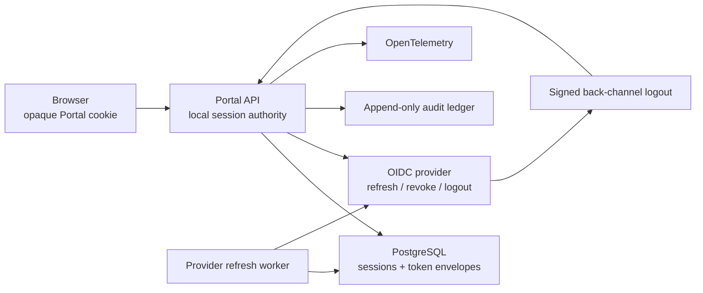
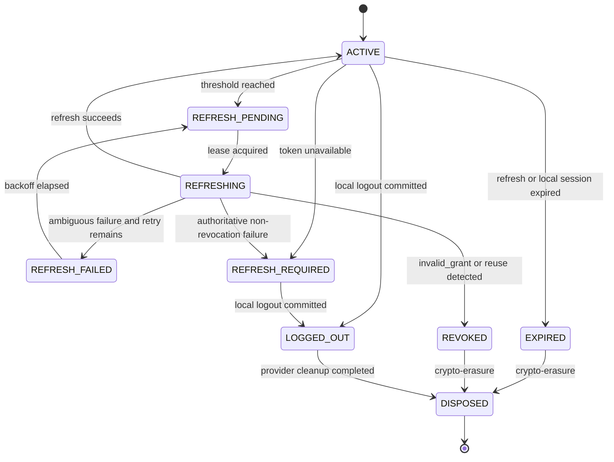

# Provider-backed session lifecycle

The Portal owns browser session authority while integrating with the provider token lifecycle.
The browser receives only an opaque, HttpOnly Portal session cookie. Provider access, ID, and
refresh tokens remain in encrypted server-side envelopes and are never returned by an API,
cookie, browser storage, redirect, log, metric label, or audit payload.

## Architecture



The database is the concurrency authority. Workers claim due envelopes with row locks,
`SKIP LOCKED`, a bounded batch, and an expiring lease. Provider network I/O occurs outside a
database transaction. Completion reacquires the row and succeeds only when the lease owner and
token generation still match, preventing duplicate refresh finalization across replicas.

The worker starts after database schema validation and stops before telemetry shutdown. One
provider outage cannot block unrelated HTTP requests.

## State machine



### Transition matrix

| Current | Allowed next states | Meaning |
| --- | --- | --- |
| `ACTIVE` | `REFRESH_PENDING`, `REFRESH_REQUIRED`, `EXPIRED`, `LOGGED_OUT`, `REVOKED`, `DISPOSED` | Token is usable or awaiting a bounded lifecycle action |
| `REFRESH_PENDING` | `REFRESHING`, `REFRESH_REQUIRED`, `LOGGED_OUT`, `REVOKED`, `DISPOSED` | Durable due work exists |
| `REFRESHING` | `ACTIVE`, `REFRESH_FAILED`, `REFRESH_REQUIRED`, `EXPIRED`, `LOGGED_OUT`, `REVOKED`, `DISPOSED` | A worker owns an expiring database lease |
| `REFRESH_FAILED` | `REFRESH_PENDING`, `REFRESH_REQUIRED`, `EXPIRED`, `LOGGED_OUT`, `REVOKED`, `DISPOSED` | Ambiguous provider failure may retry inside the budget |
| `REFRESH_REQUIRED` | `REFRESH_PENDING`, `EXPIRED`, `LOGGED_OUT`, `REVOKED`, `DISPOSED` | Local requests fail closed until bounded recovery |
| `EXPIRED` | `DISPOSED` | Provider or local session lifetime ended |
| `LOGGED_OUT` | `DISPOSED` | Local authority ended before provider cleanup |
| `REVOKED` | `DISPOSED` | Provider rejected authority or reuse was detected |
| `DISPOSED` | none | Terminal crypto-erased state |

Invalid transitions raise an error rather than silently repairing state.

## Refresh strategy

The worker selects an `ACTIVE` envelope when its provider access token expires inside the
configured proactive threshold. `REFRESH_FAILED` work becomes eligible after its durable retry
timestamp. An expired lease is recovered as a failed attempt before it can be claimed again.

The sequence is:

1. Lock and validate the envelope, local session lifetime, retry budget, and refresh-token
   lifetime.
2. Decrypt tokens only inside the server process.
3. Persist `REFRESH_PENDING`, then `REFRESHING`, the worker lease, and an audit event.
4. Commit and perform the confidential-client refresh outside the transaction.
5. If the provider emits a refreshed ID token, verify its signature, issuer, audience, time
   claims, subject, and provider session. An unknown signing key triggers one forced JWKS refresh.
6. Re-lock and atomically persist the new encrypted token set, generation, provider expiry,
   local-session freshness, rotation fingerprints, lifecycle state, and audit events.

Refresh-token rotation moves the old HMAC fingerprint into a previous-token slot. A later response
that returns that previous fingerprint is treated as reuse: the provider authority is revoked,
all local family members fail closed, and the envelope is crypto-erased.

The worker does not refresh provider tokens after the local session is idle-expired,
absolute-expired, or has no active family member. Those envelopes are disposed instead.

### Retry and failure policy

| Condition | Result |
| --- | --- |
| Timeout, network/provider outage | `REFRESH_FAILED`; exponential backoff while budget and current access-token lifetime remain |
| `invalid_grant` | `REVOKED`, local `PROVIDER_REVOKED`, then `DISPOSED` |
| `invalid_client` or invalid refreshed identity | `REFRESH_REQUIRED`; local access fails closed |
| Refresh token missing/expired | `REFRESH_REQUIRED` or `EXPIRED`, then fail closed |
| Retry budget exhausted | `REFRESH_REQUIRED`; no unbounded retry |
| Stale worker completion | Ignored as `stale_claim`; newer database authority wins |
| Provider restart | Retry after durable backoff; successful refresh returns to `ACTIVE` |

Discovery and endpoint authority remain strict. A discovery change is accepted only after normal
issuer and same-origin endpoint validation. JWKS rotation is handled by one forced refresh on an
unknown `kid`; unresolved keys fail closed.

## Logout and revocation

Portal logout commits local termination first. Provider cleanup then runs with an independent,
bounded timeout for each operation:

1. provider `end_session` using the server-held refresh token, when advertised;
2. RFC 7009 access-token revocation, when advertised;
3. RFC 7009 refresh-token revocation, when advertised;
4. durable audit persistence and token-envelope crypto-erasure.

Provider failure cannot resurrect the local session. It is recorded as an observable cleanup
failure, and token material is still disposed. A provider that advertises neither logout nor
revocation is recorded as `UNSUPPORTED`; local logout still completes. When an `end_session`
endpoint exists, the logout response also includes an `openid-provider-logout` link relation for
an approved browser integration to consume.

The back-channel endpoint is:

```text
POST /v1/auth/backchannel-logout
Content-Type: application/x-www-form-urlencoded
logout_token=<signed logout token>
```

The logout token must have the configured issuer and audience, a bounded `iat`, a `jti`, the OIDC
back-channel logout event, no `nonce`, and at least `sid` or `sub`. The Portal validates its
signature through the same bounded JWKS authority, records a keyed-HMAC replay receipt, revokes
matching sessions, and disposes their envelopes. Reusing the same `jti` fails closed.

## Durable fields

`portal_token_envelopes` persists:

- `issued_at`, `expires_at`, `refresh_expires_at`, `refreshed_at`, `rotated_at`, `disposed_at`;
- provider ID, subject, and session;
- lifecycle state and token generation;
- current and previous refresh-token fingerprints;
- refresh failure count, last bounded failure code, next retry time;
- refresh lease owner and expiry;
- encrypted envelope ciphertext, nonce, authentication tag, and wrapped data key.

All successful refresh transitions are atomic. Disposal overwrites protected fields with fresh
random bytes, clears token fingerprints and leases, and records `disposed_at`.

Migration `007_provider_session_lifecycle` adds these fields, the due-work index, the durable
back-channel replay table, constraints, and least-privilege runtime grants. It does not alter
business-domain schemas.

## Security boundaries

- AES-GCM envelope encryption uses a per-record data key and durable, versioned wrapping authority.
- Refresh-token fingerprints use a domain-separated keyed hash, not a plaintext digest.
- Provider tokens are marked `repr=False`; exceptions, logs, telemetry, and audit metadata contain
  bounded reason codes only.
- Refresh and logout use confidential-client authentication.
- Local Portal session status remains authoritative for every browser request.
- Local logout, absolute expiration, idle expiration, provider revocation, replay, and unrecoverable
  refresh failures all fail closed.
- Back-channel replay receipts store a keyed hash of `jti`, never the raw token identifier.

## Telemetry and audit

OpenTelemetry instruments:

| Metric | Labels |
| --- | --- |
| `portal.provider.session.operations` | bounded `operation`, `outcome` |
| `portal.provider.session.duration` | bounded `operation`, `outcome` |
| `portal.provider.session.retries` | bounded `operation` |
| `portal.provider.session.transitions` | bounded `from`, `to` |

Lifecycle spans are `provider.session.refresh`, `provider.session.provider_logout`,
`provider.session.access_revocation`, `provider.session.refresh_revocation`, and
`provider.session.backchannel_logout`. Existing `oidc.token`, discovery, JWKS, database, and HTTP
spans remain children of the active trace where applicable.

The append-only ledger records refresh start/success/failure/reuse, state transitions, revocation,
provider logout, back-channel logout, and token disposal. Request/correlation IDs are attached
without adding high-cardinality identifiers to metrics.

## Configuration

| Variable | Purpose |
| --- | --- |
| `PORTAL_API_PROVIDER_REFRESH_ENABLED` | Enable the background refresh worker |
| `PORTAL_API_PROVIDER_REFRESH_THRESHOLD_SECONDS` | Refresh this far before provider access-token expiry |
| `PORTAL_API_PROVIDER_REFRESH_SCAN_INTERVAL_SECONDS` | Worker polling interval |
| `PORTAL_API_PROVIDER_REFRESH_RETRY_BUDGET` | Maximum ambiguous failures |
| `PORTAL_API_PROVIDER_REFRESH_INITIAL_BACKOFF_SECONDS` | Initial exponential retry delay |
| `PORTAL_API_PROVIDER_REFRESH_MAX_BACKOFF_SECONDS` | Retry delay ceiling |
| `PORTAL_API_PROVIDER_REFRESH_LEASE_SECONDS` | Durable claim lifetime |
| `PORTAL_API_PROVIDER_REFRESH_BATCH_SIZE` | Claims per scan |
| `PORTAL_API_PROVIDER_LOGOUT_TIMEOUT_SECONDS` | Timeout for each cleanup call |
| `PORTAL_API_PROVIDER_LOGOUT_REPLAY_TTL_SECONDS` | Back-channel `jti` replay-record lifetime |

The lease must exceed both provider HTTP and logout timeouts. Keep the proactive threshold below
the provider access-token lifetime to avoid continuously refreshing every scan.

## Operational validation

### Default local stack

```bash
docker compose up -d --build portal-postgres portal-migrate portal-keycloak portal-api portal-web
docker compose ps portal-postgres portal-keycloak portal-api portal-web
```

Run the real Keycloak lifecycle E2E:

```bash
PORTAL_E2E_AUTH=1 \
PORTAL_E2E_PROVIDER_LIFECYCLE=1 \
PORTAL_E2E_EXTERNAL=1 \
PORTAL_WEB_URL=http://localhost:3000 \
pnpm --filter @fintech/portal-web exec playwright test \
  tests/e2e/security/provider-session-lifecycle.spec.ts --project chromium
```

This test uses only the disposable local control plane. It logs in through Keycloak, marks the
new server-side envelope due, waits for worker-driven rotation, confirms the browser remains
token-free, logs out, and confirms disposal plus lifecycle audit events.

Run the deterministic 10,000-operation coordinator load check:

```bash
cd apps/portal-api
python scripts/validate_provider_session_load.py
```

By default, every fiftieth operation receives one synthetic transient provider outage and must
recover before the run completes. The command fails on incomplete operations, duplicate
finalization, p95 latency over 250 ms, or peak traced allocation over 128 MiB. Adjust its explicit
flags only for controlled capacity studies.

## Troubleshooting

- **Envelope stays `REFRESH_FAILED`:** check provider readiness, the last bounded failure code,
  retry count, next-attempt timestamp, and whether the access token is still inside its usable
  lifetime.
- **Envelope becomes `REFRESH_REQUIRED`:** inspect audit reason codes. Common causes are retry
  exhaustion, invalid client credentials, unavailable encrypted material, or refreshed identity
  mismatch. Browser access must remain denied until a new login establishes authority.
- **Envelope becomes `DISPOSED`:** this is terminal. The user must authenticate again.
- **Refresh storm:** confirm the proactive threshold is lower than provider access-token lifetime
  and that replicas use the same database.
- **Logout succeeds locally but provider cleanup fails:** the local session must stay terminated.
  Inspect provider operation metrics and audit outcomes; correct endpoint/client configuration
  before retrying through a new authenticated session.
- **Back-channel logout rejected:** verify provider issuer/audience, signed logout-token event,
  `sid`/`sub`, clock skew, and whether the `jti` was already consumed.
- **Unknown signing key:** one JWKS refresh is expected. Continued failure is fail-closed and
  indicates an invalid token or provider/JWKS inconsistency.

## Remaining platform work

The lifecycle is complete for the current single configured OIDC provider and local/development
security runtime. Broader production deployment still requires distributed abuse protection,
authoritative audit-outbox delivery and maintenance workers, dynamic policy/capability authority,
production secret/KMS integration, deployment hardening, and sustained multi-node chaos and
capacity qualification.
