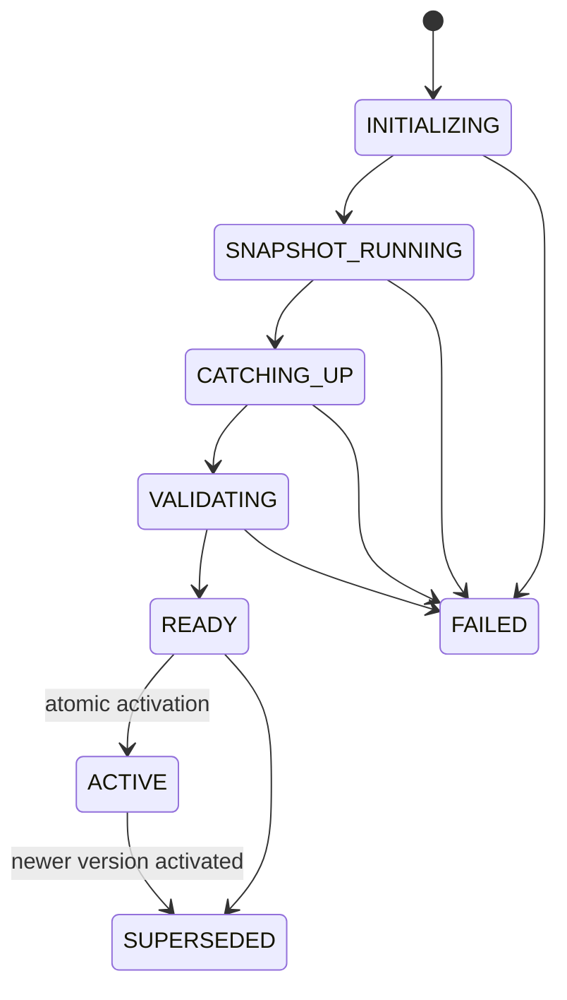
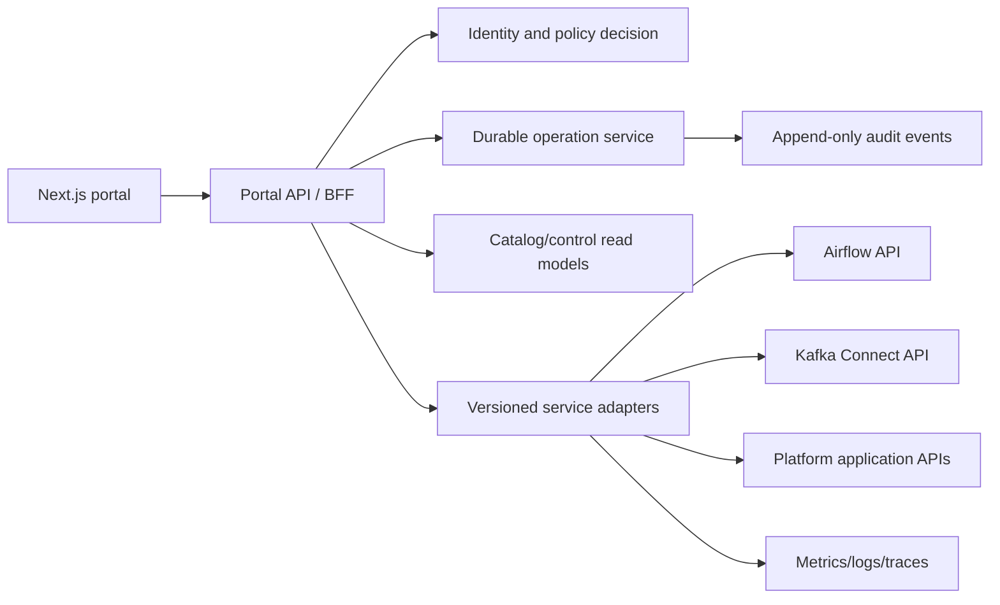

# Enterprise Data Platform Portal

## Document status

| Field                     | Value                                                                                         |
| ------------------------- | --------------------------------------------------------------------------------------------- |
| Status                    | Historical target product direction; current runtime status is documented elsewhere           |
| Scope                     | Possible governed data-platform product; not the implemented Portal security/runtime boundary |
| Current platform baseline | Phase 7 data path plus implemented Portal Web/API security runtime                            |
| Implementation gate       | Data-plane adapters and production authorization remain deferred                              |
| Primary audience          | Product, frontend, backend, platform, security, operations, and governance teams              |

This document preserves a possible control-plane product direction. It is not an implementation
claim and does not replace component manifests, Kafka offsets, Airflow metadata, PostgreSQL control
state, or future catalog authority. The implemented Portal currently provides identity, sessions,
abuse protection, audit/outbox, health, and telemetry, but no operational adapter for Kafka, MinIO,
Airflow, or Silver.

Use the [current architecture](../architecture/current-state.md), the
[Portal boundary](../portal/architecture-boundaries.md), and the
[canonical claim matrix](../architecture/claims.md) for present-tense status.

## 1. Product vision

The portal is the governed entry point for discovering, operating, and auditing the data platform.
It presents the lifecycle from source registration to publication and consumption without exposing
raw infrastructure consoles or privileged service credentials to ordinary users.

The product has four outcomes:

1. Data consumers can discover trusted datasets and understand their ownership, freshness, quality,
   contract, lineage, and approved uses.
2. Engineers can configure and observe ingestion, transformations, publications, backfills, and
   schema changes through consistent workflows.
3. Operators can diagnose lag, failures, recovery state, and incidents from evidence linked across
   PostgreSQL, Kafka, object storage, Silver, Airflow, and the control plane.
4. Administrators can govern access, runtime identities, policies, connections, and audited
   high-risk operations without distributing infrastructure-admin credentials.

The portal is not:

- a replacement for PostgreSQL, Kafka, MinIO, Airflow, or warehouse control planes;
- a raw object editor, arbitrary shell, or universal SQL administration console;
- the source of truth for offsets, object checksums, processing state, or dataset activation;
- permission to expose a planned backend capability as if it already existed.

### Target personas

| Persona                         | Primary outcomes                                                           | Default access                      |
| ------------------------------- | -------------------------------------------------------------------------- | ----------------------------------- |
| Data consumer / analyst         | Find trusted data, preview masked samples, inspect schema and quality      | Read published datasets             |
| Analytics engineer              | Inspect contracts, transformations, tests, lineage, and releases           | Read plus transformation operations |
| Data engineer                   | Operate sources, ingestion, datasets, backfills, and schema compatibility  | Domain-scoped engineering           |
| Platform operator / SRE         | Diagnose health, lag, failed operations, incidents, and recovery           | Cross-domain operations             |
| Data steward                    | Own glossary, classification, quality policy, and access reviews           | Governance mutations                |
| Security auditor                | Review access, privileged actions, identities, and evidence                | Read-only audit access              |
| Platform administrator          | Manage integrations, policies, capabilities, and environment configuration | Restricted administration           |
| Executive / finance stakeholder | View certified service, risk, quality, and reconciliation outcomes         | Aggregated, non-sensitive views     |

### Primary workflows

- Register and validate a data source, obtain approval, deploy ingestion, and monitor it.
- Observe a dataset from source event through Bronze, Silver, warehouse, and business products.
- Investigate a failed pipeline from alert to root cause, runbook, recovery action, and evidence.
- Request and execute a bounded, approved backfill against an immutable input snapshot.
- Triage, approve, redrive, and close quarantined records without losing original evidence.
- Review a schema proposal, compatibility impact, affected consumers, and staged rollout.
- Request dataset access based on classification, purpose, environment, and expiry.
- Execute snapshot bootstrap and atomic activation without exposing an incomplete `CURRENT`.

## 2. Truthful capability model

The portal must query a server-owned capability registry at session start and on environment change.
Navigation, actions, and page explanations are derived from this registry.

| Capability state | Meaning                                                       | Portal behavior                                         |
| ---------------- | ------------------------------------------------------------- | ------------------------------------------------------- |
| `AVAILABLE`      | Backend is deployed, healthy enough to query, and supported   | Show page and permitted actions                         |
| `READ_ONLY`      | Query is supported but mutations are intentionally disabled   | Show data; disable actions with reason                  |
| `DEGRADED`       | Capability exists but health or dependency checks are failing | Show last verified state and degraded banner            |
| `PLANNED`        | Approved target capability has no supported runtime backend   | Hide by default or show a clearly labelled roadmap page |
| `DISABLED`       | Installed capability is administratively disabled             | Hide actions; show policy reason to authorized users    |

The frontend must not hard-code platform maturity. The registry response includes environment,
capability version, API contract version, health, read/write mode, and reason.

### Baseline mapping

| Domain                                                        | Repository status                        | Current or possible Portal state                              |
| ------------------------------------------------------------- | ---------------------------------------- | ------------------------------------------------------------- |
| Portal identity, sessions, abuse, audit, health, telemetry    | Implemented locally                      | Available within the current Portal security/runtime boundary |
| PostgreSQL payment source and generator                       | Implemented locally                      | No Portal adapter; possible future `AVAILABLE` state          |
| Debezium, Kafka, and Kafka Connect                            | Implemented as a local single-node stack | No Portal adapter; possible future `AVAILABLE` state          |
| Settlement batch ingestion                                    | Implemented                              | No Portal adapter; possible future `AVAILABLE` state          |
| MinIO Bronze/quarantine and Silver                            | Implemented locally                      | No Portal adapter; possible future `AVAILABLE` state          |
| CDC consumer and component manifests                          | Implemented                              | No Portal adapter; possible future `AVAILABLE` state          |
| Airflow and PostgreSQL control schema                         | Implemented locally                      | No Portal adapter; possible future `AVAILABLE` state          |
| Production identity, policies, deployment, HA/DR              | Deferred                                 | `PLANNED` only if separately authorized                       |
| Gold, executable dbt, warehouse, Dremio, Superset             | Not implemented                          | `PLANNED`                                                     |
| Enterprise catalog, column lineage, governed DLQ redrive      | Not implemented                          | `PLANNED`                                                     |
| Full platform observability, incident, and alert integrations | Not implemented                          | `PLANNED`                                                     |

## 3. Product principles

1. **Evidence before action.** Every operational claim links to its source, verification time, and
   freshness. Unknown is never rendered as healthy.
2. **Safe by default.** Production mutations require explicit scope, impact preview, idempotency,
   authorization, and audit evidence.
3. **Active is distinct from staged.** Candidate datasets, partial snapshots, unverified outputs,
   and failed runs are visually and semantically separate from active publications.
4. **Metadata, not payload, is the default.** Search, notifications, URLs, logs, analytics, and
   browser telemetry must not contain raw financial or personal data.
5. **Server-side authority.** The portal API enforces policy and state transitions. Hiding a button
   is not authorization.
6. **One operational vocabulary.** Dataset, run, attempt, operation, publication, incident, finding,
   and approval have stable identifiers across pages.
7. **Bounded work.** Lists are cursor-paginated, previews are sampled and masked, log tails are
   bounded, and long-running work is represented as durable operations.
8. **Degraded operation is explicit.** Cached results show age and source. Mutations are disabled
   when the control plane cannot prove preconditions.
9. **Accessibility is a release requirement.** Keyboard operation, focus management, contrast,
   non-color status cues, and accessible chart alternatives target WCAG 2.2 AA.

## 4. Information architecture

```text
Home
  Overview
  My work

Build
  Data sources
    Sources
    Connections
    Contracts
    Schema changes
  Ingestion
    CDC overview
    Connectors
    Replication slots
    Kafka topics
    Snapshots
    Consumer batches
    CDC quarantine
    Settlement files
    Batch deliveries
    Batch contracts
  Pipelines
    Pipelines
    Runs
    Schedules
    Backfills
  Transformations
    Projects
    Models
    Releases
  Delivery
    Deployments
    CI/CD runs
    Artifacts

Data
  Datasets
  Lakehouse
    Bronze
    Silver
    Gold
    Object browser
    Publications
  Warehouse
    Warehouses
    Query history
  Query and BI
    SQL workbench
    Dremio
    Superset

Trust
  Catalog
    Technical catalog
    Business catalog
    Glossary
    Search
  Lineage
    Dataset lineage
    Column lineage
    Impact analysis
  Quality
    Overview
    Rules
    Findings
    Decisions
  Governance
    Classifications
    Policies
    Access requests
    Retention

Operate
  Monitoring
    Platform health
    Kafka
    Airflow
    Storage
    Warehouse
    SLAs and freshness
  Alerts
  Incidents
  Recovery
    Recovery checkpoints
    Restore validation
    Replay plans
  DLQ and redrive
  Runbooks
  Audit

Admin
  Users
  Groups and roles
  Service identities
  Permissions and policies
  Secrets and references
  Environments
  Compute and clusters
  Storage configuration
  Feature flags
  API clients and keys
  Integrations
  Portal configuration

Settings
  Profile and locale
  Notifications
  Saved views
  Accessibility
```

Items whose capability is `PLANNED` are not mixed into normal operational navigation. Authorized
users may enable “Show roadmap capabilities,” which renders non-interactive product previews with
an explicit status and dependency list.

## 5. Global application shell

The shell contains:

- a left navigation grouped by Build, Data, Trust, Operate, and Admin;
- an environment selector with persistent production/non-production visual distinction;
- breadcrumbs containing stable resource identifiers;
- global search for approved metadata only;
- a command palette filtered by permission, capability, environment, and resource context;
- an operation center for long-running commands and approval status;
- notifications linked to alert, incident, run, dataset, or access-request records;
- a contextual help drawer containing ownership, runbook, support route, and last verification time;
- a user menu for sessions, preferences, accessibility, locale, and delegated access.

The environment selector cannot silently change while a dialog is open. A production action dialog
pins the environment, resource, revision, and authorization decision to the operation request.

### Common screen contract

Every resource list and workspace implements these states:

| State        | Required behavior                                                                      |
| ------------ | -------------------------------------------------------------------------------------- |
| Loading      | Stable skeleton; preserve filters; no misleading zero values                           |
| Empty        | Explain whether no resources exist, filters exclude them, or access hides them         |
| Error        | Sanitized cause, correlation ID, last verified data, retry, and runbook when available |
| Degraded     | Data age/source banner; reads allowed; unsafe actions disabled                         |
| Unauthorized | Resource existence is not leaked; offer access-request route when policy permits       |
| Stale        | Display observed-at and expires-at; do not merge stale and live metrics without labels |
| Partial      | Name missing sources/partitions and avoid aggregate “healthy” status                   |

All large tables use server-side filtering, sorting, pagination, export authorization, saved views,
column selection, and stable shareable filters. Export is a separate audited permission.

## 6. Screen inventory

The tables below define the complete initial product surface. “Actions” are conditional on both
capability and permission. All pages inherit the common screen contract.

### Home and personal work

| Page     | Purpose and principal content                                                                                   | Actions                                          | Minimum permission |
| -------- | --------------------------------------------------------------------------------------------------------------- | ------------------------------------------------ | ------------------ |
| Overview | Environment status, active incidents, SLA risk, ingestion health, dataset freshness, quality and cost summaries | Open evidence, acknowledge personal notices      | Portal viewer      |
| My work  | Assigned approvals, incidents, access reviews, failed owned pipelines, saved datasets and recent operations     | Approve when authorized, reassign, open resource | Authenticated user |

### Sources and ingestion

| Page                     | Purpose and principal content                                                                                   | Actions                                                | Minimum permission          |
| ------------------------ | --------------------------------------------------------------------------------------------------------------- | ------------------------------------------------------ | --------------------------- |
| Sources                  | Inventory by type, owner, domain, environment, health, contract and ingestion mode                              | Register, validate, disable, open workspace            | Source viewer / engineer    |
| Source workspace         | Connection metadata, datasets, contracts, health, lineage, change history and access                            | Validate, propose change, deploy approved revision     | Domain engineer             |
| Connections              | Endpoint metadata, credential reference, TLS mode, last validation and dependants; never secret values          | Test, rotate reference, disable                        | Platform operator           |
| Contracts                | Versioned schemas, compatibility, owners, examples without sensitive payload and consumers                      | Propose, compare, approve, deprecate                   | Engineer / steward          |
| Schema changes           | Detected/proposed changes, compatibility result, affected datasets and consumer acknowledgement                 | Approve rollout, reject, schedule                      | Steward plus engineer       |
| CDC overview             | Connector/slot/topic/consumer topology, per-partition progress and snapshot state                               | Open component, create approved recovery plan          | CDC viewer / operator       |
| Connectors               | Desired vs observed config fingerprint, task state, source, publication and recent restarts                     | Validate, deploy, pause, resume, restart               | CDC operator                |
| Connector workspace      | Configuration with secrets redacted, tasks, errors, metrics, revisions, audit and dependants                    | Reconcile approved revision, rotate secret reference   | CDC operator                |
| Replication slots        | Active state, retained WAL, restart/flush LSN, owner, connector and risk forecast                               | Create approved remediation, never ad-hoc drop         | Database operator           |
| Kafka topics             | Topic/partition inventory, retention, replica health, offsets, consumers and schema references                  | Inspect metadata, request retention change             | Streaming viewer / operator |
| Topic workspace          | Per-partition watermarks, consumer lag, sample metadata, schemas and linked Bronze ranges                       | Create replay plan, open partition evidence            | Streaming operator          |
| Snapshots                | Generation, attempt, table state, source fence, catch-up, validation and activation progress                    | Start, resume, cancel before activation                | CDC operator                |
| Snapshot workspace       | State timeline, candidate outputs, fence/checkpoint evidence, missing partitions, validation and active pointer | Approve activation, fail attempt, supersede            | Operator plus approver      |
| Consumer batches         | Topic/partition offset ranges, manifest state, object/checksum, commit evidence and attempts                    | Retry eligible failure, open object metadata           | CDC operator                |
| CDC quarantine           | Poison record metadata, source coordinate, error classification, retention and redrive status                   | Triage, propose redrive, close                         | Restricted operator         |
| Settlement files         | Delivery inventory, filename/checksum identity, contract, validation and manifest state                         | Upload through supported intake, validate, quarantine  | Batch engineer              |
| Batch delivery workspace | Artifact/delivery lineage, file and row counts, rejection summary, Bronze object and attempts                   | Retry eligible failure, approve changed-content policy | Batch engineer / steward    |
| Batch contracts          | Partner contract versions, compatibility, field policy and adoption                                             | Propose, test, approve, retire                         | Batch engineer / steward    |

### Pipelines and transformations

| Page                    | Purpose and principal content                                                                            | Actions                                            | Minimum permission                  |
| ----------------------- | -------------------------------------------------------------------------------------------------------- | -------------------------------------------------- | ----------------------------------- |
| Pipelines               | Inventory by owner, schedule, status, SLA, capability and environment                                    | Create supported pipeline, enable/disable schedule | Pipeline viewer / engineer          |
| Pipeline workspace      | Graph, current run, schedule, parameters, dependencies, versions, metrics, alerts and ownership          | Trigger, pause schedule, propose revision          | Pipeline engineer                   |
| Runs                    | Cross-pipeline run/attempt history with state, duration, input/output evidence and quality decision      | Compare, retry eligible attempt, cancel            | Pipeline operator                   |
| Run workspace           | Attempt timeline, task graph, bounded logs, inputs, outputs, quality, lineage, operation and audit links | Retry from allowed boundary, create incident       | Pipeline operator                   |
| Schedules               | Timetables, timezone, concurrency, catch-up, next runs and conflicts                                     | Propose change, pause/resume                       | Pipeline engineer                   |
| Backfills               | Request, immutable input snapshot, overlap decision, owner, approval, claim, attempts and outputs        | Dry-run, submit, approve, cancel, supersede        | Engineer / approver                 |
| Transformation projects | Future dbt/project inventory, repository revision, environments and deployment state                     | Available only when transformation backend exists  | Transformation engineer             |
| Models                  | Future model graph, contract, tests, SQL, materialization and consumers                                  | Compile/test/deploy through approved release       | Transformation engineer             |
| Releases                | Future immutable transformation release, artifacts, checks and promotion evidence                        | Promote exact artifact, roll back                  | Release operator                    |
| Deployments             | Environment promotion, exact artifact digest, migration compatibility, approvals and rollout status      | Promote, pause, roll back exact artifact           | Release operator                    |
| CI/CD runs              | Build/test/security/provenance results linked to revision and artifact                                   | Re-run permitted check, open evidence              | Engineer / release operator         |
| Artifacts               | Immutable image/package/config digest, SBOM, signature, provenance and environment use                   | Promote or revoke under policy                     | Release operator / security auditor |

### Datasets, lakehouse, and warehouse

| Page                 | Purpose and principal content                                                                                              | Actions                                                     | Minimum permission        |
| -------------------- | -------------------------------------------------------------------------------------------------------------------------- | ----------------------------------------------------------- | ------------------------- |
| Datasets             | Searchable inventory of active and staged data products with owner, tier, classification, freshness and quality            | Request access, follow, compare versions                    | Catalog viewer            |
| Dataset workspace    | Profile, schema, partitions, snapshots, versions, lineage, statistics, quality, preview, SQL, files, metadata and ACL tabs | Context-dependent; detailed below                           | Dataset viewer            |
| Bronze               | Immutable source artifacts by source/entity/date/partition with manifest and checksum status                               | Verify, quarantine corrupted artifact; no edit              | Restricted data engineer  |
| Silver               | Normalized publications, active/candidate versions, output types, schema, quality and lineage                              | Validate candidate, request activation                      | Data engineer             |
| Gold                 | Certified business products and reconciliation outputs                                                                     | Hidden until implemented                                    | Business data viewer      |
| Object browser       | Metadata-only bucket/prefix explorer with classification, version, checksum and manifest link                              | Download only by explicit permission; no inline edit        | Restricted storage viewer |
| Publications         | Dataset generation/version inventory, staging state, validation, activation pointer and supersession                       | Activate through guarded workflow                           | Dataset publisher         |
| Warehouse            | Future logical warehouses, workload, credits/cost, queues and role access                                                  | Hidden until implemented                                    | Warehouse viewer          |
| Query history        | Future sanitized query metadata, duration, bytes/credits and failure class                                                 | Cancel own query, open profile                              | Warehouse user            |
| SQL workbench        | Governed read-only or scoped query session with catalog browser, cost estimate, result limit and saved query metadata      | Execute, cancel, save, export when permitted                | Warehouse user            |
| Dremio integration   | Engine status, catalogs, reflections, workloads, jobs and deep links                                                       | Submit governed query or open native console when supported | Query-engine user         |
| Superset integration | Approved dashboards, ownership, certification, freshness, dependencies and embedded/deep-link policy                       | View, request access, open native authoring when permitted  | BI consumer / author      |

### Catalog, lineage, quality, and governance

| Page              | Purpose and principal content                                                                     | Actions                                   | Minimum permission         |
| ----------------- | ------------------------------------------------------------------------------------------------- | ----------------------------------------- | -------------------------- |
| Technical catalog | Physical assets, schemas, storage, owners, producers, consumers and lifecycle                     | Edit governed metadata, assign owner      | Catalog viewer / steward   |
| Business catalog  | Data products, business definitions, certification, SLAs and approved purposes                    | Certify, deprecate, request access        | Consumer / steward         |
| Glossary          | Terms, domains, synonyms, owners, status and linked fields/datasets                               | Propose, approve, retire term             | Steward                    |
| Global search     | Permission-filtered metadata results across datasets, columns, pipelines, incidents and runbooks  | Save search, open access request          | Authenticated user         |
| Dataset lineage   | Interactive upstream/downstream dataset and job graph with version/time filters                   | Expand, compare, export governed evidence | Lineage viewer             |
| Column lineage    | Column mappings, transformation expressions where safe, confidence and provenance                 | Review generated edge, flag uncertainty   | Restricted lineage viewer  |
| Impact analysis   | Consumers, SLAs, owners, dashboards and policies affected by a proposed change                    | Create review package                     | Engineer / steward         |
| Quality overview  | Scorecards by dataset/domain, freshness, completeness, validity, reconciliation and open findings | Drill down, create incident               | Quality viewer             |
| Quality rules     | Versioned rule definition, threshold, scope, owner, deployment and dependencies                   | Propose, test, approve, retire            | Quality engineer / steward |
| Findings          | Append-only evaluations and unresolved references with severity, age, evidence and resolution     | Assign, waive with expiry, link incident  | Quality operator           |
| Quality decisions | Immutable decision snapshots linking evaluations to PASS/WARN/FAIL or publication outcome         | Review, export evidence                   | Auditor / steward          |
| Classifications   | Classification taxonomy and field/dataset assignments                                             | Propose/approve classification            | Data steward               |
| Policies          | Access, masking, retention, residency, export and action policies                                 | Simulate, propose, approve                | Security admin             |
| Access requests   | Purpose, scope, environment, duration, approval chain and revocation status                       | Request, approve, revoke                  | User / approver            |
| Retention         | Policy coverage, legal holds, lifecycle eligibility and deletion evidence                         | Propose hold or policy change             | Governance operator        |

### Operations and administration

| Page                     | Purpose and principal content                                                                              | Actions                                    | Minimum permission              |
| ------------------------ | ---------------------------------------------------------------------------------------------------------- | ------------------------------------------ | ------------------------------- |
| Platform health          | Dependency graph with service liveness, pipeline progress, data freshness and verification age             | Open incident, run approved diagnostic     | Operator                        |
| Kafka monitoring         | Broker/topic/partition availability, lag velocity, retention risk and group progress                       | Open replay/retention request              | Streaming operator              |
| Airflow monitoring       | Scheduler, triggerer, workers, queues, pools, DAG health and metadata DB status                            | Pause DAG, open native logs                | Airflow operator                |
| Storage monitoring       | Capacity, error rate, latency, object integrity, lifecycle and replication/backup status                   | Start approved scrub, open recovery        | Storage operator                |
| Warehouse monitoring     | Future workload, queue, failure, cost and capacity                                                         | Hidden until implemented                   | Warehouse operator              |
| SLA and freshness        | Expected arrival, event-time freshness, processing freshness, backlog and breach forecast                  | Acknowledge, create incident               | Operator / owner                |
| Alerts                   | Alert instances, dedup key, routing, silence, evidence and linked resources                                | Acknowledge, silence with expiry           | Operator                        |
| Incidents                | Severity, commander, timeline, impacted assets, alerts, operations, communications and review              | Declare, update, resolve, start postmortem | Incident responder              |
| Recovery checkpoints     | Cross-system offset/object/publication evidence and restore compatibility                                  | Verify, create replay plan                 | Recovery operator               |
| Restore validation       | Backup/restore drill and consistency checks across source, Kafka, object and publication state             | Run controlled validation                  | Recovery operator               |
| Replay plans             | Immutable scope, starting coordinates, retained-data proof, outputs, approval and execution state          | Dry-run, approve, execute, cancel          | Recovery operator plus approver |
| DLQ and redrive          | Quarantine queue, triage, policy/parser version, decision, target and redrive outcomes                     | Propose/approve/execute redrive            | Restricted operator             |
| Runbooks                 | Versioned operational procedures linked to alert/resource/state                                            | Start checklist, record outcome            | Operator                        |
| Audit                    | Append-only user/service actions, policy decision, request, operation, result and evidence                 | Filter and export governed report          | Auditor                         |
| Users                    | Federated identity status and assignments; not password management                                         | Suspend portal access, review grants       | Identity admin                  |
| Groups and roles         | Role bundles and memberships                                                                               | Propose/approve assignment                 | Identity admin                  |
| Service identities       | Workload identity, owner, scopes, expiry and last use                                                      | Rotate/revoke through provider             | Security admin                  |
| Permissions and policies | Resources, actions, attributes, conditions and policy simulation                                           | Propose/approve policy                     | Security admin                  |
| Secrets and references   | Secret references, owners, rotation state and consumers; values never rendered                             | Rotate reference, revoke                   | Security admin                  |
| Environments             | Environment type, capability registry, guardrails and endpoints                                            | Disable capability, maintenance mode       | Platform admin                  |
| Compute and clusters     | Installed service topology, version, resource class and health                                             | Planned production adapters only           | Platform admin                  |
| Storage configuration    | Bucket, retention, encryption, versioning and policy metadata                                              | Propose configuration change               | Storage admin                   |
| Feature flags            | Environment/tenant-scoped product capabilities with owner and expiry                                       | Enable after approval                      | Platform admin                  |
| API clients and keys     | Machine client, owner, scopes, environment, expiry and last use; secret shown once only                    | Create scoped credential, rotate, revoke   | Security admin                  |
| Integrations             | Airflow, Kafka Connect, MinIO, warehouse, Dremio, Superset, CI/CD and observability adapter status/version | Validate, enable/disable adapter           | Platform admin                  |
| Portal configuration     | Branding, support routes, defaults, session policy and integration status                                  | Update controlled settings                 | Portal admin                    |
| Profile and locale       | User timezone, locale, density and default environment                                                     | Update own preferences                     | Authenticated user              |
| Notifications            | Personal channel/routing preferences within mandatory-policy limits                                        | Subscribe, mute optional notification      | Authenticated user              |
| Saved views              | Personal/team filters, columns and dashboards without sensitive result data                                | Create, share, delete                      | Authenticated user              |
| Accessibility            | Motion, contrast, chart table preference, keyboard help and assistive settings                             | Update own preferences                     | Authenticated user              |

### Screen implementation contract

Every page in the inventory inherits one of the following screen archetypes. This inheritance makes
widgets, tables, charts, filters, dialogs, navigation, and state behavior explicit without defining
the same behavior separately for every route.

| Archetype      | Pages                                                                                                                                                        | Widgets and charts                                                                            | Tables and filters                                                                                   | Actions and dialogs                                                                              | Navigation and state changes                                                                               |
| -------------- | ------------------------------------------------------------------------------------------------------------------------------------------------------------ | --------------------------------------------------------------------------------------------- | ---------------------------------------------------------------------------------------------------- | ------------------------------------------------------------------------------------------------ | ---------------------------------------------------------------------------------------------------------- |
| Dashboard      | Overview and the seven role dashboards                                                                                                                       | KPI cards, health matrix, time series, SLA/risk charts and actionable queues                  | Environment, domain, owner, time range and severity; drill-down table behind every chart             | Save view, share metadata-only link, acknowledge when authorized                                 | Card/chart opens a filtered inventory; live updates never erase the selected time range                    |
| Inventory      | Sources, connections, contracts, connectors, slots, topics, batches, files, pipelines, runs, datasets, objects, findings, alerts, users and other list pages | Summary counts, state distribution and age/freshness strip                                    | Cursor-paginated server-side grid; allowlisted filters, stable sort, saved views and governed export | Create/request/bulk action only where bounded; dialogs show scope and validation                 | Row opens workspace; mutation creates operation and row displays pending state until authoritative refresh |
| Workspace      | Source, connector, snapshot, batch delivery, pipeline, run, dataset and incident workspaces                                                                  | Identity header, state/SLA cards, timeline, dependency/lineage graph and evidence panels      | Version, attempt, time and evidence filters; child-resource tables                                   | Contextual actions use impact, confirmation, approval and result dialogs                         | Tabs retain resource/version context; state changes append timeline events rather than replace history     |
| Graph          | Pipeline, lineage, column lineage, topology and impact analysis                                                                                              | Bounded interactive graph, minimap, legend, version/time selector and selected-node inspector | Search, node/edge type, environment, depth, confidence and status filters                            | Expand branch, compare versions, create review package; no graph edit unless explicitly governed | Node opens workspace drawer/page; URL preserves root, version and filters                                  |
| Operation      | Backfills, recovery, replay, redrive, deployment and activation                                                                                              | Stepper, immutable scope, precondition checklist, progress, affected resources and evidence   | Attempts, approvals, per-item outcomes and errors                                                    | Draft, validate, dry-run, submit, approve, cancel request and verify dialogs                     | Browser never advances state locally; operation events trigger authoritative re-fetch                      |
| Administration | Roles, policies, identities, secrets, keys, environments, integrations, flags and configuration                                                              | Coverage, expiry, risk and dependency summaries                                               | Principal/resource/environment/status filters and change history                                     | Create revision, simulate policy, approve, rotate, revoke and disable                            | All edits create revisions; effective state changes only after server validation/approval                  |
| Evidence       | Quality decisions, audit, query history, CI/CD evidence and artifacts                                                                                        | Integrity, provenance, decision and retention summary                                         | Append-only server-side table with time, actor, resource, result and correlation filters             | Export under explicit permission; link incident or review; no destructive edits                  | Entries deep-link to resource revision and operation; evidence is immutable                                |

Page-specific composition is as follows:

| Page group                                           | Archetype and mandatory page-specific behavior                                                   |
| ---------------------------------------------------- | ------------------------------------------------------------------------------------------------ |
| Home and dashboards                                  | Dashboard; empty state distinguishes “no access,” “no configured data,” and “healthy zero”       |
| All resource plural routes                           | Inventory; creation is absent when the capability is read-only or planned                        |
| Named resource details                               | Workspace; failed/degraded dependencies show last verified evidence and disable unsafe mutations |
| Dataset/pipeline/lineage topologies                  | Graph plus Workspace; graph is progressively expanded and has an accessible table representation |
| Backfill/snapshot/recovery/replay/redrive/activation | Operation; leaving the page does not cancel work and reopening restores durable status           |
| Admin and Settings                                   | Administration; settings preview effective scope and never expose secret values                  |
| Audit/quality decisions/artifact provenance          | Evidence; no update/delete transition exists in the Portal contract                              |

### Dialog contract

| Dialog type     | Required content                                                                                                    |
| --------------- | ------------------------------------------------------------------------------------------------------------------- |
| Create/revision | Environment, owner, immutable base revision, changed fields, validation result and save-as-draft                    |
| Impact preview  | Exact resources/partitions/versions, expected data movement, SLA/cost estimate, policy checks and unknowns          |
| Approval        | Requester, approver eligibility, separation of duties, reason, expiry and immutable request fingerprint             |
| Confirmation    | Stable resource identifier, environment, action consequence, rollback/recovery path and idempotency key             |
| Progress        | Durable operation ID, current state, heartbeat, completed/failed units, cancellation eligibility and event timeline |
| Error           | Safe problem statement, correlation ID, failed precondition, retry eligibility and runbook                          |
| Access request  | Dataset/fields, purpose, duration, environment, requested operations and approval chain                             |

Dialogs never contain the only copy of operation evidence. Closing a dialog retains the operation in
the global operation center.

## 7. Dashboard design

Dashboards are role-specific saved views over governed metrics, not independent metric sources.

| Dashboard    | Principal questions                                       | Required measures                                                                                                                   |
| ------------ | --------------------------------------------------------- | ----------------------------------------------------------------------------------------------------------------------------------- |
| Executive    | Is the platform meeting service and business commitments? | Certified availability, SLA attainment, active material incidents, trusted dataset coverage, reconciliation status when implemented |
| Platform     | Which platform domains are healthy or at risk?            | Service liveness, backlog, per-partition progress, storage capacity, failed operations, capability degradation                      |
| Operations   | What needs action now?                                    | Stalled partitions, WAL retention risk, failed tasks, publishing failures, stale manifests, alert/incident queue                    |
| Engineering  | Are changes and workloads behaving correctly?             | Deployment/revision state, run success, latency, schema changes, quality regression, retry/replay rate                              |
| Data quality | Can consumers trust published data?                       | Rule outcomes, rejected records, unresolved references, freshness, decision history, waivers                                        |
| Security     | Is access and privileged operation use within policy?     | Active privileged grants, expiring identities, denied actions, secret rotation, break-glass use, audit gaps                         |
| Business     | Are payment and settlement products current and complete? | Product-specific certified KPIs only after Gold/reconciliation exists                                                               |

Every visualization has a table alternative, unit, time window, timezone, aggregation rule,
last-updated timestamp, source, and definition link. “No data,” zero, and unknown are distinct.

## 8. Dataset workspace

The dataset workspace is the main unit of discovery and publication:

| Tab        | Content                                                                                                                      |
| ---------- | ---------------------------------------------------------------------------------------------------------------------------- |
| Overview   | Description, owner, domain, tier, certification, active version, freshness, quality, classification, producers and consumers |
| Schema     | Versioned fields, types, nullability, key, money precision, timestamp semantics, classification and glossary mapping         |
| Partitions | Physical/logical partitions, ranges, size, rows, freshness, completeness and gaps                                            |
| Snapshots  | Snapshot generations/attempts, source fence, catch-up, validation and activation                                             |
| Versions   | Active, prior, candidate, failed and superseded versions with immutable lineage                                              |
| Lineage    | Dataset graph with time/version filters and source evidence                                                                  |
| Statistics | Row/byte counts, distributions safe for classification, skew and change over time                                            |
| Quality    | Current and historical rules, findings, decisions, waivers and unresolved references                                         |
| History    | Audit-safe event/publication timeline; payload omitted by default                                                            |
| Preview    | Bounded, masked, purpose-authorized sample; disabled for restricted datasets                                                 |
| SQL        | Read-only governed query editor when a query backend exists; cost/row limits enforced server-side                            |
| Files      | Authorized physical objects, checksums, versions, manifests and retention                                                    |
| Metadata   | Technical/business attributes, contracts, tags, owners, SLAs and support                                                     |
| Access     | Effective permissions, policy explanation, access requests and expiry                                                        |

The header always identifies environment, dataset ID, active publication, candidate status, schema
version, classification, and freshness. A staged or incomplete version never inherits the active
badge.

## 9. Pipeline workspace

The graph distinguishes data assets, tasks, external dependencies, quality gates, publications, and
manual approvals. Selecting a node opens evidence rather than duplicating component consoles.

The current-run panel includes run and attempt identity, durable state, claimed inputs, output
publications, quality decision, elapsed/SLA time, retry eligibility, and last heartbeat. History is
filterable by release, schedule, backfill, status, input version, and incident.

Triggering requires:

1. an immutable pipeline release and parameter schema;
2. server validation and impact preview;
3. an idempotency key;
4. production approval where policy requires it;
5. a durable operation resource returned before execution.

Logs are bounded, redacted, access-controlled, correlated to task attempts, and retained according to
policy. The portal links to the native Airflow UI for unsupported low-level diagnostics rather than
proxying unrestricted administration.

## 10. CDC workspace

The CDC topology is rendered as:

```mermaid
flowchart LR
    PG["PostgreSQL source"] --> SLOT["Replication slot"]
    SLOT --> CONNECTOR["Debezium connector"]
    CONNECTOR --> TOPIC["Kafka topic partitions"]
    TOPIC --> GROUP["Bronze consumer group"]
    GROUP --> BRONZE["Immutable Bronze ranges"]
    BRONZE --> CANDIDATE["Silver candidate"]
    CANDIDATE --> ACTIVE["Active dataset version"]
```



The workspace treats the following as separate signals:

- service liveness;
- per-partition transport progress;
- source-event and publication freshness;
- snapshot/bootstrap state;
- WAL/retention recoverability;
- consumer commit versus verified Bronze publication;
- active dataset version versus staged candidate.

Snapshot details use the frozen ADR vocabulary: dataset generation, snapshot attempt, stream
incarnation, source fence, connector offset checkpoint, candidate version, continuation epoch, and
atomic activation pointer. Recovery and replay are planned operations, never direct offset text
boxes.

Delete inspection shows whether the event carried a full pre-image, key-only pre-image, or a
reconstructed state and links to the governing delete policy. Schema-change events are visible even
when downstream processing does not yet support them.

## 11. Lakehouse workspace

Bronze, Silver, and future Gold have distinct semantics:

| Layer  | Portal contract                                                                          |
| ------ | ---------------------------------------------------------------------------------------- |
| Bronze | Immutable source evidence and transport coordinates; no correction or active-state claim |
| Silver | Versioned normalized outputs; candidates are not active until publication succeeds       |
| Gold   | Certified business products only after reconciliation/business contracts are implemented |

The object browser is metadata-first. Inline content preview is not the default and is unavailable
for quarantine or restricted financial data without an explicit policy decision. The manifest view
shows object URI, checksum, version ID when available, writer identity, input identity, state,
verification evidence, and publication membership.

Compaction, lifecycle, retention, legal hold, and integrity-scrub actions are represented as durable
operations with impact previews. The portal cannot mutate or delete an immutable Bronze object.

## 12. Catalog and lineage

The catalog separates physical assets, technical datasets, and governed business products. Search
indexes only metadata the current principal is allowed to discover.

Lineage edges include:

- upstream and downstream asset IDs and versions;
- producer run/release and transformation;
- source of lineage evidence: declared, parsed, runtime, or manual;
- confidence and verification time;
- column mappings when supported;
- environment and publication scope.

Impact analysis uses versioned lineage, not only the latest graph. A proposed schema or policy
change produces a review package of affected pipelines, datasets, dashboards, owners, SLAs, access
policies, and unresolved consumers. Manual edges are labelled and audited.

Root-cause analysis starts from a failed dataset, quality finding, alert, or incident and traverses
upstream using the resource versions and run attempts that were active at the failure time. It
overlays failed tasks, schema changes, delayed partitions, publication changes, deployments, and
quality decisions. It does not infer causality from graph proximity: suspected causes are labelled
as hypotheses until linked to operational evidence.

## 13. Observability, incidents, and recovery

The portal aggregates operational evidence but does not become the only telemetry store. Each panel
links to the underlying metric/log/trace source and query time.

The observability surface includes:

- PostgreSQL WAL, connection, transaction, lock and replication health;
- Kafka broker, topic, partition, consumer-group, retention and lag-velocity health;
- Kafka Connect connector/task state, error class, restart history and configuration revision;
- Airflow scheduler, triggerer, worker, pool, queue, DAG and task-attempt health;
- MinIO capacity, request latency/error, versioning, replication, backup and integrity scrub;
- dbt project/model/test/exposure execution after its runtime exists;
- Snowflake and Dremio query, workload, queue, cost and capacity after adapters exist;
- Superset dashboard freshness and dependency status without importing dashboard data into Portal;
- pipeline SLA, event-time freshness, processing progress and publication freshness as separate
  measures;
- Portal API and adapter latency, error, authorization denial and durable-operation health.

An incident workspace provides:

- declared severity, status, commander, responders, and impacted environments;
- an append-only timeline of alerts, state changes, operations, and annotations;
- linked datasets, pipelines, connectors, partitions, publications, and access changes;
- runbook execution with checked steps and captured evidence;
- recovery checkpoint and replay-plan status;
- post-incident actions and immutable closure summary.

Recovery UI is intentionally plan-driven:

```text
Select checkpoint
  -> verify object checksums and publication references
  -> compare Kafka committed offsets and retained ranges
  -> determine first missing/replay coordinate per partition
  -> simulate impact
  -> obtain policy approval
  -> execute durable operation
  -> validate convergence
  -> close with evidence
```

The browser never decides offset values or marks recovery complete. Those decisions are made and
verified by the recovery service defined by the production-readiness architecture.

## 14. Administration and operational safety

### Authorization model

The identity provider supplies authenticated principal and group claims. The portal API evaluates
resource/action policy using:

- role;
- environment;
- domain and resource ownership;
- data classification;
- action risk;
- purpose and access expiry;
- incident or change context;
- separation-of-duties constraints.

| Risk class | Examples                                                      | Required control                                                                             |
| ---------- | ------------------------------------------------------------- | -------------------------------------------------------------------------------------------- |
| R0         | Metadata read, masked preview                                 | Standard authorization                                                                       |
| R1         | Retry failed non-terminal attempt, acknowledge alert          | Authorization, idempotency and audit                                                         |
| R2         | Connector restart, backfill, candidate activation, redrive    | Impact preview, step-up authentication, approval as policy requires                          |
| R3         | Restore, offset reset, retention override, break-glass access | Two-person approval, bounded scope/time, incident/change reference, post-action verification |

Approval is a durable resource separate from the action. The same principal cannot request and
approve an R3 action. All mutations carry the authenticated actor, delegated/service identity,
policy revision, request body fingerprint, correlation ID, idempotency key, and result.

### Secret policy

The portal stores and displays secret references only. Secret values are entered directly into an
approved secret-management flow, never returned to the browser after submission, never placed in
URLs or operation payloads, and never included in audit/event text. Connector and connection views
show credential version, owner, expiry, rotation status, and consumers.

## 15. Major user flows

### Create and deploy a source

```text
Draft source
  -> select supported source type and environment
  -> configure non-secret connection metadata and secret reference
  -> validate connectivity and least privilege
  -> discover candidate datasets
  -> define contract, owner, classification and ingestion mode
  -> run compatibility and impact checks
  -> obtain required approval
  -> deploy immutable source revision
  -> monitor bootstrap and activation
```

### Ingest a settlement delivery

```text
Observe or register delivery
  -> bind partner contract and expected settlement window
  -> calculate immutable artifact identity
  -> validate file and rows
  -> review partial rejection or file quarantine
  -> publish unchanged raw bytes to Bronze
  -> verify manifest and checksum
  -> process Silver candidate
  -> publish eligible output
  -> monitor quality and reconciliation when available
```

### Dataset bootstrap and activation



The Portal displays and controls this state only through the dataset bootstrap API defined by
ADR-001. Candidate objects remain outside active queries until the activation pointer moves.

### Backfill

```text
Choose pipeline and immutable release
  -> define dataset/date/partition scope
  -> snapshot exact eligible inputs
  -> validate source/entity compatibility and overlap
  -> dry-run and estimate impact
  -> approve
  -> claim work with lease
  -> execute attempts
  -> validate outputs and quality
  -> publish or fail
  -> record supersession and audit
```

### Diagnose and recover CDC

```text
Alert identifies connector, slot, topic and affected partitions
  -> compare source/WAL, connector, Kafka and consumer progress
  -> verify Bronze object ranges and committed offsets
  -> identify retention and replay feasibility
  -> create immutable recovery or replay plan
  -> dry-run preconditions and impact
  -> obtain R2/R3 approval
  -> execute through recovery service
  -> validate per-partition convergence and dataset publication
  -> close incident with evidence
```

### DLQ redrive

```text
Triage immutable quarantine evidence
  -> classify root cause
  -> select parser/policy version
  -> preview target and duplicate protection
  -> approve bounded redrive
  -> write new immutable attempt
  -> verify downstream publication
  -> resolve or retain finding
```

### Schema evolution

```text
Detect/propose schema revision
  -> compatibility evaluation
  -> versioned lineage impact
  -> consumer acknowledgements
  -> expand-compatible deployment
  -> validation/backfill if required
  -> activate
  -> observe
  -> contract old schema only after policy gate
```

### Request and grant dataset access

```text
Discover dataset and masked metadata
  -> request fields, purpose, environment, actions and expiry
  -> evaluate classification and policy
  -> steward/security approval where required
  -> provision time-bounded entitlement
  -> verify access
  -> review and revoke automatically at expiry
```

### Release a pipeline or transformation

```text
Select signed build artifact and immutable configuration
  -> verify tests, migration compatibility, SBOM and policy
  -> show lineage and SLA impact
  -> approve environment promotion
  -> deploy the same artifact digest
  -> observe canary/rollout
  -> verify pipeline and data outcomes
  -> roll back to previous digest if the release gate fails
```

### Rotate a credential

```text
Select secret reference and dependants
  -> create new secret version outside the Portal display path
  -> validate affected connection with new version
  -> reconcile connector/service configuration
  -> verify reconnect and processing progress
  -> revoke previous version after safety window
  -> record rotation evidence
```

### Respond to an incident

```text
Alert or user declares incident
  -> assign commander and scope impact
  -> correlate deployments, pipeline attempts, partitions and publications
  -> follow versioned runbook
  -> execute approved recovery operations
  -> verify service and data convergence
  -> communicate resolution
  -> complete post-incident review and follow-up backlog
```

## 16. UX and design system

### Visual language

- Desktop-first workspace with compact density; tablet supports incident response and approvals;
  mobile is read-mostly and does not expose R2/R3 actions.
- Dark and light themes are equal product modes. Production is distinguished by labelled
  environment chrome, not only color.
- Neutral surfaces use slate/gray. Blue represents information, green verified success, amber
  warning, red failure/danger, and violet staged/candidate state.
- Status always uses icon, label, and accessible text in addition to color.
- Typography: Inter or another tested variable sans for UI; JetBrains Mono or equivalent for IDs,
  offsets, SQL, and logs.
- A 4-pixel spacing scale, 44-pixel minimum pointer target for primary controls, and consistent
  focus rings.
- Lucide-style outline icons with text labels for consequential actions.
- Charts use accessible descriptions, keyboard-accessible legends, high-contrast palettes, patterns
  where needed, and tabular alternatives.

### Interaction rules

- Destructive or high-risk actions are not placed beside routine actions without separation.
- Confirmation requires re-entering a stable resource identifier for R3 operations, not generic
  “Are you sure?”
- Optimistic UI is permitted for local preferences, never for platform state transitions.
- Toasts do not carry the only evidence of an operation; every command appears in the operation
  center.
- URLs contain opaque identifiers and metadata filters, never raw payload, secret, token, or SQL.
- Date/time shows user timezone and UTC on hover/detail; operational ordering uses source
  coordinates rather than display time.

## 17. Frontend architecture

### Recommended structure

| Concern              | Decision                                                                                                               |
| -------------------- | ---------------------------------------------------------------------------------------------------------------------- |
| Framework            | Next.js App Router with TypeScript                                                                                     |
| Rendering            | Server components for shell/read composition; client components for interactive grids, graphs, editors and live panels |
| Component foundation | Tailwind CSS plus accessible Radix/shadcn-style primitives behind a platform-owned design system                       |
| Server state         | TanStack Query for cache, invalidation, retries, pagination and mutation lifecycle                                     |
| Local UI state       | Zustand only for ephemeral workspace preferences, selections and layout; never authoritative server state              |
| Forms                | React Hook Form plus generated/central schema validation                                                               |
| Tables               | AG Grid after license review; server-side or infinite model for large resources                                        |
| Graphs               | React Flow for pipeline and lineage exploration                                                                        |
| Charts               | Apache ECharts with ARIA enabled and table alternatives                                                                |
| Editors              | Monaco for SQL/JSON/YAML where a backend supports safe validation                                                      |
| Authentication       | OIDC authorization-code flow with PKCE; secure server-managed session preferred                                        |
| Live updates         | SSE by default for operation/status feeds; WebSocket only for truly bidirectional sessions                             |
| Contracts            | Generated TypeScript client from versioned OpenAPI, with runtime validation at trust boundaries                        |
| Localization         | Message catalogs, locale-safe numbers, and explicit timezones; English first with Vietnamese-ready structure           |

Conceptual frontend boundaries:

```text
app/
  routes and layouts
features/
  sources, ingestion, datasets, pipelines, quality, operations, admin
entities/
  typed resource views and identifiers
components/
  platform design system and shared workspace primitives
api/
  generated client, query keys, event subscriptions, error mapping
auth/
  session, policy hints, route experience
telemetry/
  privacy-safe frontend metrics and correlation
```

Feature modules cannot import infrastructure-specific response shapes. Adapter/query layers map the
portal API into stable product entities.

### State and caching

- Query keys include environment, capability version, resource ID, filters, sort, and API revision.
- Mutations invalidate only affected resources and follow the durable operation until terminal.
- Sensitive previews use no persistent browser cache and clear on environment/session change.
- Browser storage contains preferences only; no tokens, raw records, secrets, logs, or approval
  payloads.
- Offline mode is not supported for operational actions.

### Error handling

The UI maps server problem details into field errors, conflict/precondition state, authorization,
rate limit, dependency degradation, or internal failure. It shows correlation ID and safe recovery
actions. It never displays raw upstream error bodies or stack traces.

## 18. Portal backend architecture

The Portal API is a Backend for Frontend (BFF), initially implemented as an independently deployed
FastAPI service. It provides a stable product contract, policy enforcement, aggregation, capability
discovery, audit, and durable operations. It does not connect from the browser directly to Kafka,
PostgreSQL, MinIO, Airflow metadata tables, or service administration endpoints.



The BFF must not write component databases directly to bypass application state machines. Where a
supported API does not exist, the capability remains read-only or planned.

### API style

Use versioned REST/OpenAPI for resources, commands, approvals, and durable operations. GraphQL may
be evaluated later for catalog/lineage read composition, but is not required for the initial
product. Command semantics remain REST resources even if a read graph is added.

### Endpoint families

| Method and path                                       | Responsibility                                               | Risk  |
| ----------------------------------------------------- | ------------------------------------------------------------ | ----- |
| `GET /v1/capabilities`                                | Environment capability registry and health                   | R0    |
| `GET /v1/environments`                                | Authorized environments and guardrails                       | R0    |
| `GET /v1/search`                                      | Permission-filtered metadata search                          | R0    |
| `GET /v1/datasets`                                    | Dataset inventory with cursor pagination                     | R0    |
| `GET /v1/datasets/{id}`                               | Dataset workspace summary                                    | R0    |
| `GET /v1/datasets/{id}/versions`                      | Active/candidate/superseded publications                     | R0    |
| `POST /v1/datasets/{id}/activation-requests`          | Guarded candidate activation request                         | R2    |
| `GET /v1/pipelines`                                   | Pipeline inventory                                           | R0    |
| `GET /v1/pipeline-runs`                               | Run and attempt history                                      | R0    |
| `POST /v1/pipelines/{id}/run-requests`                | Trigger immutable pipeline release                           | R1/R2 |
| `GET /v1/sources`                                     | Source inventory                                             | R0    |
| `POST /v1/source-revisions`                           | Create source revision, not live resource                    | R1    |
| `POST /v1/source-revisions/{id}/validations`          | Durable validation                                           | R1    |
| `GET /v1/cdc/connectors`                              | Desired and observed connectors                              | R0    |
| `POST /v1/cdc/connectors/{id}/operations`             | Reconcile/pause/resume/restart request                       | R2    |
| `GET /v1/cdc/slots`                                   | Replication slot/WAL evidence                                | R0    |
| `GET /v1/kafka/topics/{topic}/partitions`             | Per-partition watermarks and progress                        | R0    |
| `GET /v1/cdc/snapshots`                               | Bootstrap generation/attempt state                           | R0    |
| `POST /v1/cdc/snapshots`                              | Start approved snapshot generation                           | R2    |
| `GET /v1/lakehouse/objects`                           | Authorized metadata-only object listing                      | R0    |
| `POST /v1/query-sessions`                             | Create bounded governed SQL session when engine exists       | R1    |
| `POST /v1/query-sessions/{id}/statements`             | Validate/execute statement with limits                       | R1    |
| `GET /v1/bi-assets`                                   | Dremio/Superset-backed approved query and dashboard metadata | R0    |
| `GET /v1/catalog/assets`                              | Technical and business catalog                               | R0    |
| `GET /v1/lineage`                                     | Version/time-bounded lineage graph                           | R0    |
| `GET /v1/quality/findings`                            | Append-only quality evidence                                 | R0    |
| `POST /v1/backfill-requests`                          | Validate/create bounded backfill                             | R2    |
| `POST /v1/redrive-requests`                           | Create governed DLQ redrive                                  | R2    |
| `GET /v1/recovery/checkpoints`                        | Cross-system recovery evidence                               | R0    |
| `POST /v1/recovery/replay-plans`                      | Dry-run/submit replay plan                                   | R2/R3 |
| `GET /v1/operations/{id}`                             | Durable operation status/evidence                            | R0    |
| `GET /v1/deployments`                                 | Environment promotion and rollout status                     | R0    |
| `POST /v1/deployment-requests`                        | Promote exact signed artifact                                | R2    |
| `GET /v1/artifacts/{digest}`                          | Artifact provenance, SBOM, signature and use                 | R0    |
| `GET /v1/integrations`                                | Adapter capabilities, version and health                     | R0    |
| `GET /v1/events`                                      | Authorized SSE stream                                        | R0    |
| `GET /v1/audit-events`                                | Permission-filtered audit ledger                             | R0    |
| `POST /v1/admin/api-clients`                          | Create scoped machine client; credential returned once       | R2    |
| `POST /v1/admin/api-clients/{id}/rotations`           | Rotate machine credential                                    | R2    |
| `DELETE /v1/admin/api-clients/{id}/active-credential` | Revoke active credential                                     | R2/R3 |
| `/v1/admin/*`                                         | Identity, policy, environment and capability administration  | R2/R3 |

### API invariants

- Cursor pagination is opaque and tied to a stable sort. Page-number pagination is not used for
  rapidly changing operational resources.
- Filters are explicit allowlisted fields and include environment.
- Mutating requests require an `Idempotency-Key`, expected resource revision/ETag, and reason.
- A stale revision returns a conflict/precondition response rather than silently overwriting state.
- Long-running commands return `202 Accepted` with an operation resource containing status,
  progress, approval, result, safe error, timestamps, actor and audit links.
- Cancellation is a requested state transition, not process termination.
- Bulk actions have explicit maximum scope and per-item result.
- Error responses use a consistent problem-details contract and correlation ID.
- SSE events contain resource IDs and state summaries, not sensitive payloads. Clients always
  re-fetch authoritative resource state after reconnect.
- APIs version contracts independently from backend component versions.

### Event contract

Portal events are notifications that state may have changed, not an alternate event-sourced source
of truth. Each event contains event ID, type, occurred time, environment, resource type/ID/revision,
operation ID when applicable, authorization scope, and a safe summary. Event types are versioned,
for example:

```text
operation.state_changed.v1
pipeline_run.state_changed.v1
dataset_candidate.validation_changed.v1
dataset_publication.activated.v1
alert.state_changed.v1
incident.timeline_appended.v1
approval.state_changed.v1
capability.state_changed.v1
```

Clients resume SSE with the last event ID. If the resume window has expired, the server signals a
reset and the client invalidates relevant queries. Events never contain raw records, secrets,
arbitrary upstream errors, or complete log lines.

### GraphQL decision

GraphQL is optional for future catalog/lineage read aggregation where clients need bounded graph
selection. If adopted, persisted queries, depth/complexity limits, field-level authorization and
cursor pagination are mandatory. GraphQL does not expose infrastructure schemas and does not
replace REST command, operation, approval, audit, or streaming contracts.

## 19. Authentication, authorization, and tenancy

Use Keycloak or an equivalent enterprise OIDC provider after an operational evaluation. Browser
authentication uses authorization code with PKCE and MFA/step-up according to action risk. The
Portal API is the policy enforcement point; the identity provider may provide role and attribute
claims or a centralized decision service.

The first production version is single organization with explicit environment/domain boundaries.
Do not claim multi-tenancy by adding a `tenant_id` column. Enterprise multi-tenancy requires
isolation for identity, policy, encryption, quotas, metadata, operations, audit, search, telemetry,
and recovery and belongs to a separate architecture decision.

## 20. Non-functional requirements

| Area            | Initial target                                                                                                           |
| --------------- | ------------------------------------------------------------------------------------------------------------------------ |
| Availability    | Portal degradation must not stop existing data-plane ingestion; mutations fail closed when authority is unavailable      |
| Read latency    | P95 under 2 seconds for ordinary metadata lists; long queries become operations                                          |
| Scale           | No unbounded browser lists; server-side pagination/filtering; graph expansion is bounded                                 |
| Freshness       | Every status carries observed time and source; operational feeds reconnect from event IDs                                |
| Security        | OIDC, short-lived sessions, CSP, CSRF protection, rate limits, input validation, dependency allowlists                   |
| Privacy         | No raw data in telemetry/search/notifications; masked previews; explicit export permission                               |
| Audit           | Append-only action and policy evidence, synchronized time, retention and integrity verification                          |
| Accessibility   | WCAG 2.2 AA target, keyboard-first workflows and automated/manual testing                                                |
| Browser support | Current enterprise-managed Chromium, Firefox, and Safari policy versions                                                 |
| Resilience      | Capability isolation, bounded retries, circuit breakers, stale read labelling and no implicit cross-environment fallback |
| Observability   | Portal traces, metrics, safe logs, frontend performance and correlation propagated to adapters                           |

## 21. Recommended technology stack

| Layer           | Recommendation                                          | Decision condition                                                     |
| --------------- | ------------------------------------------------------- | ---------------------------------------------------------------------- |
| Web application | React, Next.js App Router, TypeScript                   | Confirm deployment/runtime ownership and security patch process        |
| Design system   | Tailwind plus accessible Radix/shadcn primitives        | Own the tokens/components; do not fork pages directly from examples    |
| Server state    | TanStack Query                                          | Keep authoritative state server-side                                   |
| Local state     | Zustand                                                 | Ephemeral UI state only                                                |
| Tables          | AG Grid                                                 | License and accessibility/performance spike before commitment          |
| Charts          | Apache ECharts                                          | Enable ARIA and supply tabular alternatives                            |
| Graphs          | React Flow                                              | Validate 1,000+ visible/expanded node behavior and keyboard experience |
| Editor          | Monaco                                                  | Only for validated SQL/config surfaces; lazy load                      |
| Portal API      | FastAPI, Pydantic, OpenAPI                              | Separate service/release from data-plane applications                  |
| Identity        | Keycloak or Authentik through OIDC                      | HA, upgrade, policy, MFA, audit and operations evaluation              |
| Live updates    | SSE first; WebSocket selectively                        | SSE is enough for one-way operation/alert status                       |
| Telemetry       | OpenTelemetry-compatible traces/metrics/log correlation | Backend vendor remains replaceable                                     |

Technology choices are validated against their official documentation before implementation:

- [Next.js App Router](https://nextjs.org/docs/app)
- [TanStack Query](https://tanstack.com/query/latest/docs/framework/react/overview)
- [FastAPI features](https://fastapi.tiangolo.com/features/)
- [FastAPI WebSockets](https://fastapi.tiangolo.com/advanced/websockets/)
- [Keycloak Authorization Services](https://www.keycloak.org/docs/latest/authorization_services/)
- [React Flow](https://reactflow.dev/learn)
- [AG Grid row models](https://www.ag-grid.com/react-data-grid/row-models/)
- [Apache ECharts accessibility](https://echarts.apache.org/handbook/en/best-practices/aria/)
- [Monaco Editor](https://microsoft.github.io/monaco-editor/)
- [WCAG 2.2](https://www.w3.org/TR/WCAG22/)

## 22. Delivery roadmap

### Portal V1: truthful read plane

- Capability registry and environment guardrails.
- OIDC session and server-side authorization.
- Read-only home, source, CDC, batch, pipeline, run, dataset, Bronze/Silver, quality and audit views
  for capabilities that exist after the production blockers.
- Global metadata search, operation IDs, correlation links, and native-console deep links.
- No Gold, warehouse, transformations, catalog lineage claims, privileged actions, or raw preview.

### Portal V2: governed control plane

- Durable operation center, approvals, step-up authentication and risk-class policy.
- Supported connector, snapshot activation, pipeline, backfill, replay, recovery, and redrive
  workflows only after their application APIs and ADRs exist.
- Dataset publication workspace, active/candidate versions and access requests.
- Incident and runbook workflows.

### Portal V3: data product and governance plane

- Executable dbt/warehouse adapters after Phase 8.
- Business catalog, versioned lineage, schema-change impact, quality decisions and Gold products.
- Reconciliation workspace after Phase 9.
- Cost and workload-management views backed by real metering.

### Enterprise evolution

- Regional deployment and isolation, policy federation, delegated administration, HA portal API,
  pluggable adapters, signed exports, advanced retention/legal hold, and organization-scale search.
- AI copilot only after governed metadata, lineage, policy, audit, and evaluation exist. It may
  summarize evidence and draft plans; it cannot execute R2/R3 actions without the same approval and
  authorization path as a human.
- Natural-language query uses approved semantic models, read-only credentials, bounded cost/result,
  prompt/output audit, and data-classification enforcement.
- Predictive monitoring and auto-recovery begin as recommendations. Automatic execution requires
  a separate safety case, bounded action policy, rollback, and measured false-positive evidence.

| Future capability          | Safe product boundary                                                                                                                                   |
| -------------------------- | ------------------------------------------------------------------------------------------------------------------------------------------------------- |
| AI Copilot / LLM assistant | Summarize authorized metadata, explain incidents, draft queries/runbooks/recovery plans and cite evidence; never bypass policy or approval              |
| Natural-language query     | Use certified semantic models, read-only scoped sessions, cost/row/time limits, SQL preview and complete audit                                          |
| Cost optimization          | Attribute cost to workload/product/owner, recommend scheduling/materialization/storage changes and require approval before mutation                     |
| Anomaly detection          | Versioned model and baseline, confidence/explanation, feedback loop, drift monitoring and alert deduplication                                           |
| Predictive monitoring      | Forecast SLA, capacity, WAL, lag and retention risk with uncertainty and historical accuracy                                                            |
| Auto recovery              | Initially recommendation-only; later permit a small allowlist of reversible actions with circuit breaker, blast-radius limit and automatic verification |
| Enterprise edition         | Multi-region and organizational isolation, policy federation, delegated administration, premium support/SLO, compliance evidence and adapter SDK        |

AI-generated content is always labelled, carries model/prompt/policy version and source citations,
and is excluded from immutable operational evidence until a human or deterministic service accepts
it through a governed workflow.

## 23. Implementation entry criteria

Frontend and backend implementation must not begin until:

1. the five production-readiness blocker ADRs and required data/control contracts are frozen;
2. Portal V1 scope and capability registry schema are accepted;
3. the resource/action permission matrix and threat model are approved;
4. product wireframes cover all V1 loading, empty, error, degraded, stale, unauthorized and partial
   states;
5. the Portal API OpenAPI contract, problem details, pagination, idempotency, operation, approval,
   audit and SSE contracts are reviewed;
6. each enabled action maps to one supported backend application API and state machine;
7. accessibility, frontend security, privacy-safe telemetry, performance budgets and browser support
   are testable release criteria;
8. no planned capability is represented with fake operational data.

The recommended first vertical slice is read-only:

```text
OIDC session
  -> capability registry
  -> environment-aware source/CDC inventory
  -> one dataset workspace
  -> one pipeline/run workspace
  -> correlation and audit evidence
```

Only after this slice proves policy enforcement, truthful state, degraded behavior, pagination, and
operational observability should mutation workflows be added.

## 24. Team handoff and traceability

Before sprint planning, the product team decomposes this architecture into:

- route and screen inventory with V1/V2/V3 ownership;
- responsive wireframes and interactive prototypes for normal and failure states;
- design-system tokens and accessible component acceptance tests;
- OpenAPI resource/operation contracts and generated mock server;
- authorization matrix and policy test cases;
- adapter contracts for each backend capability;
- threat model, privacy review and audit-event catalogue;
- SLOs, dashboards, alerts and runbooks for the Portal itself;
- end-to-end journeys covering read, mutation, approval, degradation and recovery.

| Requested deliverable                      | Authoritative section |
| ------------------------------------------ | --------------------- |
| Product vision, users and workflows        | Sections 1 and 15     |
| Information architecture                   | Section 4             |
| Complete screen list and behavior          | Sections 5 and 6      |
| Dashboards                                 | Section 7             |
| Dataset workspace                          | Section 8             |
| Pipeline workspace                         | Section 9             |
| CDC workspace                              | Section 10            |
| Lakehouse workspace                        | Section 11            |
| Metadata, catalog and lineage              | Section 12            |
| Observability, incidents and runbooks      | Section 13            |
| Administration and operational safety      | Section 14            |
| UI/UX design system                        | Section 16            |
| Frontend architecture                      | Section 17            |
| Backend APIs, events and long-running work | Section 18            |
| Authentication and authorization           | Sections 14 and 19    |
| Non-functional requirements                | Section 20            |
| Recommended technologies                   | Section 21            |
| V1/V2/V3, Enterprise and AI roadmap        | Section 22            |
| Implementation entry and team handoff      | Sections 23 and 24    |

The Portal architecture is complete enough for product decomposition, API design, threat modelling,
wireframes and technical spikes. Production implementation remains gated by the accepted
production-readiness contracts and must proceed as vertical slices rather than a single
all-capabilities release.
